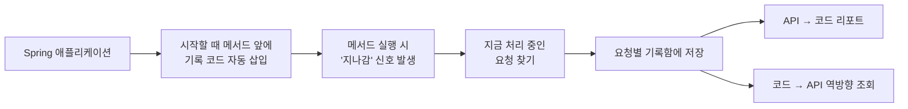

<div align="center">

<picture>
  <source media="(prefers-color-scheme: dark)" srcset="docs/assets/reqover-wordmark-dark.svg">
  
</picture>

<p><strong>이 API를 호출하면, 실제로 어떤 코드가 실행되는가?</strong></p>

<p>Spring MVC와 WebFlux의 실행 귀속을 —<br>
요청 단위로 기록하고, 역방향으로도 되묻고, CI에서 확인합니다.</p>

<p>
  <a href="https://github.com/reqover-labs/reqover/actions/workflows/build.yml"></a>
  <a href="https://github.com/reqover-labs/reqover/releases/latest"></a>
  <a href="LICENSE"></a>
  <a href=".github/workflows/build.yml"></a>
  <a href="build.gradle.kts"></a>
</p>

<p>
  <a href="#5분-만에-직접-보기"><b>5분 체험</b></a> ·
  <a href="#무슨-문제를-푸나">왜 필요한가</a> ·
  <a href="#use-it-in-ci">CI에서 쓰기</a> ·
  <a href="#어떻게-동작하나">동작 원리</a> ·
  <a href="docs/17_integration_guide.ko.md">내 앱에 붙이기</a> ·
  <a href="https://youtu.be/N62BEzVchSM">데모 영상</a> ·
  <a href="#문서-목록">문서</a> ·
  <a href="README.md">English</a>
</p>

</div>


<p align="center">
  <a href="https://youtu.be/N62BEzVchSM"><b>▶&nbsp; 2분 데모 영상 보기</b></a><br>
  <sub>요청 분리, 역방향 조회, WebFlux thread hop, 그리고 Pull Request 코멘트까지 실제로 돌아가는 화면으로 봅니다.</sub>
</p>

> [!IMPORTANT]
> Reqover `0.2.0`은 **초기 개발 단계**입니다. 소스를 직접 빌드하거나 [GitHub Releases](https://github.com/reqover-labs/reqover/releases)에서 받아 쓸 수 있습니다. 서명된 Maven Central 배포 파이프라인은 만들어 두었지만 아직 실행한 적이 없어서, 지금 Central에서 받아올 수 있는 것은 없습니다. 개발·QA·스테이징 환경에서 써보는 것을 전제로 만들었고, 운영 환경에 상시로 켜두는 용도는 아닙니다.


## 무슨 문제를 푸나

테스트 커버리지 도구(JaCoCo 같은 것)는 이렇게 알려줍니다.

> `OrderService.find()` — 실행됨 ✅

여기서 알 수 없는 게 하나 있습니다. **누가** 실행했는지입니다. `GET /orders/{id}`가 실행했을까요, 아니면 관리자용 배치가 실행했을까요? 둘 다일까요? 커버리지 숫자만으로는 알 수 없어서, 보통 코드를 따라 읽으며 직접 추적합니다.

Reqover는 요청이 들어오는 순간부터 응답이 나갈 때까지 **그 요청이 실제로 밟고 지나간 메서드를 요청별로 따로 기록합니다.** 그래서 이런 게 됩니다.

|                                              | 기존 커버리지 도구  | Reqover               |
| -------------------------------------------- | ----------- | --------------------- |
| 어떤 코드가 실행됐는지                                 | ✅           | ✅                     |
| `POST /payments`가 실행한 코드만 따로 보기               | 직접 추적해야 함   | ✅ 리포트에서 바로            |
| `SharedValidator`를 실행하는 API 목록 보기             | 직접 추적해야 함   | ✅ 역방향 조회              |
| Pull Request의 변경분이 영향을 주는 API 짚어내기           | 직접 추적해야 함   | ✅ CI에서 `reqover impact` |
| 몇 줄 중 몇 줄을 실행했는지 (line/branch)               | ✅ 정밀함       | ❌ 지원 안 함              |

**JaCoCo를 대체하지 않습니다.** JaCoCo는 "얼마나 촘촘히 테스트됐나"를, Reqover는 "누가 이 코드를 실행했나"를 봅니다. 같이 쓰는 도구입니다.

### 이런 상황에서 유용합니다

- **변경 영향 파악** — 공통 유틸 하나 고쳤는데, 이걸 타는 API가 몇 개인지 모를 때
- **QA 테스트 범위 선정** — 코드 리뷰에서 바뀐 파일을 보고 다시 돌려야 할 API를 좁힐 때, 그것도 직접 따져보는 대신 Pull Request에 붙어 있으면 좋을 때
- **레거시 코드 읽기** — 문서 없는 서비스에 들어와서, API 하나가 어디까지 파고드는지 눈으로 확인할 때
- **WebFlux 디버깅** — 요청 처리가 여러 스레드로 흩어져서 흐름을 따라가기 어려울 때

## 리포트가 보여주는 세 가지

### 1. API별로 나눠 본 실행 경로

같은 애플리케이션에 `GET /orders/{id}`와 `POST /payments`를 각각 호출하면, 두 요청이 실행한 컨트롤러와 서비스가 **API별로 분리되어** 표시됩니다. 두 요청이 공통으로 지나간 `SharedValidator`는 양쪽에 모두 나타나고, 2개 이상의 API가 도달한 메서드는 따로 강조됩니다. (= 여기를 고치면 여러 곳이 영향받는다는 신호)

### 2. 스레드를 넘나들어도 유지되는 추적 (WebFlux)

WebFlux는 요청 하나를 처리하면서 스레드를 여러 번 갈아탑니다. 보통 이러면 "이 코드가 어느 요청 때문에 돌았는지"를 놓치는데, Reqover는 스레드가 바뀌어도 같은 요청으로 계속 기록합니다.


### 3. 코드 → API 역방향 조회

`Code to Endpoint Index`는 방향을 뒤집은 표입니다. 메서드마다 **그 메서드를 실행한 API가 나열됩니다.** 코드를 고친 뒤 어디부터 다시 확인할지 정할 때 쓰면 됩니다. 메서드 이름은 JVM 내부 표기 대신 `find(long): OrderResponse`처럼 읽기 쉬운 형태로 보여줍니다.

> 리포트 위쪽에는 필터 입력란이 있습니다. 엔드포인트·클래스·메서드 이름의 일부를 입력하면 두 섹션이 함께 걸러집니다. `/`를 누르면 입력란으로 이동하고, `Esc`를 누르면 지웁니다. 디스크립터는 두 표기 모두 매칭되므로 `(J)`로 찾든 `long`으로 찾든 같은 메서드가 나옵니다. 스크립트가 없어도 표 전체는 그대로 그려집니다 — 필터는 행을 숨길 뿐이라 브라우저 찾기(`Ctrl`/`Cmd`+`F`)도 그대로 동작합니다.


> 스크린샷을 어떤 환경에서 어떻게 찍었는지는 [README Demo Capture](docs/16_readme_demo_capture.md)에 적어두었습니다.

## 5분 만에 직접 보기

내 프로젝트에 붙이기 전에, 데모 애플리케이션으로 먼저 확인해보는 걸 권합니다.

**준비물**

- JDK 17 또는 21 (`java -version`으로 확인)
- Git
- 비어 있는 포트 하나 (아래 예시는 8080)

> [!WARNING]
> 데모의 리포트 페이지에는 **로그인이 없습니다.** 아래 스크립트는 `127.0.0.1`(내 컴퓨터 안에서만 접속 가능)로 고정해서 실행합니다. 이 포트를 외부에 열지 마세요.

### macOS / Linux

```bash
git clone https://github.com/reqover-labs/reqover.git
cd reqover

./gradlew test
./scripts/run-agent-demo.sh mvc 8080
```

### Windows (PowerShell)

```powershell
git clone https://github.com/reqover-labs/reqover.git
Set-Location .\reqover

# JAVA_HOME이 JDK 17 또는 21을 가리켜야 합니다
$env:Path = "$env:JAVA_HOME\bin;$env:Path"

.\gradlew.bat test
.\scripts\run-agent-demo.ps1 -App mvc -Port 8080
```

### 그 다음

스크립트가 주소를 출력하고 멈춰 있으면, 브라우저에서 아래를 엽니다.

```
http://127.0.0.1:8080/reqover/report.html
```

리포트에 이런 내용이 보이면 정상 동작한 것입니다.

```
GET /auto/orders/{id}          3 classes · 3 methods · 1 thread
  AutoOrderController          io.reqover.example.mvc.auto
  AutoOrderService             io.reqover.example.mvc.auto
  AutoOrderResponse            io.reqover.example.mvc.auto
```

끝낼 때는 스크립트를 실행한 터미널에서 `Enter`를 누릅니다. 기다리지 않고 리포트만 저장한 뒤 바로 종료하려면 — 스크립트나 CI에서 유용합니다 — 세 번째 인자를 넘기세요.

```bash
./scripts/run-agent-demo.sh mvc 8080 --stop-after-report
```

### WebFlux 버전도 보고 싶다면

```bash
./scripts/run-agent-demo.sh webflux 8080
```

```powershell
.\scripts\run-agent-demo.ps1 -App webflux -Port 8080
```

이번에는 `GET /auto/reactive/orders/{id}`와 함께 **서로 다른 스레드 이름이 2개 이상** 나타나야 합니다. 그게 "스레드가 바뀌어도 추적이 유지됐다"는 증거입니다.

### CI 흐름 전체를 한 번에 보고 싶다면

```bash
./scripts/run-impact-demo.sh 8080
```

트래픽을 기록하고, 애플리케이션이 종료될 때 리포트를 파일로 내보낸 다음, 데모 클래스
하나를 고치면 어떤 엔드포인트가 영향을 받는지 물어봅니다. [CI 섹션](#use-it-in-ci)에서
설명하는 것과 같은 순서를 명령 하나로 돌리는 것입니다.

### 내 프로젝트에 붙이려면

의존성 하나면 어댑터와 리포트, Spring 연결이 함께 들어옵니다.

```kotlin
implementation("io.reqover:reqover-spring-boot-starter:0.2.0")
```

그다음 agent를 붙이고 기록할 패키지를 지정합니다.

```bash
java -javaagent:reqover-agent-0.2.0.jar=include=com.example.orders -jar your-app.jar
```

전체 속성 목록은 [Spring 애플리케이션 연동 가이드](docs/17_integration_guide.ko.md)를
참고하세요. 잘 안 되면 [이슈](https://github.com/reqover-labs/reqover/issues)로 남겨주시면 도움이 됩니다 — 어디서 막히는지가 지금 가장 필요한 정보입니다.

<a id="use-it-in-ci"></a>

## CI에서 쓰기

한 번 열어보고 마는 리포트보다, 누군가 Pull Request를 열 때마다 질문에 답해주는
리포트가 낫습니다. 그 질문은 이것입니다.

> 이 파일들을 고쳤습니다. **어떤 API를 다시 테스트해야 하나요?**

Reqover는 어떤 엔드포인트가 어떤 메서드를 실행했는지 이미 알고 있으니 이 질문에 답할
수 있습니다. diff를 넘겨주면 역방향 조회가 체크리스트가 됩니다.

### 1. 테스트 실행에서 리포트 뽑아내기

starter는 애플리케이션이 종료될 때 리포트를 파일로 쓸 수 있습니다. 통합 테스트를 한 번
돌리고 나면 파일이 하나 남습니다.

```properties
reqover.report.export.json-path=build/reqover-report.json
```

agent를 붙인 채로 통합 테스트를 돌리고 애플리케이션이 정상적으로 종료되면 파일이
생깁니다. (`SIGKILL`로 죽인 프로세스는 아무것도 쓰지 않습니다.) 이 파일을 기준선으로
커밋해 두거나, CI 아티팩트로 남겨두세요.

### 2. 변경이 무엇에 영향을 주는지 묻기

```bash
git diff --name-only origin/main... \
  | reqover impact --report build/reqover-report.json --changed-files - --format markdown
```

```
### Reqover — endpoints to retest

**2 endpoints** were observed executing code this change touches.

| Endpoint | Changed code it ran |
| --- | --- |
| `GET /orders/{id}` | `OrderService#find(long): OrderResponse` |
| `POST /payments`   | `SharedValidator#validate(String)` |
```

여기서 `reqover`는 릴리스에 들어 있는 `java -jar reqover-cli-0.2.0.jar`입니다. CLI에는
`render`(리포트 JSON을 단독 실행 페이지로)와 `diff`(두 기록 사이에 무엇이 달라졌는지)도
있습니다. `--fail-on-impact`를 주면 이 분석이 게이트가 됩니다. 영향받는 것이 없으면 종료
코드 0, 있으면 1, 입력이 잘못됐으면 2입니다.

### 3. Pull Request에 코멘트로 남기기

```yaml
- uses: reqover-labs/reqover/.github/actions/impact@v0.2.0
  with:
    report: build/reqover-report.json
```

> [!NOTE]
> 영향도 분석은 **실행되는 것을 관측한** 코드에 대해서만 말할 수 있습니다. 관측된 실행
> 기록이 없다고 보고된 파일은, 그 리포트를 만든 트래픽이 그 코드를 지나가지 않았을
> 뿐일 수도 있습니다. 결과는 "어디부터 봐야 하는지"로 쓰고, 나머지가 안전하다는
> 증거로 쓰지 마세요.

전체 워크플로 파일을 포함한 자세한 설명: [CI에서 영향도 분석하기](docs/18_ci_impact_analysis.ko.md).

## 어떻게 동작하나

한 문장으로: **애플리케이션이 시작될 때 코드에 "여기 지나갔다"고 알리는 코드를 자동으로 끼워 넣고, 그 기록을 요청별로 모읍니다.**



조금 더 자세히:

1. **코드 끼워 넣기** — Java에는 애플리케이션이 실행될 때 클래스를 살짝 손볼 수 있는 공식 기능(Java agent)이 있습니다. Reqover는 이걸 써서 지정한 클래스의 메서드 시작 지점에 기록 호출을 넣습니다. **원본 소스 코드는 건드리지 않습니다.**
2. **요청과 연결** — MVC에서는 요청마다 붙어 있는 저장 공간을, WebFlux에서는 Reactor가 요청 따라 전달하는 컨텍스트를 이용해 "지금 이건 어느 요청인지"를 찾습니다.
3. **리포트 만들기** — 요청이 끝나면 기록을 API별로 묶어서 JSON과 HTML 파일로 만듭니다. HTML은 다른 파일 없이 혼자 열립니다.

설계 문서: [시스템 아키텍처](docs/02_architecture.ko.md) · [Agent E2E Demo](docs/09_agent_e2e_demo.md)

## 지금 되는 것 / 안 되는 것

솔직하게 적었습니다. 도구를 잘못 기대하고 쓰면 서로 시간만 낭비하니까요.

### 되는 것

- Spring MVC / WebFlux 요청별 실행 기록
- 메서드 시작 지점 자동 기록 (소스 수정 불필요)
- API → 코드 리포트, 그리고 코드 → API 역방향 조회
- 리포트를 JSON으로 쓰고 다시 읽기 — JVM이 끝나도 기록이 남습니다
- 바뀐 파일 → 다시 테스트할 엔드포인트. CLI 명령과 GitHub Action 두 가지로 제공
- 두 기록 사이의 차이 비교
- Spring Boot 자동 설정, 그리고 의존성 하나로 연결해주는 starter
- 원할 때만 켜는 리포트 엔드포인트와, 종료 시 파일로 내보내기
- HTTP 요청이 아닌 작업 단위에 대한 귀속 (`UnitScope`)
- 교체 가능한 저장소 SPI (`CoverageStore`)
- 별도 JVM에서 agent를 붙여 돌리는 E2E 테스트
- 의존성 목록(SBOM, CycloneDX 1.6) 생성

### 안 되는 것 / 주의할 점

- **몇 번째 줄까지 실행했는지는 모릅니다.** 메서드 단위로만 봅니다. 줄·분기 단위 정밀도가 필요하면 JaCoCo를 쓰세요.
- **컴파일러가 자동 생성한 메서드**는 기록하지 않습니다.
- **기록은 메모리에만 남습니다.** 기본 상한은 10,000건이고(`reqover.mvc.max-snapshots` / `reqover.webflux.max-snapshots`로 조정), 넘으면 오래된 것부터 지웁니다. 애플리케이션을 재시작하면 사라집니다. 다른 곳에 저장하고 싶다면 `CoverageStore`가 확장 지점이지만, Reqover가 제공하는 영속 구현체는 없습니다 — 대신 리포트를 파일로 내보내세요.
- **영향도 분석은 기록된 범위 안에서만 동작합니다.** 바뀐 파일을, 리포트가 실행을 관측한 코드와 맞춰볼 뿐입니다. 맞출 수 없는 파일은 매칭 실패로 보고되는데, 이는 "영향 없음"이 아니라 "본 적 없음"이라는 뜻입니다.
- **MVC의 비동기 처리 구간**은 자동 연결이 끊깁니다. 별도 스레드로 넘어간 부분은 기록되지 않고, 요청 처리가 다시 돌아오는 시점부터 이어집니다.
- **WebFlux 어댑터는 JVM 전체에 영향을 주는 설정 하나를 켭니다.** (Reactor의 컨텍스트 자동 전달 기능. 스레드를 넘어 요청 정보를 옮기기 위해 필요합니다.) 원하지 않으면 애플리케이션 시작 전에 `reqover.webflux.enabled=false`로 어댑터를 끄세요.
- **agent는 `include=`를 명시하지 않으면 아무것도 기록하지 않습니다.** 실수로 전체를 계측하는 사고를 막기 위한 기본값입니다. JDK 내부 클래스와 Reqover 자신은 include로도 계측되지 않습니다.
- **리포트는 "실제로 관측된 것"만 보여줍니다.** 리포트에 없다고 그 관계가 존재하지 않는다는 뜻은 아닙니다. 그 API를 아직 호출하지 않았을 수도 있습니다.
- **역방향 조회는 "여기부터 보라"는 힌트입니다.** 완전한 변경 영향 분석을 보장하지 않습니다.
- **데모의 리포트 페이지에는 로그인이 없습니다.** `127.0.0.1`로만 열어두세요.

성능은 [로컬 측정 결과](docs/15_performance_results.md)에 공개해 두었습니다. 정식 벤치마크가 아니라 "심하게 느려지지는 않는다" 수준의 확인입니다.

## 지원 범위

| 항목                 | 현재                            |
| ------------------ | ----------------------------- |
| 버전                 | `0.2.0`                       |
| 빌드에 필요한 JDK        | 17 또는 21                      |
| 컴파일 결과물 대상         | Java 17                       |
| CI                 | Ubuntu + Temurin 17 / 21      |
| 데모 Spring Boot 버전  | 3.5.16                        |
| MVC                | 구현 완료 + 통합 테스트                |
| WebFlux            | 구현 완료 + 스레드 전환 통합 테스트         |
| 리포트 형식             | JSON, 단독 실행 HTML, Markdown (영향도·diff) |
| CI 연동              | 종료 코드로 게이트를 거는 CLI, GitHub Action |
| 배포 방법              | 소스 빌드 또는 GitHub Release. Central 파이프라인은 준비됐지만 아직 배포 전 |

## 저장소 구조

각 폴더가 뭘 하는지 먼저 알면 코드 읽기가 훨씬 빠릅니다.

| 폴더                        | 하는 일                                       |
| ------------------------- | ----------------------------------------- |
| `reqover-core`            | 요청별 기록함, 기록 저장소 — **여기가 심장부입니다**          |
| `reqover-instrumentation` | 클래스에 기록 코드를 끼워 넣는 부분 (ASM 사용)             |
| `reqover-agent`           | 위 기능을 `-javaagent`로 쓸 수 있게 포장             |
| `reqover-spring-mvc`      | MVC에서 "지금 어느 요청인지" 찾기                     |
| `reqover-spring-webflux`  | WebFlux에서 같은 일 (스레드 전환 처리 포함)             |
| `reqover-spring-boot-starter` | 의존성 하나로 전체를 연결. 리포트 엔드포인트와 파일 내보내기 포함 |
| `reqover-report`          | 리포트 집계, 역방향 조회, 영향도 분석, 기록 비교, JSON/HTML 만들기 |
| `reqover-cli`             | 기록된 리포트에 대한 `render`, `diff`, `impact` 명령 |
| `examples/mvc-sample`     | MVC 데모 애플리케이션                             |
| `examples/webflux-sample` | WebFlux 데모 애플리케이션                         |
| `docs`                    | 설계·측정·결정 기록                               |
| `scripts`                 | 데모 실행 스크립트, 영향도 데모, SBOM 점검 스크립트          |

### 빌드와 의존성 목록

```bash
./gradlew clean test      # 테스트
./gradlew cyclonedxBom    # 의존성 목록 생성
```

Windows는 `.\gradlew.bat`을 씁니다. 의존성 목록은 `build/reports/bom/reqover.cdx.json`에 생성되고, 릴리스에 고정한 사본은 [`sbom/reqover.cdx.json`](sbom/reqover.cdx.json)에 있습니다. 알려진 취약점 확인은 아래로 재현할 수 있습니다.

```bash
./scripts/check-sbom-osv.py sbom/reqover.cdx.json
```

## 기여하기

작은 저장소라 무엇이든 도움이 됩니다. 특히 **"데모를 돌렸는데 안 됐다"는 제보**가 지금 제일 귀합니다.

**처음이라면 이런 것부터**

- 데모를 돌려보고 안 되는 부분 [이슈로 남기기](https://github.com/reqover-labs/reqover/issues/new/choose) — OS와 JDK 버전, 실행한 명령어, 실제로 나온 결과를 적어주세요
- README나 `docs/`에서 이해 안 되는 문장 지적하기 (이해가 안 된다는 것 자체가 버그입니다)
- 실제 저장소에 `reqover impact`를 돌려보고, 파일 매칭이 어긋나는 지점 알려주기 — 그 휴리스틱은 우리가 쓰지 않은 프로젝트에 부딪혀 봐야 합니다
- 아직 *(한국어)*로만 있는 문서 번역
- 내 Spring 프로젝트에 붙여본 후기 공유

fork 후 브랜치를 만들고, `./gradlew clean test` 통과를 확인한 뒤 `main`으로 Pull Request를 열어주세요. 큰 변경이라면 코드를 쓰기 전에 이슈로 먼저 이야기해 주세요 — 방향이 안 맞아서 작업이 버려지는 게 제일 아깝습니다. 전체 규칙과 PR 체크리스트: [Contributing Guide](CONTRIBUTING.md) · [행동 강령](CODE_OF_CONDUCT.md)

이슈·PR·커밋 메시지는 영어로 씁니다. 한국어 질문도 환영이니 영어 요약만 함께 달아주세요.

> [!CAUTION]
> **보안 취약점은 공개 이슈로 올리지 마세요.** [Security Policy](SECURITY.md)의 비공개 신고 절차를 이용해 주세요.

## 용어 정리

<details>
<summary>이 프로젝트 문서와 코드에 반복해서 나오는 용어들</summary>

이 문서와 코드에 반복해서 나오는 표현들입니다.

| 표현                  | 뜻                                                          |
| ------------------- | ---------------------------------------------------------- |
| **엔드포인트(endpoint)** | `GET /orders/{id}` 같은 하나의 API 주소                           |
| **계측(instrument)**  | 실행 기록을 남기려고 코드에 기록용 호출을 끼워 넣는 것                            |
| **Java agent**      | 애플리케이션 실행 시점에 클래스를 손볼 수 있게 해주는 Java 공식 기능                   |
| **ASM**             | Java 클래스 파일을 읽고 수정하는 라이브러리. 계측에 사용                         |
| **WebFlux**         | Spring의 비동기 웹 방식. 요청 하나가 여러 스레드를 거칠 수 있음                    |
| **버킷(bucket)**      | 요청 하나에 대응하는 기록함. "이 요청이 지나간 메서드들"을 담아둠                      |
| **SBOM**            | 이 프로젝트가 쓰는 외부 라이브러리 목록. 취약점 점검에 사용                         |

</details>

## 문서 목록

- [시스템 아키텍처](docs/02_architecture.ko.md)
- [Spring 애플리케이션 연동 가이드](docs/17_integration_guide.ko.md)
- [CI에서 영향도 분석하기](docs/18_ci_impact_analysis.ko.md)
- [프로젝트 기획](docs/00_project_plan.md) · [요구사항](docs/01_requirements.md)
- [MVP 진행 상태](docs/08_phase0_mvp_status.md) · [Agent E2E Demo](docs/09_agent_e2e_demo.md) · [데모 스크립트](docs/10_demo_script.md)
- [성능 측정 방법](docs/11_performance_measurement.md) · [로컬 성능 결과](docs/15_performance_results.md)
- [JaCoCo 연동 관련 결정](docs/14_jacoco_interop_decision.md) · [README 스크린샷 촬영 기록](docs/16_readme_demo_capture.md)
- [대회 준비 문서](docs/competition/README.md)

## 만든 사람들

[Reqover Lab](https://github.com/reqover-labs) — 2026 오픈소스 개발자대회 출품을 목표로 개발 중입니다.

Reqover는 대회 출품작으로 시작했지만, **대회가 끝난 뒤에도 계속 유지할 생각입니다.** 대회 일정과 무관하게 이슈와 Pull Request를 환영합니다.

| 이름  | GitHub                                       | LinkedIn                                                        | 맡은 부분                                            |
| --- | -------------------------------------------- | --------------------------------------------------------------- | ------------------------------------------------ |
| 김태희 | [@TaeHuiKKIM](https://github.com/TaeHuiKKIM) | [TaeHui Kim](https://www.linkedin.com/in/taehui-kim-930713412/) | 설계 및 MVP 구현: core, 계측, agent, 리포트, 데모          |
| 이상민 | [@lsmin3388](https://github.com/lsmin3388)   | [Sangmin Lee](https://www.linkedin.com/in/sangminn0)            | 설계 및 공개 저장소 정비: 빌드, CI, core 안정화, Spring 어댑터, 문서      |

## 라이선스

Reqover가 직접 작성한 코드는 [Apache License 2.0](LICENSE)입니다. 사용한 외부 라이브러리의 라이선스는 [THIRD_PARTY_NOTICES.md](THIRD_PARTY_NOTICES.md)에 정리해 두었습니다.
