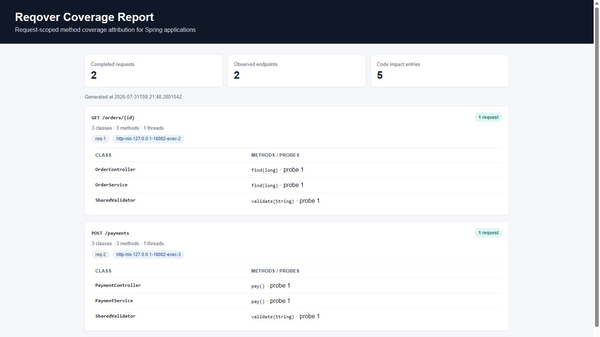
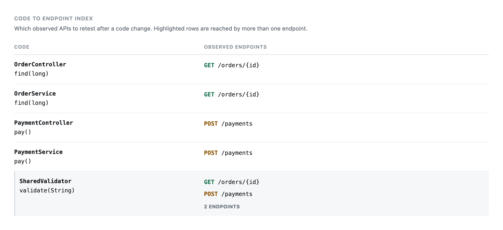
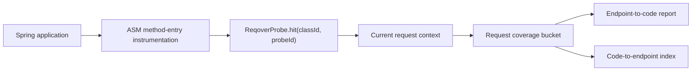

<h1 align="center">Reqover</h1>

<p align="center">
  <strong>Request-scoped runtime coverage attribution for Spring MVC and WebFlux.</strong><br>
  어떤 HTTP 요청이 어떤 메서드를 실행했는지 연결하고, 변경된 코드에서 관측된 엔드포인트를 역으로 찾습니다.
</p>

<p align="center">
  <a href="https://github.com/reqover-labs/reqover/actions/workflows/build.yml"></a>
  <a href="LICENSE"></a>
  <a href="build.gradle.kts"></a>
  <a href="build.gradle.kts"></a>
</p>

<p align="center">
  <a href="#see-it-in-action">Demo</a> ·
  <a href="#quickstart">Quickstart</a> ·
  <a href="#documentation">Documentation</a> ·
  <a href="#contributing">Contributing</a>
</p>



> [!IMPORTANT]
> Reqover는 현재 소스에서 빌드해 사용하는 `0.1.0-SNAPSHOT` MVP입니다. Maven Central 또는 GitHub Releases에 배포된 artifact는 아직 없습니다. 개발·QA·staging 환경의 관측과 시연을 우선하며, sample report endpoint는 인증을 제공하지 않습니다.

## Why Reqover

일반적인 집계 커버리지는 코드가 실행됐다는 사실을 보여주지만, 그 실행을 만든 HTTP 요청을 기본 차원으로 제공하지는 않습니다. Reqover는 Spring 애플리케이션에서 관측된 요청과 method-entry hit를 같은 bucket에 기록합니다.

| 질문 | 집계 커버리지 | Reqover |
| --- | --- | --- |
| 어떤 코드가 실행됐는가? | 제공 | 제공 |
| 어떤 HTTP endpoint가 그 코드를 실행했는가? | 기본 차원이 아님 | endpoint-to-code report |
| 이 메서드를 실행한 관측 API는 무엇인가? | 별도 분석 필요 | code-to-endpoint index |
| WebFlux가 thread를 바꿔도 요청 귀속이 유지되는가? | 요청 차원 밖의 문제 | Reactor Context 기반으로 유지 |

Reqover는 JaCoCo를 대체하지 않습니다. line/branch 정밀 커버리지에 요청 단위 실행 귀속을 보완하는 도구입니다.

## See It in Action

### 1. 요청별 실행 경로 분리

같은 애플리케이션에서 `GET /orders/{id}`와 `POST /payments`를 호출하면 각 endpoint가 실행한 controller와 service가 별도 카드에 표시됩니다. 공통으로 실행된 `SharedValidator`는 두 카드 모두에 나타납니다.

### 2. WebFlux thread hop 추적

Java agent가 controller와 service의 method entry를 자동 계측합니다. reactive 실행이 여러 thread로 이동해도 같은 요청 bucket에 기록됩니다.


### 3. 코드에서 관측 endpoint 역조회

`Code to Endpoint Index`는 특정 메서드를 실행한 관측 API를 보여줍니다. 코드 변경 후 먼저 재검증할 endpoint를 좁히는 신호로 사용할 수 있습니다.



촬영 환경과 검증 절차는 [README Demo Capture](docs/16_readme_demo_capture.md)에 기록되어 있습니다.

## Quickstart

### Requirements

- JDK 21 — Gradle build와 테스트에 필요
- Git
- 사용 가능한 HTTP port

Reqover가 생성하는 bytecode target은 Java 17입니다. 현재 CI는 JDK 21에서 검증합니다.

> [!WARNING]
> Sample report endpoint에는 인증이 없습니다. 아래 Quickstart 명령은 `SERVER_ADDRESS`를 `127.0.0.1`로 명시해 loopback에만 바인딩합니다. 이 설정을 제거하거나 port를 public 또는 신뢰할 수 없는 네트워크에 노출하지 마십시오.

### Windows PowerShell

```powershell
git clone https://github.com/reqover-labs/reqover.git
Set-Location .\reqover

# Configure JAVA_HOME for your installed JDK 21.
$env:Path = "$env:JAVA_HOME\bin;$env:Path"
$env:SERVER_ADDRESS = '127.0.0.1'

.\gradlew.bat test
.\scripts\run-agent-demo.ps1 -App mvc -Port 8080
```

`JAVA_HOME`은 설치한 JDK 21 경로로 설정하십시오. 스크립트가 report URL을 출력하고 대기하면 다음 주소를 엽니다.

```text
http://localhost:8080/reqover/report.html
```

종료하려면 스크립트를 실행한 터미널에서 Enter를 누릅니다.

### macOS / Linux

```bash
git clone https://github.com/reqover-labs/reqover.git
cd reqover

export SERVER_ADDRESS=127.0.0.1

./gradlew test
./scripts/run-agent-demo.sh mvc 8080
```

### Expected result

MVC auto demo report에는 다음 항목이 나타나야 합니다.

```text
GET /auto/orders/{id}
io.reqover.example.mvc.auto.AutoOrderController
io.reqover.example.mvc.auto.AutoOrderService
```

WebFlux demo는 다음 명령으로 실행합니다.

```powershell
.\scripts\run-agent-demo.ps1 -App webflux -Port 8080
```

```bash
./scripts/run-agent-demo.sh webflux 8080
```

report에는 `GET /auto/reactive/orders/{id}`와 자동 계측된 reactive controller/service, 두 개 이상의 thread 이름이 나타나야 합니다.

## How It Works



1. **Instrumentation** — Java agent가 선택한 application class의 method entry에 probe 호출을 삽입합니다.
2. **Attribution** — Spring MVC는 request-bound ThreadLocal을, WebFlux는 Reactor Context와 context propagation을 이용해 현재 bucket을 찾습니다.
3. **Reporting** — 완료된 bucket을 endpoint별로 집계하고 JSON과 standalone HTML로 렌더링합니다.

상세 설계는 [시스템 아키텍처](docs/02_architecture.md)와 [Agent E2E Demo](docs/09_agent_e2e_demo.md)를 참고하십시오.

## Compatibility and Status

| 항목 | 현재 기준 |
| --- | --- |
| Project version | `0.1.0-SNAPSHOT` |
| Build JDK | 21 |
| Bytecode target | Java 17 |
| CI | Ubuntu + Temurin 21 |
| Spring Boot samples | 3.3.5 |
| MVC adapter | 구현 및 integration test |
| WebFlux adapter | 구현 및 thread-hop integration test |
| Instrumentation | ASM method-entry + `-javaagent` |
| Report | JSON + standalone HTML |
| Distribution | source build only |

### Current capabilities

- Spring MVC와 WebFlux 요청별 coverage bucket
- ASM method-entry 자동 계측
- endpoint-to-code report
- code-to-endpoint reverse index
- Spring Boot auto-configuration
- agent 기반 별도 JVM E2E test
- CycloneDX 1.6 SBOM 생성

## Project Structure

| 모듈 | 책임 |
| --- | --- |
| `reqover-core` | request bucket, context, probe registry, in-memory snapshot |
| `reqover-instrumentation` | ASM class transformation과 stable class ID |
| `reqover-agent` | `-javaagent` packaging과 class transformer |
| `reqover-spring-mvc` | Spring MVC request attribution |
| `reqover-spring-webflux` | Reactor Context 기반 WebFlux attribution |
| `reqover-report` | endpoint report와 reverse index, JSON/HTML model |
| `examples/mvc-sample` | MVC 수동 probe·agent demo |
| `examples/webflux-sample` | WebFlux thread-hop·agent demo |

## Build and SBOM

```bash
./gradlew clean test
./gradlew cyclonedxBom
```

Windows에서는 `.\gradlew.bat`을 사용합니다.

SBOM 출력:

```text
build/reports/bom/reqover-sbom.json
```

## Documentation

- [프로젝트 기획](docs/00_project_plan.md)
- [요구사항](docs/01_requirements.md)
- [시스템 아키텍처](docs/02_architecture.md)
- [MVP 상태](docs/08_phase0_mvp_status.md)
- [Agent E2E Demo](docs/09_agent_e2e_demo.md)
- [Demo Script](docs/10_demo_script.md)
- [Performance Measurement](docs/11_performance_measurement.md)
- [JaCoCo Interop Decision](docs/14_jacoco_interop_decision.md)
- [Local Performance Results](docs/15_performance_results.md)
- [README Demo Capture](docs/16_readme_demo_capture.md)
- [대회 준비 문서](docs/competition/README.md)

## Limitations and Safe Use

- 현재 method-entry 기준이며 JaCoCo 수준의 line/branch coverage를 제공하지 않습니다.
- synthetic method는 현재 계측 대상에서 제외됩니다.
- snapshot은 in-memory로 유지되며 기본 상한 10,000건을 넘으면 오래된 항목부터 제거합니다.
- report는 관측된 요청의 실행 관계만 보여줍니다. 보이지 않은 관계가 없다는 증거가 아닙니다.
- code-to-endpoint index는 우선 재검증 대상을 좁히는 신호이며 완전한 변경 영향 분석을 보장하지 않습니다.
- sample의 `/reqover/report`와 `/reqover/report.html`에는 인증이 없습니다. Quickstart의 `SERVER_ADDRESS=127.0.0.1` loopback 설정을 유지하고 public 또는 신뢰할 수 없는 네트워크에 노출하지 마십시오.
- 현재는 production always-on agent가 아니라 개발·QA·staging 관측을 우선합니다.

## Performance

로컬 순차 측정의 범위와 한계는 [Local Performance Results](docs/15_performance_results.md)에 공개되어 있습니다. 해당 수치는 production benchmark가 아니라 MVP sanity check입니다.

## Contributing

문서 개선, 버그 재현, 테스트와 코드 기여를 환영합니다.

- [Contributing Guide](CONTRIBUTING.md)
- [Code of Conduct](CODE_OF_CONDUCT.md)
- [Security Policy](SECURITY.md)
- [Issues](https://github.com/reqover-labs/reqover/issues)

보안 취약점은 공개 issue 대신 Security Policy의 private reporting 절차를 사용하십시오.

## Team

2026 오픈소스 개발자대회 출품을 목표로 Reqover를 개발하는 [Reqover Labs](https://github.com/reqover-labs)입니다.

| 이름 | GitHub | LinkedIn | 주요 기여 |
| --- | --- | --- | --- |
| 김태희 | [@TaeHuiKKIM](https://github.com/TaeHuiKKIM) | [TaeHui Kim](https://www.linkedin.com/in/taehui-kim-930713412/) | 코어 설계와 MVP 구현: core, instrumentation, agent, report, sample |
| 이상민 | [@lsmin3388](https://github.com/lsmin3388) | [Sangmin Lee](https://www.linkedin.com/in/sangminn0) | 공개 저장소 정비: build, CI, core hardening, Spring adapter, docs |

## License

Reqover 자체 작성 코드는 [Apache License 2.0](LICENSE)으로 제공됩니다. 서드파티 라이선스는 [THIRD_PARTY_NOTICES.md](THIRD_PARTY_NOTICES.md)를 참고하십시오.
