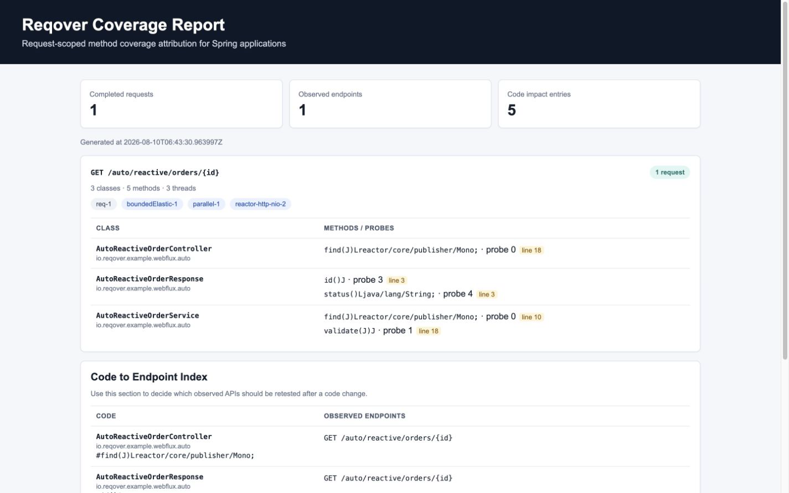

# Reqover

Reqover는 실행 중인 Spring 애플리케이션에서 코드 커버리지를 전역 값이 아니라 개별 HTTP 요청과 엔드포인트 단위로 귀속하는 개발자 도구입니다.

기존 커버리지 도구는 "어떤 코드가 실행되었는가"를 알려주지만, Reqover는 한 단계 더 들어가 "어느 요청이 그 코드를 실행했는가"를 보여주는 것을 목표로 합니다. 특히 Spring WebFlux처럼 요청 처리 중 thread가 바뀌는 reactive 환경에서도 귀속이 유지되는지를 핵심 차별점으로 둡니다.



## 현재 상태

2026 오픈소스 개발자대회 출품을 목표로 개발 중인 MVP입니다. 현재 다음이 동작합니다.

- 요청별 coverage bucket routing (Spring MVC, WebFlux)
- ASM method-entry instrumentation과 `-javaagent` 자동 계측
- JSON/HTML coverage report와 code-to-endpoint 역조회 인덱스
- Spring Boot auto-configuration
- agent 기반 Spring E2E 테스트, CycloneDX SBOM 생성

## 모듈 구성

- `reqover-core`: coverage bucket, ThreadLocal context, probe entry point, in-memory snapshot store
- `reqover-report`: endpoint-level coverage report model
- `reqover-spring-mvc`: Spring MVC request bucket adapter
- `reqover-spring-webflux`: WebFlux/Reactor Context request bucket adapter
- `reqover-instrumentation`: ASM method-entry instrumentation
- `reqover-agent`: Java agent packaging and class transformer
- `examples/mvc-sample`: MVC demo application
- `examples/webflux-sample`: WebFlux thread-hop demo application

## Build

요구사항:

- JDK 21 권장
- 컴파일 target은 Java 17

테스트 실행:

```bash
./gradlew test
```

Windows에서는 `.\gradlew.bat`을 사용합니다.

## Quick Demo: Manual Probe

MVC sample:

```bash
./gradlew :examples:mvc-sample:bootRun
```

Then call:

```text
GET  http://localhost:8080/orders/1
POST http://localhost:8080/payments
GET  http://localhost:8080/reqover/report
GET  http://localhost:8080/reqover/report.html
```

WebFlux sample:

```bash
./gradlew :examples:webflux-sample:bootRun
```

Then call:

```text
GET http://localhost:8080/reactive/orders/1
GET http://localhost:8080/reqover/report
GET http://localhost:8080/reqover/report.html
```

Reports include both endpoint-to-code coverage and code-to-endpoint reverse lookup.

## Quick Demo: Java Agent Auto Instrumentation

아래 데모는 샘플 컨트롤러/서비스 코드에 `ReqoverProbe.hit(...)`를 직접 넣지 않고, `-javaagent`가 method entry probe를 삽입하는 흐름입니다.

Build agent and sample jars:

```bash
./gradlew :reqover-agent:jar :examples:mvc-sample:bootJar :examples:webflux-sample:bootJar
```

Run MVC sample with the agent:

```bash
java -javaagent:reqover-agent/build/libs/reqover-agent-0.1.0-SNAPSHOT.jar=include=io.reqover.example.mvc.auto -jar examples/mvc-sample/build/libs/mvc-sample-0.1.0-SNAPSHOT.jar
```

Then call:

```text
GET http://localhost:8080/auto/orders/42
GET http://localhost:8080/reqover/report
GET http://localhost:8080/reqover/report.html
```

Run WebFlux sample with the agent:

```bash
java -javaagent:reqover-agent/build/libs/reqover-agent-0.1.0-SNAPSHOT.jar=include=io.reqover.example.webflux.auto -jar examples/webflux-sample/build/libs/webflux-sample-0.1.0-SNAPSHOT.jar
```

Then call:

```text
GET http://localhost:8080/auto/reactive/orders/42
GET http://localhost:8080/reqover/report
GET http://localhost:8080/reqover/report.html
```

Demo runner scripts:

```bash
./scripts/run-agent-demo.sh mvc 8080
./scripts/run-agent-demo.sh webflux 8080
```

Windows PowerShell:

```powershell
.\scripts\run-agent-demo.ps1 -App mvc -Port 8080
.\scripts\run-agent-demo.ps1 -App webflux -Port 8080
```

## SBOM

Generate CycloneDX SBOM:

```bash
./gradlew cyclonedxBom
```

Expected output:

```text
build/reports/bom/reqover-sbom.json
```

## Performance Measurement

순차 로컬 지연 측정 도구는 PowerShell(pwsh) 스크립트로 제공되며 macOS/Linux/Windows에서 동일하게 동작합니다.

```bash
pwsh scripts/measure-demo-latency.ps1 -Url http://localhost:8080/auto/orders/1 -WarmupRequests 30 -MeasuredRequests 300
```

현재 로컬 WebFlux 기준 결과는 [15. Local Performance Results](docs/15_performance_results.md)에 정리되어 있습니다.

## 핵심 가치

- 코드 변경 영향 범위를 정적 추측이 아니라 실제 실행 기록으로 확인합니다.
- 엔드포인트별 커버리지 리포트를 제공합니다.
- 운영 또는 시연 트래픽에서 어떤 코드 경로가 실제로 사용되는지 보여줍니다.
- WebFlux의 thread hop 상황에서도 coverage bucket이 요청을 따라가는지 검증합니다.

## 예상 사용자

- Spring 기반 백엔드 개발자
- 테스트 커버리지와 회귀 테스트 범위를 관리하는 팀
- 장애 또는 변경 영향 범위를 빠르게 좁혀야 하는 플랫폼 팀
- JaCoCo, SonarQube, Codecov를 이미 쓰고 있지만 요청 단위 관찰성이 부족한 팀

## 문서 구조

- [00. 프로젝트 기획](docs/00_project_plan.md)
- [01. 요구사항](docs/01_requirements.md)
- [02. 시스템 아키텍처](docs/02_architecture.md)
- [03. Phase 0 PoC 계획](docs/03_phase0_spike_plan.md)
- [08. Phase 0 MVP Status](docs/08_phase0_mvp_status.md)
- [09. Agent E2E Demo](docs/09_agent_e2e_demo.md)
- [10. Demo Script](docs/10_demo_script.md)
- [11. Performance Measurement](docs/11_performance_measurement.md)
- [14. JaCoCo Interop Decision](docs/14_jacoco_interop_decision.md)
- [15. Local Performance Results](docs/15_performance_results.md)

대회 준비 관련 문서는 [docs/competition](docs/competition/README.md)에 별도로 정리되어 있습니다.

## 구현 방향

Reqover는 JaCoCo 내부를 수정하는 대신, 경량 bytecode instrumentation으로 `ReqoverProbe.hit(classId, probeId)` 호출을 method entry에 삽입하고 이 호출을 현재 요청의 coverage bucket으로 routing합니다. branch 정밀도보다 요청 단위 귀속을 우선한 결정이며, JaCoCo와의 관계에 대한 배경은 [14. JaCoCo Interop Decision](docs/14_jacoco_interop_decision.md)에 정리되어 있습니다.

## 알려진 제한

- method entry 기준 계측이므로 branch/line 단위 세분화는 제공하지 않습니다.
- synthetic method(lambda 본문 등)는 현재 계측 대상에서 제외됩니다.
- coverage snapshot은 in-memory로 유지되며 기본 상한은 10,000건입니다(초과 시 오래된 것부터 제거).
- report 엔드포인트는 sample 애플리케이션이 제공합니다. 인증 없이 공개 네트워크에 노출하지 마십시오.

## License

Reqover 자체 작성 코드는 Apache License 2.0을 적용합니다. 전문은 [LICENSE](LICENSE), 서드파티 고지는 [THIRD_PARTY_NOTICES.md](THIRD_PARTY_NOTICES.md)를 참고하십시오.

JaCoCo fork 또는 내부 수정 파일이 생기는 경우 해당 모듈의 EPL-2.0 영향은 별도 검토합니다.
