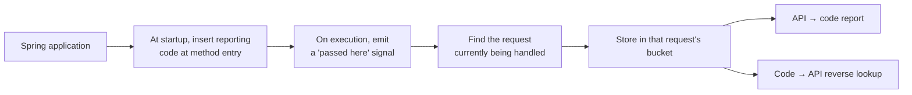

> 🇰🇷 **한국어 사용자는 [한국어 README](README.ko.md)를 봐주세요.** — 설치·사용법·기여 안내 전체가 한국어로 준비되어 있습니다.

**English** | [한국어](README.ko.md)

# Reqover

**A tool that answers "which code actually runs when I call this API?" — by running it and recording what happened.**

For Spring MVC and WebFlux applications. It works the other way around too — "I changed this method; which APIs do I need to retest?"

[](https://github.com/reqover-labs/reqover/actions/workflows/build.yml)
[](LICENSE)
[](build.gradle.kts)
[](.github/workflows/build.yml)

[Try it in 5 minutes](#try-it-in-5-minutes) · [What problem it solves](#what-problem-it-solves) · [How it works](#how-it-works) · [Contributing](#contributing)


> [!IMPORTANT]
> Reqover `0.1.1` is an **early development release**. You can build it from source or download it from [GitHub Releases](https://github.com/reqover-labs/reqover/releases); it is not on Maven Central yet. It is designed for development, QA, and staging — not for running permanently in production.

---

## What problem it solves

A test coverage tool (JaCoCo, for example) tells you this:

> `OrderService.find()` — executed ✅

One thing it does not tell you: **who** executed it. Was it `GET /orders/{id}`? An admin batch job? Both? Coverage numbers alone cannot say, so you usually end up tracing through the code by hand.

Reqover records, from the moment a request arrives until the response leaves, **the methods that request actually walked through — kept separate per request.** That makes the following possible:

|                                                        | Ordinary coverage tools | Reqover                |
| ------------------------------------------------------ | ----------------------- | ---------------------- |
| Which code ran                                         | ✅                       | ✅                      |
| See only the code `POST /payments` ran                 | Trace it yourself       | ✅ Straight from the report |
| List the APIs that reach `SharedValidator`             | Trace it yourself       | ✅ Reverse lookup       |
| How many lines/branches of a method ran                | ✅ Precise               | ❌ Not supported        |

**Reqover does not replace JaCoCo.** JaCoCo answers "how thoroughly is this tested?"; Reqover answers "who executed this code?" They are meant to be used together.

### When this is useful

- **Change impact** — you touched one shared utility and don't know how many APIs go through it
- **Choosing QA scope** — you see the changed files in a code review and want to narrow down which APIs to re-run
- **Reading unfamiliar code** — you joined an undocumented service and want to see how deep one API actually reaches
- **Debugging WebFlux** — request handling is scattered across threads and the flow is hard to follow

---

## Three things the report shows

### 1. Execution paths split per API

Call `GET /orders/{id}` and `POST /payments` against the same application, and the controllers and services each request executed are shown **separated by API**. `SharedValidator`, which both requests passed through, appears under both — and methods reached by two or more APIs are highlighted separately. (A signal that changing it affects several places.)

### 2. Tracking that survives thread hops (WebFlux)

WebFlux switches threads several times while handling a single request. That normally loses the answer to "which request caused this code to run" — Reqover keeps recording it under the same request even after the thread changes.


### 3. Code → API reverse lookup

`Code to Endpoint Index` is the same data flipped around: for each method, **the APIs that executed it are listed.** Use it to decide where to look first after changing code. Method names are shown in a readable form like `find(long): OrderResponse` rather than JVM descriptors.

> Today this is a fully rendered static HTML table — use your browser's find (`Ctrl`/`Cmd`+`F`). An in-report filter is tracked in [issue #5](https://github.com/reqover-labs/reqover/issues/5) — a good first contribution.


> How and where these screenshots were captured is recorded in [README Demo Capture](docs/16_readme_demo_capture.md).

---

## Try it in 5 minutes

Before wiring Reqover into your own project, we recommend running the demo application first.

**You need**

- JDK 17 or 21 (check with `java -version`)
- Git
- One free port (the examples below use 8080)

> [!WARNING]
> The demo report page has **no authentication.** The scripts below bind to `127.0.0.1` (reachable only from your own machine). Do not expose this port to a network.

### macOS / Linux

```bash
git clone https://github.com/reqover-labs/reqover.git
cd reqover

./gradlew test
./scripts/run-agent-demo.sh mvc 8080
```

### Windows (PowerShell)

```powershell
git clone https://github.com/reqover-labs/reqover.git
Set-Location .\reqover

# JAVA_HOME must point at JDK 17 or 21
$env:Path = "$env:JAVA_HOME\bin;$env:Path"

.\gradlew.bat test
.\scripts\run-agent-demo.ps1 -App mvc -Port 8080
```

### Then

When the script prints an address and waits, open this in your browser:

```
http://127.0.0.1:8080/reqover/report.html
```

If the report shows something like this, it worked:

```
GET /auto/orders/{id}
  io.reqover.example.mvc.auto.AutoOrderController
  io.reqover.example.mvc.auto.AutoOrderService
```

Press `Enter` in the terminal running the script to shut it down.

### To see the WebFlux version

```bash
./scripts/run-agent-demo.sh webflux 8080
```

```powershell
.\scripts\run-agent-demo.ps1 -App webflux -Port 8080
```

This time you should see `GET /auto/reactive/orders/{id}` together with **two or more distinct thread names.** That is the evidence that tracking survived the thread hop.

### To wire it into your own project

See the [Spring integration guide](docs/17_integration_guide.md). If it doesn't work, [opening an issue](https://github.com/reqover-labs/reqover/issues) genuinely helps — where people get stuck is the information this project needs most right now.

---

## How it works

In one sentence: **when the application starts, Reqover inserts code that reports "execution passed here", then groups those reports per request.**



In a little more detail:

1. **Inserting the code** — Java has an official mechanism (a Java agent) for adjusting classes as an application loads them. Reqover uses it to add a recording call at the entry of methods in the packages you name. **Your source code is never modified.**
2. **Linking to the request** — in MVC it uses the storage bound to each request; in WebFlux it uses the context Reactor carries along with the request, to answer "which request is this?"
3. **Building the report** — once a request finishes, the records are grouped by API and rendered as JSON and HTML. The HTML opens on its own with no other files.

Design documents: [System architecture](docs/02_architecture.md) · [Agent E2E Demo](docs/09_agent_e2e_demo.md)

---

## What works / What doesn't

Written plainly. Using a tool with the wrong expectations wastes everyone's time.

### What works

- Per-request execution records for Spring MVC and WebFlux
- Automatic recording at method entry (no source changes)
- API → code report
- Code → API reverse lookup
- Spring Boot auto-configuration
- E2E tests that attach the agent in a separate JVM
- Dependency inventory (SBOM, CycloneDX 1.6)

### What doesn't / Things to know

- **It does not know which lines ran.** Method granularity only. If you need line and branch precision, use JaCoCo.
- **Compiler-generated methods** are not recorded.
- **Records live in memory only.** The default cap is 10,000 entries; beyond that the oldest are dropped. Restarting the application clears everything.
- **MVC async sections are not linked automatically.** Work handed to a separate thread is not recorded; attribution resumes when request handling returns.
- **The WebFlux adapter turns on one JVM-wide setting.** (Reactor's automatic context propagation — needed to carry request information across threads.) If you don't want that, disable the adapter entirely with `reqover.webflux.enabled=false` before the application starts.
- **The agent records nothing unless you pass `include=`.** This default exists to prevent accidentally instrumenting everything. JDK internals and Reqover's own classes cannot be instrumented even with an include.
- **The report only shows what was actually observed.** Absence from the report does not prove a relationship doesn't exist — you may simply not have called that API yet.
- **The reverse lookup is a "start looking here" hint.** It is not a complete change-impact analysis.
- **The demo report page has no authentication.** Keep it on `127.0.0.1`.

Performance is published in [local measurement results](docs/15_performance_results.md). It is a sanity check, not a formal benchmark.

---

## Support matrix

| Item                      | Current                       |
| ------------------------- | ----------------------------- |
| Version                   | `0.1.1`                       |
| JDK required to build     | 17 or 21                      |
| Bytecode target           | Java 17                       |
| CI                        | Ubuntu + Temurin 17 / 21      |
| Spring Boot in samples    | 3.5.16                        |
| MVC                       | Implemented + integration tests |
| WebFlux                   | Implemented + thread-hop integration tests |
| Report formats            | JSON, self-contained HTML     |
| Distribution              | Source build or GitHub Release |

---

## Repository layout

Knowing what each directory does makes the code much faster to read.

| Directory                 | What it does                                              |
| ------------------------- | --------------------------------------------------------- |
| `reqover-core`            | Per-request buckets and the record store — **this is the heart** |
| `reqover-instrumentation` | Inserting recording code into classes (uses ASM)          |
| `reqover-agent`           | Packaging the above for use as a `-javaagent`             |
| `reqover-spring-mvc`      | Finding "which request is this" in MVC                    |
| `reqover-spring-webflux`  | The same for WebFlux, including thread hops               |
| `reqover-report`          | Report aggregation, reverse lookup, JSON/HTML rendering   |
| `examples/mvc-sample`     | MVC demo application                                      |
| `examples/webflux-sample` | WebFlux demo application                                  |
| `docs`                    | Design, measurement, and decision records                 |
| `scripts`                 | Demo runner scripts and the SBOM check script             |

### Build and dependency inventory

```bash
./gradlew clean test      # tests
./gradlew cyclonedxBom    # generate the dependency inventory
```

On Windows use `.\gradlew.bat`. The inventory is written to `build/reports/bom/reqover.cdx.json`, and the copy pinned to the release is at [`sbom/reqover.cdx.json`](sbom/reqover.cdx.json). Reproduce the known-vulnerability check with:

```bash
./scripts/check-sbom-osv.py sbom/reqover.cdx.json
```

---

## Contributing

This is a small repository, so anything helps. The most valuable contribution right now is a report saying **"I ran the demo and it didn't work."**

### Good places to start

- Run the demo and [open an issue](https://github.com/reqover-labs/reqover/issues/new/choose) about whatever broke — include your OS and JDK version, the exact command, and what actually happened
- Point out sentences in the README or `docs/` that don't make sense (if it isn't understandable, that is a bug)
- Fix typos and broken links
- Share what happened when you wired it into your own Spring project

### The code contribution flow

```bash
# 1. Fork the repository, then clone your fork
git clone https://github.com/<your-username>/reqover.git
cd reqover

# 2. Create a branch
git checkout -b fix/webflux-context-leak

# 3. Make your change and confirm the tests pass
./gradlew clean test

# 4. Commit and push
git commit -m "fix(webflux): ..."
git push origin fix/webflux-context-leak
```

Then open a Pull Request on GitHub. Filling in the PR template checklist speeds up review.

**Before opening a PR**

- [ ] `./gradlew test` passes
- [ ] `./gradlew build` passes
- [ ] Documentation updated if behavior changed
- [ ] README updated if the way you run it changed
- [ ] `THIRD_PARTY_NOTICES.md` updated if you added a dependency
- [ ] No secrets, tokens, or `.env` files included

If you are planning a large change, please open an issue before writing code. Work thrown away because the direction didn't match is the worst outcome for everyone.

Commit messages, PR descriptions, and issues are written in English so contributors from anywhere can follow the history.

Full rules: [Contributing Guide](CONTRIBUTING.md) · [Code of Conduct](CODE_OF_CONDUCT.md)

> [!CAUTION]
> **Do not report security vulnerabilities in public issues.** Use the private reporting process in the [Security Policy](SECURITY.md).

---

## Glossary

Terms that keep appearing in this project's docs and code.

| Term                | Meaning                                                          |
| ------------------- | ---------------------------------------------------------------- |
| **Endpoint**        | One API address, such as `GET /orders/{id}`                       |
| **Instrument**      | Inserting recording calls into code so execution can be observed  |
| **Java agent**      | The official Java mechanism for adjusting classes as they load    |
| **ASM**             | A library for reading and modifying Java class files; used here for instrumentation |
| **WebFlux**         | Spring's reactive web stack; one request may cross several threads |
| **Bucket**          | The record holder for a single request — "the methods this request passed through" |
| **SBOM**            | The inventory of third-party libraries this project uses; used for vulnerability checks |

---

## Documentation

- [System architecture](docs/02_architecture.md) · [한국어판](docs/02_architecture.ko.md)
- [Project plan](docs/00_project_plan.md) (Korean) · [Requirements](docs/01_requirements.md) (Korean)
- [MVP status](docs/08_phase0_mvp_status.md) · [Agent E2E Demo](docs/09_agent_e2e_demo.md) · [Demo script](docs/10_demo_script.md)
- [Performance measurement](docs/11_performance_measurement.md) · [Local performance results](docs/15_performance_results.md)
- [JaCoCo interop decision](docs/14_jacoco_interop_decision.md) · [README demo capture](docs/16_readme_demo_capture.md)
- [Spring integration guide](docs/17_integration_guide.md) · [한국어판](docs/17_integration_guide.ko.md)
- [Competition preparation documents](docs/competition/README.md) (Korean)

Documents marked *(Korean)* have not been translated yet. Translations are welcome contributions.

---

## Team

[Reqover Labs](https://github.com/reqover-labs) — building Reqover, initially as an entry for the 2026 Korea Open Source Developer Competition.

Reqover started as a competition entry, but we intend to keep maintaining it past
the contest. Issues and pull requests are welcome regardless of the competition
timeline.

| Name | GitHub | LinkedIn | Area |
| --- | --- | --- | --- |
| TaeHui Kim | [@TaeHuiKKIM](https://github.com/TaeHuiKKIM) | [TaeHui Kim](https://www.linkedin.com/in/taehui-kim-930713412/) | Design and MVP implementation: core, instrumentation, agent, report, demos |
| Sangmin Lee | [@lsmin3388](https://github.com/lsmin3388) | [Sangmin Lee](https://www.linkedin.com/in/sangminn0) | Design and public repository work: build, CI, core hardening, Spring adapters, docs |

## License

Code written for Reqover is licensed under the [Apache License 2.0](LICENSE). Third-party licenses are listed in [THIRD_PARTY_NOTICES.md](THIRD_PARTY_NOTICES.md).
