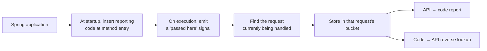

<div align="center">

<picture>
  <source media="(prefers-color-scheme: dark)" srcset="docs/assets/reqover-wordmark-dark.svg">
  
</picture>

<p><strong>Which code actually ran when this API was called?</strong></p>

<p>Runtime execution attribution for Spring MVC and WebFlux —<br>
recorded per request, answerable in reverse, and checkable in CI.</p>

<p>
  <a href="https://github.com/reqover-labs/reqover/actions/workflows/build.yml"></a>
  <a href="https://github.com/reqover-labs/reqover/releases/latest"></a>
  <a href="LICENSE"></a>
  <a href=".github/workflows/build.yml"></a>
  <a href="build.gradle.kts"></a>
</p>

<p>
  <a href="#try-it-in-5-minutes"><b>Quickstart</b></a> ·
  <a href="#what-problem-it-solves">Why</a> ·
  <a href="#use-it-in-ci">In CI</a> ·
  <a href="#how-it-works">How it works</a> ·
  <a href="docs/17_integration_guide.md">Integration</a> ·
  <a href="https://youtu.be/N62BEzVchSM">Demo video</a> ·
  <a href="#documentation">Docs</a> ·
  <a href="README.ko.md">한국어</a>
</p>

</div>


<p align="center">
  <a href="https://youtu.be/N62BEzVchSM"><b>▶&nbsp; Watch the 2-minute demo</b></a><br>
  <sub>Request separation, the reverse lookup, WebFlux thread hops, and the pull request comment — running, not slides.</sub>
</p>

> [!IMPORTANT]
> Reqover `0.2.0` is an **early development release**. You can build it from source or download it from [GitHub Releases](https://github.com/reqover-labs/reqover/releases). The signed Maven Central publication pipeline is in place but has not been run yet, so there is nothing to resolve from Central today. Reqover is designed for development, QA, and staging — not for running permanently in production.


## What problem it solves

A test coverage tool (JaCoCo, for example) tells you this:

> `OrderService.find()` — executed ✅

One thing it does not tell you: **who** executed it. Was it `GET /orders/{id}`? An admin batch job? Both? Coverage numbers alone cannot say, so you usually end up tracing through the code by hand.

Reqover records, from the moment a request arrives until the response leaves, **the methods that request actually walked through — kept separate per request.** That makes the following possible:

|                                                        | Ordinary coverage tools | Reqover                |
| ------------------------------------------------------ | ----------------------- | ---------------------- |
| Which code ran                                         | ✅                       | ✅                      |
| See only the code `POST /payments` ran                 | Trace it yourself       | ✅ Straight from the report |
| List the APIs that reach `SharedValidator`             | Trace it yourself       | ✅ Reverse lookup       |
| Name the APIs a pull request's diff affects            | Trace it yourself       | ✅ `reqover impact` in CI |
| How many lines/branches of a method ran                | ✅ Precise               | ❌ Not supported        |

**Reqover does not replace JaCoCo.** JaCoCo answers "how thoroughly is this tested?"; Reqover answers "who executed this code?" They are meant to be used together.

### When this is useful

- **Change impact** — you touched one shared utility and don't know how many APIs go through it
- **Choosing QA scope** — you see the changed files in a code review and want to narrow down which APIs to re-run, and you would rather have that posted on the pull request than work it out by hand
- **Reading unfamiliar code** — you joined an undocumented service and want to see how deep one API actually reaches
- **Debugging WebFlux** — request handling is scattered across threads and the flow is hard to follow

## Three things the report shows

### 1. Execution paths split per API

Call `GET /orders/{id}` and `POST /payments` against the same application, and the controllers and services each request executed are shown **separated by API**. `SharedValidator`, which both requests passed through, appears under both — and methods reached by two or more APIs are highlighted separately. (A signal that changing it affects several places.)

### 2. Tracking that survives thread hops (WebFlux)

WebFlux switches threads several times while handling a single request. That normally loses the answer to "which request caused this code to run" — Reqover keeps recording it under the same request even after the thread changes.


### 3. Code → API reverse lookup

`Code to Endpoint Index` is the same data flipped around: for each method, **the APIs that executed it are listed.** Use it to decide where to look first after changing code. Method names are shown in a readable form like `find(long): OrderResponse` rather than JVM descriptors.

> The report has a filter box at the top: type part of an endpoint, class, or method and both sections narrow to what matches. Press `/` to focus it, `Esc` to clear. Descriptors match either spelling, so `(J)` and `long` find the same method. The page is still fully rendered without scripting — the filter only hides rows, so your browser's find (`Ctrl`/`Cmd`+`F`) keeps working.


> How and where these screenshots were captured is recorded in [README Demo Capture](docs/16_readme_demo_capture.md).

## Try it in 5 minutes

Before wiring Reqover into your own project, we recommend running the demo application first.

**You need**

- JDK 17 or 21 (check with `java -version`)
- Git
- One free port (the examples below use 8080)

> [!WARNING]
> The demo report page has **no authentication.** The scripts below bind to `127.0.0.1` (reachable only from your own machine). Do not expose this port to a network.

### macOS / Linux

```bash
git clone https://github.com/reqover-labs/reqover.git
cd reqover

./gradlew test
./scripts/run-agent-demo.sh mvc 8080
```

### Windows (PowerShell)

```powershell
git clone https://github.com/reqover-labs/reqover.git
Set-Location .\reqover

# JAVA_HOME must point at JDK 17 or 21
$env:Path = "$env:JAVA_HOME\bin;$env:Path"

.\gradlew.bat test
.\scripts\run-agent-demo.ps1 -App mvc -Port 8080
```

### Then

When the script prints an address and waits, open this in your browser:

```
http://127.0.0.1:8080/reqover/report.html
```

If the report groups the executed classes under the endpoint like this, it worked:

```
GET /auto/orders/{id}          3 classes · 3 methods · 1 thread
  AutoOrderController          io.reqover.example.mvc.auto
  AutoOrderService             io.reqover.example.mvc.auto
  AutoOrderResponse            io.reqover.example.mvc.auto
```

Press `Enter` in the terminal running the script to shut it down. To capture the report and exit without waiting — useful in scripts and CI — pass a third argument:

```bash
./scripts/run-agent-demo.sh mvc 8080 --stop-after-report
```

### To see the WebFlux version

```bash
./scripts/run-agent-demo.sh webflux 8080
```

```powershell
.\scripts\run-agent-demo.ps1 -App webflux -Port 8080
```

This time you should see `GET /auto/reactive/orders/{id}` together with **two or more distinct thread names.** That is the evidence that tracking survived the thread hop.

### To see the whole CI loop at once

```bash
./scripts/run-impact-demo.sh 8080
```

This records traffic, exports the report to a file when the application shuts
down, and then asks which endpoints a change to one demo class would affect. It
is the same sequence the [CI section](#use-it-in-ci) describes, in one command.

### To wire it into your own project

One dependency brings the adapters, the report, and the Spring wiring:

```kotlin
implementation("io.reqover:reqover-spring-boot-starter:0.2.0")
```

Then attach the agent and name the packages to record:

```bash
java -javaagent:reqover-agent-0.2.0.jar=include=com.example.orders -jar your-app.jar
```

See the [Spring integration guide](docs/17_integration_guide.md) for the full
property list. If it doesn't work, [opening an issue](https://github.com/reqover-labs/reqover/issues) genuinely helps — where people get stuck is the information this project needs most right now.

## Use it in CI

A report you look at once is worth less than a report that answers a question
every time someone opens a pull request. That question is:

> I changed these files. **Which APIs should be retested?**

Reqover answers it because it already knows which endpoints executed which
methods. Point it at a diff and the reverse lookup becomes a checklist.

### 1. Get a report out of a test run

The starter can write the report to a file when the application shuts down, so
an integration test run leaves one behind:

```properties
reqover.report.export.json-path=build/reqover-report.json
```

Run your integration tests with the agent attached, let the application stop
normally, and the file is there. (A process killed with `SIGKILL` writes
nothing.) Commit that file as a baseline, or keep it as a CI artifact.

### 2. Ask what a change affects

```bash
git diff --name-only origin/main... \
  | reqover impact --report build/reqover-report.json --changed-files - --format markdown
```

```
### Reqover — endpoints to retest

**2 endpoints** were observed executing code this change touches.

| Endpoint | Changed code it ran |
| --- | --- |
| `GET /orders/{id}` | `OrderService#find(long): OrderResponse` |
| `POST /payments`   | `SharedValidator#validate(String)` |
```

`reqover` here is `java -jar reqover-cli-0.2.0.jar` from the release. The CLI
also has `render` (report JSON to a standalone page) and `diff` (what changed
between two recordings). `--fail-on-impact` turns the analysis into a gate:
exit code 0 when nothing is affected, 1 when something is, 2 on bad input.

### 3. Have it comment on the pull request

```yaml
- uses: reqover-labs/reqover/.github/actions/impact@v0.2.0
  with:
    report: build/reqover-report.json
```

> [!NOTE]
> Impact analysis can only speak about code it **observed running**. A file it
> reports as having no observed coverage may simply not have been exercised by
> the traffic that produced the report. Treat the output as where to start
> looking, not as proof that anything else is safe.

Full walkthrough, including a complete workflow file: [Impact analysis in CI](docs/18_ci_impact_analysis.md).

## How it works

In one sentence: **when the application starts, Reqover inserts code that reports "execution passed here", then groups those reports per request.**



In a little more detail:

1. **Inserting the code** — Java has an official mechanism (a Java agent) for adjusting classes as an application loads them. Reqover uses it to add a recording call at the entry of methods in the packages you name. **Your source code is never modified.**
2. **Linking to the request** — in MVC it uses the storage bound to each request; in WebFlux it uses the context Reactor carries along with the request, to answer "which request is this?"
3. **Building the report** — once a request finishes, the records are grouped by API and rendered as JSON and HTML. The HTML opens on its own with no other files.

Design documents: [System architecture](docs/02_architecture.md) · [Agent E2E Demo](docs/09_agent_e2e_demo.md)

## What works / What doesn't

Written plainly. Using a tool with the wrong expectations wastes everyone's time.

### What works

- Per-request execution records for Spring MVC and WebFlux
- Automatic recording at method entry (no source changes)
- API → code report, and the code → API reverse lookup
- Reports written to and read back from JSON, so they outlive the JVM
- Changed files → endpoints to retest, as a CLI command and a GitHub Action
- Diffing two recordings
- Spring Boot auto-configuration, and a starter that wires it in one dependency
- An opt-in report endpoint and a shutdown export to a file
- Attribution for units of work that are not HTTP requests, through `UnitScope`
- A replaceable storage SPI (`CoverageStore`)
- E2E tests that attach the agent in a separate JVM
- Dependency inventory (SBOM, CycloneDX 1.6)

### What doesn't / Things to know

- **It does not know which lines ran.** Method granularity only. If you need line and branch precision, use JaCoCo.
- **Compiler-generated methods** are not recorded.
- **Records live in memory only.** The default cap is 10,000 entries (`reqover.mvc.max-snapshots` / `reqover.webflux.max-snapshots`); beyond that the oldest are dropped, and restarting the application clears everything. `CoverageStore` is the extension point for storing them elsewhere, but Reqover ships no persistent implementation — export the report to a file instead.
- **Impact analysis is bounded by what was recorded.** It matches changed files against code the report observed running. A file it cannot match is reported as unmatched, which means "not seen", not "not affected".
- **MVC async sections are not linked automatically.** Work handed to a separate thread is not recorded; attribution resumes when request handling returns.
- **The WebFlux adapter turns on one JVM-wide setting.** (Reactor's automatic context propagation — needed to carry request information across threads.) If you don't want that, disable the adapter entirely with `reqover.webflux.enabled=false` before the application starts.
- **The agent records nothing unless you pass `include=`.** This default exists to prevent accidentally instrumenting everything. JDK internals and Reqover's own classes cannot be instrumented even with an include.
- **The report only shows what was actually observed.** Absence from the report does not prove a relationship doesn't exist — you may simply not have called that API yet.
- **The reverse lookup is a "start looking here" hint.** It is not a complete change-impact analysis.
- **The demo report page has no authentication.** Keep it on `127.0.0.1`.

Performance is published in [local measurement results](docs/15_performance_results.md). It is a sanity check, not a formal benchmark.

## Support matrix

| Item                      | Current                       |
| ------------------------- | ----------------------------- |
| Version                   | `0.2.0`                       |
| JDK required to build     | 17 or 21                      |
| Bytecode target           | Java 17                       |
| CI                        | Ubuntu + Temurin 17 / 21      |
| Spring Boot in samples    | 3.5.16                        |
| MVC                       | Implemented + integration tests |
| WebFlux                   | Implemented + thread-hop integration tests |
| Report formats            | JSON, self-contained HTML, Markdown (impact and diff) |
| CI integration            | CLI with exit-code gates, GitHub Action |
| Distribution              | Source build or GitHub Release; Central pipeline ready, not yet published |

## Repository layout

Knowing what each directory does makes the code much faster to read.

| Directory                 | What it does                                              |
| ------------------------- | --------------------------------------------------------- |
| `reqover-core`            | Per-request buckets and the record store — **this is the heart** |
| `reqover-instrumentation` | Inserting recording code into classes (uses ASM)          |
| `reqover-agent`           | Packaging the above for use as a `-javaagent`             |
| `reqover-spring-mvc`      | Finding "which request is this" in MVC                    |
| `reqover-spring-webflux`  | The same for WebFlux, including thread hops               |
| `reqover-spring-boot-starter` | One dependency that wires it all up, plus the report endpoint and export |
| `reqover-report`          | Aggregation, reverse lookup, impact analysis, diffing, JSON/HTML rendering |
| `reqover-cli`             | `render`, `diff`, and `impact` over a recorded report      |
| `examples/mvc-sample`     | MVC demo application                                      |
| `examples/webflux-sample` | WebFlux demo application                                  |
| `docs`                    | Design, measurement, and decision records                 |
| `scripts`                 | Demo runners, the impact demo, and the SBOM check script  |

### Build and dependency inventory

```bash
./gradlew clean test      # tests
./gradlew cyclonedxBom    # generate the dependency inventory
```

On Windows use `.\gradlew.bat`. The inventory is written to `build/reports/bom/reqover.cdx.json`, and the copy pinned to the release is at [`sbom/reqover.cdx.json`](sbom/reqover.cdx.json). Reproduce the known-vulnerability check with:

```bash
./scripts/check-sbom-osv.py sbom/reqover.cdx.json
```

## Contributing

This is a small project, so anything helps. The most valuable contribution right now is a report saying **"I ran the demo and it didn't work."**

**Good first steps**

- Run the demo and [open an issue](https://github.com/reqover-labs/reqover/issues/new/choose) about whatever broke — include your OS and JDK version, the exact command, and what actually happened
- Point out sentences in the README or `docs/` that don't make sense; if it isn't understandable, that is a bug
- Try `reqover impact` on a real repository and tell us where the file matching got it wrong — that heuristic needs contact with projects we didn't write
- Translate a document still marked *(Korean)*
- Tell us what happened when you wired it into your own Spring project

Fork, branch, confirm `./gradlew clean test` passes, and open a pull request against `main`. For anything large, open an issue first — work thrown away because the direction didn't match is the worst outcome for everyone. Full rules and the PR checklist: [Contributing Guide](CONTRIBUTING.md) · [Code of Conduct](CODE_OF_CONDUCT.md)

Issues, pull requests, and commit messages are written in English so contributors anywhere can follow the history. Questions in Korean are welcome — just add an English summary.

> [!CAUTION]
> **Do not report security vulnerabilities in public issues.** Use the private reporting process in the [Security Policy](SECURITY.md).

## Glossary

<details>
<summary>Terms that keep appearing in this project's docs and code</summary>

| Term                | Meaning                                                          |
| ------------------- | ---------------------------------------------------------------- |
| **Endpoint**        | One API address, such as `GET /orders/{id}`                       |
| **Instrument**      | Inserting recording calls into code so execution can be observed  |
| **Java agent**      | The official Java mechanism for adjusting classes as they load    |
| **ASM**             | A library for reading and modifying Java class files; used here for instrumentation |
| **WebFlux**         | Spring's reactive web stack; one request may cross several threads |
| **Bucket**          | The record holder for a single request — "the methods this request passed through" |
| **SBOM**            | The inventory of third-party libraries this project uses; used for vulnerability checks |

</details>

## Documentation

- [System architecture](docs/02_architecture.md) · [한국어판](docs/02_architecture.ko.md)
- [Spring integration guide](docs/17_integration_guide.md) · [한국어판](docs/17_integration_guide.ko.md)
- [Impact analysis in CI](docs/18_ci_impact_analysis.md) · [한국어판](docs/18_ci_impact_analysis.ko.md)
- [Project plan](docs/00_project_plan.md) (Korean) · [Requirements](docs/01_requirements.md) (Korean)
- [MVP status](docs/08_phase0_mvp_status.md) · [Agent E2E Demo](docs/09_agent_e2e_demo.md) · [Demo script](docs/10_demo_script.md)
- [Performance measurement](docs/11_performance_measurement.md) · [Local performance results](docs/15_performance_results.md)
- [JaCoCo interop decision](docs/14_jacoco_interop_decision.md) · [README demo capture](docs/16_readme_demo_capture.md)
- [Competition preparation documents](docs/competition/README.md) (Korean)

Documents marked *(Korean)* have not been translated yet. Translations are welcome contributions.

## Team

[Reqover Lab](https://github.com/reqover-labs) — building Reqover, initially as an entry for the 2026 Korea Open Source Developer Competition.

Reqover started as a competition entry, but we intend to keep maintaining it past
the contest. Issues and pull requests are welcome regardless of the competition
timeline.

| Name | GitHub | LinkedIn | Area |
| --- | --- | --- | --- |
| TaeHui Kim | [@TaeHuiKKIM](https://github.com/TaeHuiKKIM) | [TaeHui Kim](https://www.linkedin.com/in/taehui-kim-930713412/) | Design and MVP implementation: core, instrumentation, agent, report, demos |
| Sangmin Lee | [@lsmin3388](https://github.com/lsmin3388) | [Sangmin Lee](https://www.linkedin.com/in/sangminn0) | Design and public repository work: build, CI, core hardening, Spring adapters, docs |

## License

Code written for Reqover is licensed under the [Apache License 2.0](LICENSE). Third-party licenses are listed in [THIRD_PARTY_NOTICES.md](THIRD_PARTY_NOTICES.md).
