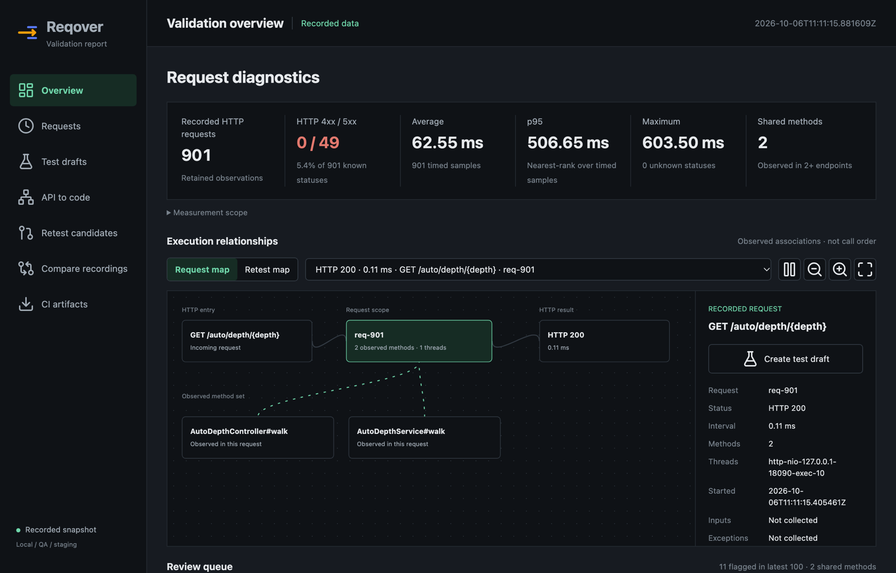
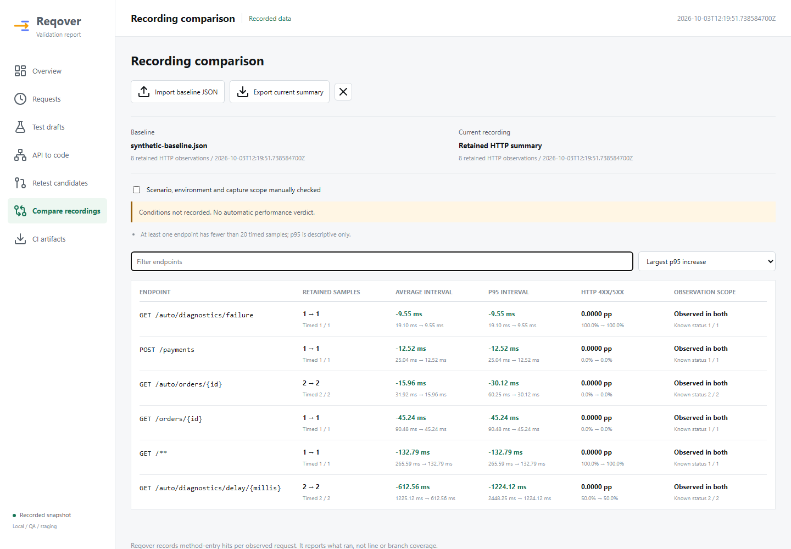
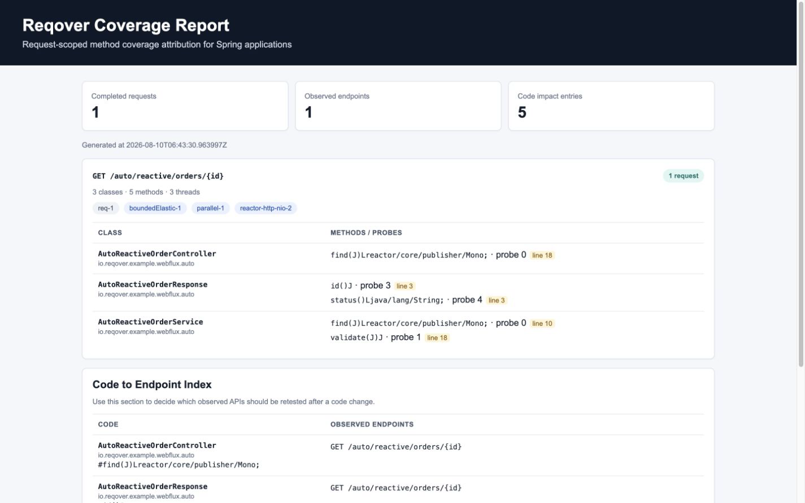
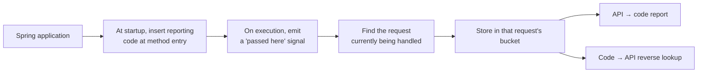

<div align="center">

<picture>
  <source media="(prefers-color-scheme: dark)" srcset="docs/assets/reqover-wordmark-dark.svg">
  
</picture>

<p><strong>Which code actually ran when this API was called?</strong></p>

<p>Runtime execution attribution for Spring MVC and WebFlux —<br>
recorded per request, answerable in reverse, and checkable in CI.</p>

<p>
  <a href="https://github.com/reqover-labs/reqover/actions/workflows/build.yml"></a>
  <a href="https://github.com/reqover-labs/reqover/releases/latest"></a>
  <a href="LICENSE"></a>
  <a href=".github/workflows/build.yml"></a>
  <a href="build.gradle.kts"></a>
</p>

<p>
  <a href="#try-it-in-5-minutes"><b>Quickstart</b></a> ·
  <a href="#what-problem-it-solves">Why</a> ·
  <a href="#use-it-in-ci">In CI</a> ·
  <a href="#how-it-works">How it works</a> ·
  <a href="docs/17_integration_guide.md">Integration</a> ·
  <a href="https://youtu.be/N62BEzVchSM">Demo video</a> ·
  <a href="docs/README.md">Docs</a> ·
  <a href="README.ko.md">한국어</a>
</p>

</div>



<p align="center">
  <a href="https://youtu.be/N62BEzVchSM"><b>▶&nbsp; Watch the 2-minute demo</b></a><br>
  <sub>Recorded on v0.2.0: request separation, reverse lookup, WebFlux thread hops and PR comments. For the current dashboard, use the quickstart below.</sub>
</p>

> [!IMPORTANT]
> Reqover `0.4.2` is an **early development release**. The libraries are on Maven Central as `io.github.reqover-labs`, and the agent and CLI jars are on [GitHub Releases](https://github.com/reqover-labs/reqover/releases). Reqover is designed for development, QA, and staging — not for running permanently in production.


## What problem it solves

A test coverage tool (JaCoCo, for example) tells you this:

> `OrderService.find()` — executed ✅

One thing it does not tell you: **who** executed it. Was it `GET /orders/{id}`? An admin batch job? Both? Coverage numbers alone cannot say, so you usually end up tracing through the code by hand.

Reqover records **the methods observed during each request's adapter scope, kept separate per request**. In MVC that scope begins after handler mapping; it is not the entire network round trip or an ordered call trace. That makes the following possible:

|                                                        | Ordinary coverage tools | Reqover                |
| ------------------------------------------------------ | ----------------------- | ---------------------- |
| Which code ran                                         | ✅                       | ✅                      |
| See only the code `POST /payments` ran                 | Trace it yourself       | ✅ Straight from the report |
| List the APIs that reach `SharedValidator`             | Trace it yourself       | ✅ Reverse lookup       |
| Name the APIs a pull request's diff affects            | Trace it yourself       | ✅ `reqover impact` in CI |
| How many lines/branches of a method ran                | ✅ Precise               | ❌ Not supported        |

**Reqover does not replace JaCoCo.** JaCoCo answers "how thoroughly is this tested?"; Reqover answers "who executed this code?" They are meant to be used together.

### When this is useful

- **Change impact** — you touched one shared utility and don't know how many APIs go through it
- **Choosing QA scope** — you see the changed files in a code review and want to narrow down which APIs to re-run, and you would rather have that posted on the pull request than work it out by hand
- **Reading unfamiliar code** — you joined an undocumented service and want to see how deep one API actually reaches
- **Debugging WebFlux** — request handling is scattered across threads and the flow is hard to follow

## Slow and failing requests, before you deploy

Since 0.4.0 the report is an offline dashboard. Open it from the report endpoint,
from the file the application exports on shutdown, or with `reqover render`.


- **Request diagnostics** — HTTP status and the adapter's recorded interval for
  each retained request, with average, p95 and maximum. Filter to failures or to
  requests over a threshold, then expand one to see the methods it ran.
  [Details](docs/24_request_diagnostics.md)
- **Recording comparison** — import the summary of an earlier recording and see
  which endpoints got slower or started failing. It shows the deltas and leaves
  the verdict to you. [Details](docs/28_recording_comparison.md)
- **Test drafts** — turn an observed request into a reviewed JSON draft or a
  disabled GET/HEAD JUnit test. Review it, set an explicit local/QA base URL and
  remove `@Disabled` yourself before running it in your existing test suite.
  [Details](docs/27_test_case_drafts.md)
- **In CI** — the Action analyses an existing recording and keeps one marked
  comment per analysis. Set `upload-artifact: "true"` to retain the dashboard;
  upload is off by default. [Details](docs/26_dashboard_and_ci.md)



These are what the adapter observed: no method timings, call order, client-side
latency or whole-service TPS. Timing statistics cover the retained requests,
while the default store's endpoint counts and executed code cover the whole recording.

## Three things the report shows

### 1. Execution paths split per API

Call `GET /orders/{id}` and `POST /payments` against the same application, and the controllers and services each request executed are shown **separated by API**. `SharedValidator`, which both requests passed through, appears under both — and methods reached by two or more APIs are highlighted separately. (A signal that changing it affects several places.)

### 2. Tracking that survives thread hops (WebFlux)

WebFlux switches threads several times while handling a single request. That normally loses the answer to "which request caused this code to run" — Reqover keeps recording it under the same request even after the thread changes.



### 3. Code → API reverse lookup

`Code to Endpoint Index` is the same data flipped around: for each method, **the APIs that executed it are listed.** Use it to decide where to look first after changing code. Method names are shown in a readable form like `find(long): OrderResponse` rather than JVM descriptors.

> Use the filter for endpoint, class or method text. `/` focuses search when you are not editing a text field, and `Esc` clears the report filter. In 0.4.2, entering `/` in a draft path or another input no longer steals focus. Descriptors match either spelling, so `(J)` and `long` find the same method. Without scripting, the static tables remain readable and browser find still works.


> How and where these screenshots were captured is recorded in [README Demo Capture](docs/16_readme_demo_capture.md).

## Try it in 5 minutes

Before wiring Reqover into your own project, we recommend running the demo application first.

**You need**

- JDK 17 or 21 (check with `java -version`)
- Git
- One free port (the examples below use 8080)

> [!WARNING]
> The demo report page has **no authentication.** The scripts below bind to `127.0.0.1` (reachable only from your own machine). Do not expose this port to a network.

### macOS / Linux

```bash
git clone https://github.com/reqover-labs/reqover.git
cd reqover
git checkout v0.4.2

./gradlew test
./scripts/run-agent-demo.sh mvc 8080
```

### Windows (PowerShell)

```powershell
git clone https://github.com/reqover-labs/reqover.git
Set-Location .\reqover
git checkout v0.4.2

# JAVA_HOME must point at JDK 17 or 21
$env:Path = "$env:JAVA_HOME\bin;$env:Path"

.\gradlew.bat test
.\scripts\run-agent-demo.ps1 -App mvc -Port 8080
```

### Then

When the script prints an address and waits, open this in your browser:

```
http://127.0.0.1:8080/reqover/report.html
```

Open **Requests** to inspect the recorded request, or **API to code** to see
its endpoint's executed code. With the default accessor-skipping policy:

```
GET /auto/orders/{id}          2 classes · 3 methods · 1 thread
  AutoOrderController          io.reqover.example.mvc.auto
  AutoOrderService             io.reqover.example.mvc.auto
```

Press `Enter` in the terminal running the script to shut it down. To print the
JSON and stop without waiting, pass a third argument. This does not save an HTML
file; use the report export settings or the HTML download button to keep one.

```bash
./scripts/run-agent-demo.sh mvc 8080 --stop-after-report
```

For failure/slow-request examples while the MVC demo is running, use a second
terminal. These read-only demo endpoints have a maximum delay of 2000 ms:

```bash
curl -s http://127.0.0.1:8080/auto/diagnostics/delay/1200
curl -s -o /dev/null -w '%{http_code}\n' http://127.0.0.1:8080/auto/diagnostics/failure
```

Refresh the dashboard: the second request deliberately returns 503. On
PowerShell, use `curl.exe`. [Request guide](docs/24_request_diagnostics.md).

### To see the WebFlux version

```bash
./scripts/run-agent-demo.sh webflux 8081
```

```powershell
.\scripts\run-agent-demo.ps1 -App webflux -Port 8081
```

This time you should see `GET /auto/reactive/orders/{id}` together with **two or more distinct thread names.** That is the evidence that tracking survived the thread hop.
Open `http://127.0.0.1:8081/reqover/report.html` for this sample.

### To see the whole CI loop at once

```bash
./scripts/run-impact-demo.sh 8080
```

This records traffic, exports the report to a file when the application shuts
down, and then asks which endpoints a change to one demo class would affect. It
is the same sequence the [CI section](#use-it-in-ci) describes, in one command.

### To wire it into your own project

One dependency brings the adapters, the report, and the Spring wiring:

```kotlin
implementation("io.github.reqover-labs:reqover-spring-boot-starter:0.4.2")
```

Then attach the agent and name the packages to record:

```bash
java -javaagent:reqover-agent-0.4.2.jar=include=com.example.orders -jar your-app.jar
```

See the [Spring integration guide](docs/17_integration_guide.md) for the full
property list. If it doesn't work, [opening an issue](https://github.com/reqover-labs/reqover/issues) genuinely helps — where people get stuck is the information this project needs most right now.

## Use it in CI

A report you look at once is worth less than a report that answers a question
every time someone opens a pull request. That question is:

> I changed these files. **Which APIs should be retested?**

Reqover answers it because it already knows which endpoints executed which
methods. Point it at a diff and the reverse lookup becomes a checklist.

### 1. Get a report out of a test run

The starter can write the report to a file when the application shuts down, so
an integration test run leaves one behind:

```properties
reqover.report.export.json-path=build/reqover-report.json
```

Run your integration tests with the agent attached, let the application stop
normally, and the file is there. (A process killed with `SIGKILL` writes
nothing.) Commit that file as a baseline, or keep it as a CI artifact.

### 2. Ask what a change affects

```bash
git diff --name-only origin/main... \
  | java -jar reqover-cli-0.4.2.jar impact --report build/reqover-report.json --changed-files - --format markdown
```

```
### Reqover — endpoints to retest

**2 endpoints** were observed executing code this change touches.

| Endpoint | Changed code it ran |
| --- | --- |
| `GET /orders/{id}` | `OrderService#find(long): OrderResponse` |
| `POST /payments`   | `SharedValidator#validate(String)` |
```

The example assumes the downloaded CLI JAR is in the current directory;
otherwise use its full path. In a source build, use
`reqover-cli/build/libs/reqover-cli-0.4.2.jar`. The CLI
also has `render` (report JSON to a standalone page) and `diff` (what changed
between two recordings). `--fail-on-impact` turns the analysis into a gate:
exit code 0 when nothing is affected, 1 when something is, 2 on bad input.

### 3. Have it comment on the pull request

```yaml
- uses: reqover-labs/reqover/.github/actions/impact@v0.4.2
  with:
    report: build/reqover-report.json
    upload-artifact: "true"
    artifact-name: reqover-${{ github.job }}-${{ strategy.job-index || 'single' }}
    analysis-name: ${{ github.job }}-${{ strategy.job-index || 'single' }}
```

This belongs after recording and Java setup in a `pull_request` job. Checkout
needs `fetch-depth: 0`; the runner needs Java 17+, Bash, Git, curl and Python 3.
Same-repository comments require `pull-requests: write`; set `comment: "false"`
without that permission. Fork comments are skipped. Use distinct artifact and
analysis names for multiple invocations; the Action does not launch tests.

> [!NOTE]
> Impact analysis can only speak about code it **observed running**. A file it
> reports as having no observed coverage may simply not have been exercised by
> the traffic that produced the report. Treat the output as where to start
> looking, not as proof that anything else is safe.

Full walkthrough, including a complete workflow file: [Impact analysis in CI](docs/18_ci_impact_analysis.md).

## How it works

In one sentence: **when the application starts, Reqover inserts code that reports "execution passed here", then groups those reports per request.**


```mermaid
flowchart LR
  A["Spring application"] --> B["At startup, insert reporting<br/>code at method entry"]
  B --> C["On execution, emit<br/>a 'passed here' signal"]
  C --> D["Find the request<br/>currently being handled"]
  D --> E["Store in that request's bucket"]
  E --> F["API → code report"]
  E --> G["Code → API reverse lookup"]
```

In a little more detail:

1. **Inserting the code** — Java has an official mechanism (a Java agent) for adjusting classes as an application loads them. Reqover uses it to add a recording call at the entry of methods in the packages you name. **Your source code is never modified.**
2. **Linking to the request** — in MVC it uses the storage bound to each request; in WebFlux it uses the context Reactor carries along with the request, to answer "which request is this?"
3. **Building the report** — once a request finishes, the records are grouped by API and rendered as JSON and HTML. The HTML opens on its own with no other files.

Design documents: [System architecture](docs/02_architecture.md) · [Agent E2E Demo](docs/09_agent_e2e_demo.md)

## What works / What doesn't

Written plainly. Using a tool with the wrong expectations wastes everyone's time.

### What works

- Per-request execution records for Spring MVC and WebFlux
- Offline dashboard, animated observed associations, status/slow filters and request details
- Retained HTTP timing/status summary comparison, separate from the CLI's code diff
- Reviewed JSON drafts and disabled GET/HEAD JUnit exports, without original-input replay
- Automatic recording at method entry (no source changes)
- API → code report, and the code → API reverse lookup
- Reports written to and read back from JSON, so they outlive the JVM
- Changed files → endpoints to retest, as a CLI command and a GitHub Action
- Diffing two recordings
- Spring Boot auto-configuration, and a starter that wires it in one dependency
- An opt-in report endpoint and a shutdown export to a file
- Attribution for units of work that are not HTTP requests, through `UnitScope`
- A replaceable storage SPI (`CoverageStore`)
- E2E tests that attach the agent in a separate JVM
- Dependency inventory (SBOM, CycloneDX 1.6)

### What doesn't / Things to know

- **It does not know which lines ran.** Method granularity only. If you need line and branch precision, use JaCoCo.
- **Compiler-generated methods and runtime proxies** (Spring CGLIB, Hibernate, Byte Buddy, Mockito) are excluded. Trivial getters, setters, builders and record accessors are skipped by default; `accessors=record` keeps them for impact recordings. `references=record` additionally observes included interface calls/static-field reads, not the referenced implementation's execution. Requests served by the unmapped catch-all resource handler are excluded.
- **Records live in memory only.** The default cap is 10,000 per-request records (`reqover.mvc.max-snapshots` / `reqover.webflux.max-snapshots`); beyond that the oldest are dropped. Which endpoints ran, how often and what they executed is kept separately per endpoint, so an endpoint called only early in a long recording stays in the report. Restarting the application clears everything. `CoverageStore` is the extension point for storing them elsewhere, but Reqover ships no persistent implementation — export the report to a file instead.
- **Exported details have their own bound.** JSON defaults to the newest 100 unit details and reports `omittedRequestDetails`; endpoint aggregates remain complete. Live HTML timing summaries use retained HTTP snapshots, while HTML rendered from exported JSON can use only that file's details. For a complete retained timing baseline, export the live dashboard's summary.
- **Impact analysis is bounded by what was recorded.** It matches changed files against code the report observed running. A file it cannot match is reported as unmatched, which means "not seen", not "not affected".
- **MVC async sections are not linked automatically.** Work handed to a separate thread is not recorded; attribution resumes when request handling returns.
- **The WebFlux adapter turns on one JVM-wide setting.** (Reactor's automatic context propagation — needed to carry request information across threads.) If you don't want that, disable the adapter entirely with `reqover.webflux.enabled=false` before the application starts.
- **The agent records nothing unless you pass `include=`.** This default exists to prevent accidentally instrumenting everything. JDK internals and Reqover's own classes cannot be instrumented even with an include.
- **The report only shows what was actually observed.** Absence from the report does not prove a relationship doesn't exist — you may simply not have called that API yet.
- **The reverse lookup is a "start looking here" hint.** It is not a complete change-impact analysis.
- **The demo report page has no authentication.** Keep it on `127.0.0.1`.

The published [method-entry benchmark](docs/15_performance_results.md) · [한국어판](docs/15_performance_results.ko.md) measured about 24 ns per entry under its stated setup. This is a dated, narrow measurement, not a full 0.4.2 dashboard/export/reference-probe or production-overhead guarantee. Check its raw samples and excluded costs before applying it to your application.

## Support matrix

| Item                      | Current                       |
| ------------------------- | ----------------------------- |
| Version                   | `0.4.2`                       |
| JDK required to build     | 17 or 21                      |
| Bytecode target           | Java 17                       |
| CI                        | Ubuntu + Temurin 17 / 21      |
| Spring Boot in samples    | 3.5.16                        |
| MVC                       | Implemented + integration tests |
| WebFlux                   | Implemented + thread-hop integration tests |
| Report formats            | JSON, self-contained HTML, Markdown (impact and diff) |
| CI integration            | CLI with exit-code gates, GitHub Action |
| Distribution              | Maven Central (libraries) and GitHub Release (agent, CLI)                 |

## Repository layout

Knowing what each directory does makes the code much faster to read.

| Directory                 | What it does                                              |
| ------------------------- | --------------------------------------------------------- |
| [reqover-core](reqover-core/README.md) | Buckets, bounded snapshots and recording-wide aggregates |
| [reqover-instrumentation](reqover-instrumentation/README.md) | ASM method-entry and optional reference probes |
| [reqover-agent](reqover-agent/README.md) | Standalone `-javaagent` JAR and recording options |
| [reqover-spring-mvc](reqover-spring-mvc/README.md) | MVC request lifecycle and attribution |
| [reqover-spring-webflux](reqover-spring-webflux/README.md) | Reactive request attribution across thread hops |
| [reqover-spring-boot-starter](reqover-spring-boot-starter/README.md) | Application wiring, opt-in report endpoint and exports |
| [reqover-report](reqover-report/README.md) | Dashboard, diagnostics, drafts, summaries, code diff and impact |
| [reqover-cli](reqover-cli/README.md) | Offline `render`, `diff`, `impact`, `version` and `help` |
| `examples/mvc-sample`     | MVC demo application                                      |
| `examples/webflux-sample` | WebFlux demo application                                  |
| `docs`                    | Design, measurement, and decision records                 |
| `scripts`                 | Demo runners, the impact demo, and the SBOM check script  |

### Build and dependency inventory

```bash
./gradlew clean test      # tests
./gradlew cyclonedxBom    # generate the dependency inventory
```

On Windows use `.\gradlew.bat`. The inventory is written to `build/reports/bom/reqover.cdx.json`, and the copy pinned to the release is at [`sbom/reqover.cdx.json`](sbom/reqover.cdx.json). Reproduce the known-vulnerability check with:

```bash
./scripts/check-sbom-osv.py sbom/reqover.cdx.json
```

## Contributing

This is a small project, so anything helps. The most valuable contribution right now is a report saying **"I ran the demo and it didn't work."**

**Good first steps**

- Run the demo and [open an issue](https://github.com/reqover-labs/reqover/issues/new/choose) about whatever broke — include your OS and JDK version, the exact command, and what actually happened
- Point out sentences in the README or `docs/` that don't make sense; if it isn't understandable, that is a bug
- Try `reqover impact` on a real repository and tell us where the file matching got it wrong — that heuristic needs contact with projects we didn't write
- Translate a document still marked *(Korean)*
- Tell us what happened when you wired it into your own Spring project

Fork, branch, confirm `./gradlew clean test` passes, and open a pull request against `main`. For anything large, open an issue first — work thrown away because the direction didn't match is the worst outcome for everyone. Full rules and the PR checklist: [Contributing Guide](CONTRIBUTING.md) · [Code of Conduct](CODE_OF_CONDUCT.md)

Issues, pull requests, and commit messages are written in English so contributors anywhere can follow the history. Questions in Korean are welcome — just add an English summary.

> [!CAUTION]
> **Do not report security vulnerabilities in public issues.** Use the private reporting process in the [Security Policy](SECURITY.md).

## Glossary

<details>
<summary>Terms that keep appearing in this project's docs and code</summary>

| Term                | Meaning                                                          |
| ------------------- | ---------------------------------------------------------------- |
| **Endpoint**        | One API address, such as `GET /orders/{id}`                       |
| **Instrument**      | Inserting recording calls into code so execution can be observed  |
| **Java agent**      | The official Java mechanism for adjusting classes as they load    |
| **ASM**             | A library for reading and modifying Java class files; used here for instrumentation |
| **WebFlux**         | Spring's reactive web stack; one request may cross several threads |
| **Bucket**          | The record holder for a single request — "the methods this request passed through" |
| **SBOM**            | The inventory of third-party libraries this project uses; used for vulnerability checks |

</details>

## Documentation

- [Current documentation index](docs/README.md) · [한국어판](docs/README.ko.md)
- [Request diagnostics](docs/24_request_diagnostics.md) · [한국어판](docs/24_request_diagnostics.ko.md)
- [Dashboard and CI artifacts](docs/26_dashboard_and_ci.md) · [한국어판](docs/26_dashboard_and_ci.ko.md)
- [Reviewed test drafts](docs/27_test_case_drafts.md) · [한국어판](docs/27_test_case_drafts.ko.md)
- [Recording comparison](docs/28_recording_comparison.md) · [한국어판](docs/28_recording_comparison.ko.md)

- [System architecture](docs/02_architecture.md) · [한국어판](docs/02_architecture.ko.md)
- [Spring integration guide](docs/17_integration_guide.md) · [한국어판](docs/17_integration_guide.ko.md)
- [Impact analysis in CI](docs/18_ci_impact_analysis.md) · [한국어판](docs/18_ci_impact_analysis.ko.md)
- [Prior art — and when to use a different tool](docs/19_prior_art.md) · [한국어판](docs/19_prior_art.ko.md)
- [Versioning, compatibility, and rollback](docs/20_versioning_and_compatibility.md) · [한국어판](docs/20_versioning_and_compatibility.ko.md)
- [Performance measurement](docs/11_performance_measurement.md) · [Measured agent overhead](docs/15_performance_results.md) · [한국어판](docs/15_performance_results.ko.md)
- [JaCoCo interop decision](docs/14_jacoco_interop_decision.md) · [README demo capture](docs/16_readme_demo_capture.md)
- [Competition preparation documents](docs/competition/README.md) (Korean)

Original plans, Phase 0 notes, old video scripts and review records remain as
historical material in the index; they are not the current installation guide.

Documents marked *(Korean)* have not been translated yet. Translations are welcome contributions.

**Project files** — [Getting help](SUPPORT.md) · [Roadmap](ROADMAP.md) · [Governance](GOVERNANCE.md) · [Contributing](CONTRIBUTING.md) · [Code of Conduct](CODE_OF_CONDUCT.md) · [Security policy](SECURITY.md) · [Changelog](CHANGELOG.md)

## Team

[Reqover Lab](https://github.com/reqover-labs) — building Reqover, initially as an entry for the 2026 Korea Open Source Developer Competition.

Reqover started as a competition entry, but we intend to keep maintaining it past
the contest. Issues and pull requests are welcome regardless of the competition
timeline.

| Name | GitHub | LinkedIn | Area |
| --- | --- | --- | --- |
| TaeHui Kim | [@TaeHuiKKIM](https://github.com/TaeHuiKKIM) | [TaeHui Kim](https://www.linkedin.com/in/taehui-kim-930713412/) | Design and MVP implementation: core, instrumentation, agent, report, demos |
| Sangmin Lee | [@lsmin3388](https://github.com/lsmin3388) | [Sangmin Lee](https://www.linkedin.com/in/sangminn0) | Design and public repository work: build, CI, core hardening, Spring adapters, docs |

## License

Code written for Reqover is licensed under the [Apache License 2.0](LICENSE). Third-party licenses are listed in [THIRD_PARTY_NOTICES.md](THIRD_PARTY_NOTICES.md).
