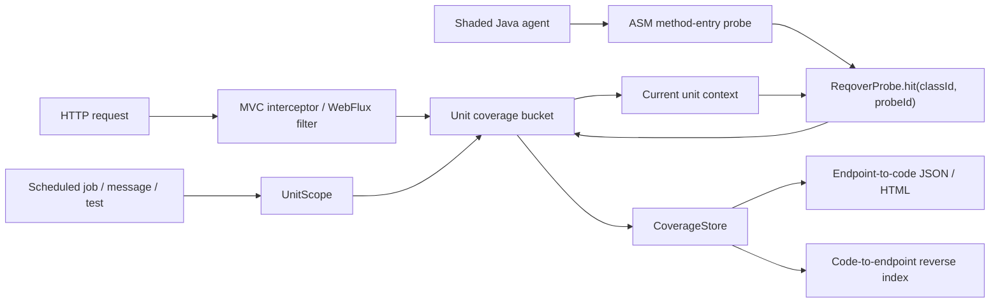
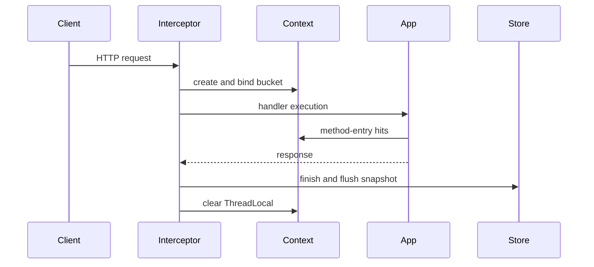
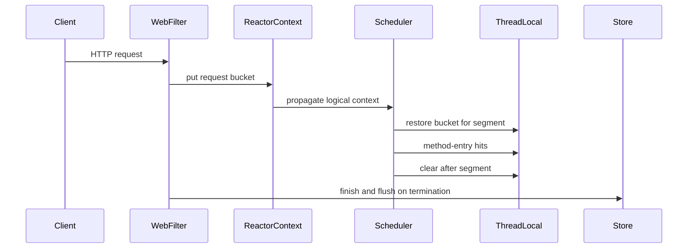
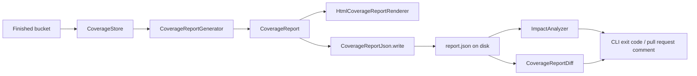

**한국어** | [English](02_architecture.md)

# 02. 시스템 아키텍처

이 문서는 Reqover `0.2.0`의 실제 구현을 설명합니다. 향후 아이디어가 아니라
현재 코드와 자동 테스트가 보장하는 범위만 포함합니다.

## 전체 흐름



Reqover는 네 층으로 나뉩니다.

1. **Instrumentation**: Java agent가 명시적으로 포함된 application class의
   method entry에 probe 호출을 삽입합니다.
2. **Attribution**: Spring adapter가 현재 HTTP 요청의 bucket을 context에
   연결하고 probe hit을 그 bucket으로 보냅니다. HTTP 요청이 아닌 작업 단위는
   `UnitScope`가 같은 일을 합니다.
3. **Reporting**: 완료된 snapshot을 작업 단위 기준으로 합치고 정방향·역방향
   관계를 standalone HTML로 렌더링하거나, JVM보다 오래 남는 JSON 문서로
   기록합니다.
4. **Analysis**: CLI가 기록된 report를 별도 JVM에서 읽어 diff, impact 목록,
   exit code로 바꿉니다.

## 모듈 책임

| 모듈 | 실제 책임 |
| --- | --- |
| `reqover-core` | bucket, unit info와 scope, ThreadLocal context, probe registry, `CoverageStore` SPI |
| `reqover-instrumentation` | ASM class transform, stable class ID, method metadata |
| `reqover-agent` | `premain`, include/exclude 정책, shaded standalone agent JAR |
| `reqover-spring-mvc` | MVC interceptor와 request lifecycle |
| `reqover-spring-webflux` | WebFilter, Reactor Context ↔ ThreadLocal bridge |
| `reqover-report` | endpoint aggregation, reverse index, HTML renderer, JSON read/write, diff, impact 분석 |
| `reqover-spring-boot-starter` | core·report·양쪽 adapter를 한 의존성으로 묶고 report service, opt-in HTTP endpoint, 종료 시 export 제공 |
| `reqover-cli` | shaded 실행 JAR. disk에서 읽은 report에 `render`, `diff`, `impact` 수행 |
| `examples/*` | manual probe와 agent 자동계측 E2E sample |

`reqover-report`는 `0.2.0`에서 렌더링 범위를 넘어섰습니다. JSON 영속화
(`CoverageReportJson`), report 비교(`CoverageReportDiff`), impact 분석
(`ImpactAnalyzer`)까지 이 모듈이 담당합니다. 그러면서도 의존성은 여전히
`reqover-core` 하나뿐입니다. JSON reader/writer를 직접 구현한 이유가 바로
이것으로, report를 만들거나 읽는 것만으로 application classpath에 JSON
라이브러리가 끌려 들어오지 않습니다.

`reqover-spring-boot-starter`는 `reqover-core`, `reqover-report`, 양쪽 adapter를
한 의존성으로 가져오며, Spring Boot auto-configuration을 직접 등록하는 유일한
모듈입니다. 다음을 제공합니다.

- `ReqoverReportService`: 활성 adapter가 context에 넣어 둔 `CoverageStore`에서
  요청 시점마다 report를 만듭니다.
- HTTP report endpoint: **기본 비활성**입니다.
  `reqover.report.endpoint.enabled=true`일 때만 등록되고,
  `reqover.report.endpoint.path`에 JSON을, 같은 경로 뒤에 `.html`을 붙인
  경로에 HTML을 제공합니다. servlet용과 reactive용 구현이 따로 있어 웹
  application 타입에 맞는 쪽만 활성화됩니다.
- `ReqoverReportExporter`: `DisposableBean`으로, application context가 닫힐 때
  `reqover.report.export.json-path`와 `reqover.report.export.html-path`에
  report를 씁니다. 둘 다 `ReqoverReportService`를 거치므로 파일 내용은
  endpoint가 제공했을 문서와 byte 단위로 같습니다. export 실패는 출력만 하고
  삼킵니다. 측정 도구가 shutdown 실패의 원인이 되어서는 안 되기 때문입니다.

starter가 등록하는 bean은 모두 `@ConditionalOnMissingBean`이라, application이
같은 bean을 직접 정의하면 Reqover 쪽이 물러납니다.

`reqover-cli`는 `render`, `diff`, `impact` 명령을 가진 shaded 실행 JAR입니다.
아무것도 계측하지 않고 실행 중인 application과도 연결되지 않으며, 이미 disk에
기록된 report만 소비합니다.

## Instrumentation

실행 형식은 다음과 같습니다.

```text
-javaagent:reqover-agent-0.2.0.jar=include=com.example.app
```

- `include=`는 필수이며 여러 prefix는 `;`, 옵션 사이는 `,`로 구분합니다.
- prefix는 점 표기 class 이름의 앞부분과 매치합니다. **가장 긴 prefix가 이기고,
  길이가 같으면 `exclude`가 이깁니다.** 따라서 더 긴 `include`는 더 짧은
  `exclude`를 이기며, 이 규칙 덕분에 기본 제외된 framework prefix의 하위
  package를 명시적 include로 뚫을 수 있습니다.
- 유효한 include가 없으면 agent는 fail-closed로 비활성화됩니다.
- 제외 계층은 두 종류이고, 차이가 중요합니다.

  | 계층 | prefix | include로 뚫을 수 있나 |
  | --- | --- | --- |
  | 하드 제외 | `java.` `javax.` `jakarta.` `jdk.` `sun.` `com.sun.` `org.objectweb.asm.` `io.reqover.core.` `io.reqover.agent.` `io.reqover.instrumentation.` `io.reqover.report.` `io.reqover.spring.` | **불가** — 어떤 include로도 안 됨 |
  | 기본 제외 | `org.springframework.` `reactor.` `io.micrometer.` | 가능 — 더 긴 include로 |
- starter는 `io.reqover.spring.boot` package이므로 `io.reqover.spring.` 하드
  제외에 이미 포함됩니다. CLI는 agent 없이 별도 JVM에서 실행되므로 목록에
  없습니다.
- ASM은 `io.reqover.agent.internal.asm`으로 relocate되어 application의 ASM과
  classpath 충돌하지 않도록 격리됩니다.
- 현재 probe 정밀도는 method-entry입니다. synthetic method는 제외합니다.

transform 결과는 class ID, probe ID, method 이름, JVM descriptor, 확인 가능한
첫 line metadata를 `ProbeRegistry`에 등록합니다. 변환 실패는 application 실행을
중단시키지 않고 해당 class의 계측만 포기합니다.

## Hit routing

계측된 application bytecode는 다음 정적 호출만 수행합니다.

```java
ReqoverProbe.hit(classId, probeId);
```

1. 현재 `CoverageContext`에 request bucket이 있으면 그 bucket에 기록합니다.
2. bucket이 없으면 global bucket에 기록합니다. global hit은 특정 HTTP
   endpoint로 오귀속하지 않습니다.
3. probe 내부 오류는 application 흐름으로 전파하지 않고 dropped-hit count로
   기록합니다.

정확성 원칙은 **미귀속이 오귀속보다 낫다**입니다.

## 작업 단위

모든 bucket은 `UnitInfo`에 속합니다. unit ID, unit type, 표시 이름, attribute
map으로 이루어진 record이며, 원래부터 HTTP에 묶이지 않은 형태였습니다. 정의된
타입은 `http-request`, `scheduled-job`, `message`, `test`, `global` 다섯
가지입니다. `0.2.0`이 더한 것은 `UnitScope`로, adapter를 새로 만들지 않고도
HTTP가 아닌 작업 단위를 쓸 수 있게 합니다.

```java
try (UnitScope scope = UnitScope.open(store, UnitInfo.scheduledJob(runId, "nightly-settlement"))) {
    settlementJob.run();
}
```

report는 타입과 무관하게 `UnitInfo.name()` 기준으로 묶습니다. 따라서 job 이름,
message destination, test 이름이 endpoint pattern과 같은 자리에 놓입니다.

귀속은 scope를 연 thread를 따라갑니다. 블록 안에서 다른 thread로 넘긴 작업은
그 thread가 같은 bucket에 `UnitScope.join(bucket)`을 열지 않는 한 이 작업
단위로 기록되지 **않습니다.** `open`이 반환한 scope를 닫으면 bucket을
`CoverageBucket.NO_STATUS`로 종료하고 정확히 한 번 flush합니다. 두 번 닫는 것은
no-op이라 블록을 조기 종료하거나 예외로 빠져나와도 안전합니다. `join` scope를
닫으면 종료·flush 없이 이전 context만 복원하며, 종료와 flush는 bucket을 만든
scope의 몫으로 남습니다.

## Spring MVC lifecycle



normalized endpoint pattern은 Spring의 best-matching pattern을 사용하고, pattern이
아직 없으면 request URI로 fallback합니다. Servlet async re-dispatch에는 기존
bucket을 재사용하지만, re-dispatch 전 async worker thread의 application 실행은
현재 `0.2.0`에서 자동 전파하지 않습니다.

## Spring WebFlux lifecycle



Micrometer Context Propagation의 `ThreadLocalAccessor`가 Reactor Context의 bucket을
각 scheduler segment에서 `CoverageContext`로 복원합니다. agent E2E는 같은
endpoint bucket에 transport별 `reactor-http-*`(`nio` 또는 `epoll`), `boundedElastic-*`, `parallel-*` hit과
thread hop 뒤의 `validate(J)J` method가 함께 기록되는지 확인합니다. manual·auto
reactive 요청 20개를 병렬 실행해 endpoint별 10개씩 분리되고 class가 교차하지
않는지도 검증합니다.

## Snapshot과 store

`CoverageStore`는 귀속과 보관을 가르는 이음새입니다. adapter와 `UnitScope`는
`flush(CoverageBucket)`, `snapshots()`, `clear()` 세 메서드만 알기 때문에, 완료된
bucket을 어떻게 처리할지는 교체 지점이 됩니다. heap에 두든, 어딘가에 쓰든,
sampling 규칙으로 버리든 구현의 자유입니다. 구현체는 동시 사용에 안전해야 하고,
`flush`는 작업 단위를 끝낸 thread — 보통 HTTP worker — 에서 호출되므로 오래
블로킹하면 안 됩니다.

`InMemoryCoverageStore`는 그 인터페이스의 한 구현이자 기본으로 제공되는
구현입니다. 최대 `maxSnapshots`개를 보관하고 초과 시 오래된 항목부터
제거합니다. 이 상한은 생성자 인자이고 기본값은 10,000이며, adapter가
`reqover.mvc.max-snapshots`와 `reqover.webflux.max-snapshots` 속성으로
노출합니다. 두 adapter 모두 store bean을
`@ConditionalOnMissingBean(CoverageStore.class)`로 선언하므로, application이 자체
`CoverageStore`를 등록하면 interceptor·filter·report service가 모두 그것을
사용합니다.

## Report 생애주기

기록된 bucket이 CI의 답이 되기까지의 경로는 하나입니다.



`CoverageReportGenerator`는 store가 보관 중인 snapshot을 읽어
`UnitInfo.name()` 기준으로 묶고, 모든 `(classId, probeId)` 쌍을
`ProbeRegistry`로 해석합니다. 결과인 `CoverageReport`에는 다음이 포함됩니다.

- endpoint(또는 다른 작업 단위 이름)와 완료 요청 수
- request ID 목록
- 관측 thread 이름
- class, method, descriptor, probe ID, 확인 가능한 첫 line
- 각 method를 실행한 관측 endpoint의 reverse index

여기서 report는 두 갈래로 갑니다. `HtmlCoverageReportRenderer`는 사람이 읽는
standalone 페이지를 만듭니다. endpoint 카드와 code-to-endpoint 표로 구성되며,
heatmap, thread transition timeline, execution duration chart는 제공하지
않습니다. `CoverageReportJson`은 같은 report를 JSON 문서(`schemaVersion` 1)로
파일에 씁니다.

**기록된 report는 완전히 해석된 상태입니다.** class 이름, method 이름,
descriptor, line 번호가 문서 안에 들어 있고 읽을 때 다시 조회하지 않습니다.
CLI가 다른 JVM, 다른 머신에서 `ProbeRegistry`도 agent도 없이 report를 렌더링하고
비교하고 분석할 수 있는 구조적 이유가 이것입니다. 문서가 담은 probe ID는 그것이
가리키던 이름과 함께 이동합니다.

JSON은 정렬된 컬렉션으로 pretty-print되므로 같은 트래픽을 두 번 기록하면
`generatedAt`을 빼고 byte 단위로 동일한 파일이 나옵니다. 의도된 설계이며,
baseline report를 커밋해 두고 git에서 깔끔하게 diff하기 위한 것입니다.

기록된 문서를 읽는 소비자는 둘이고, 어느 쪽도 application을 필요로 하지
않습니다.

- `ImpactAnalyzer`는 변경된 source 경로를 reverse index와 대조해, 그 파일의
  코드를 실행한 것으로 관측된 endpoint를 알려 줍니다. binary class 이름을 그
  class가 선언되었을 source 경로로 바꾼 뒤, 변경 경로가 디렉터리 경계에서 그
  경로로 끝나면 매치로 봅니다.
- `CoverageReportDiff`는 baseline report와 현재 report를 비교해 한쪽에만 있는
  endpoint와, endpoint가 새로 실행하거나 더 이상 실행하지 않게 된 코드를
  보고합니다.

`reqover-cli`는 이 둘을 `impact`, `diff` 명령으로, HTML 렌더링을 `render`
명령으로 노출합니다. `--fail-on-impact`와 `--fail-on-change`는 결과를 exit code
`1`로 바꾸고, `2`는 잘못된 사용법이나 읽을 수 없는 입력에만 씁니다. 덕분에
파이프라인은 게이트가 걸린 것과 설정이 틀린 것을 구분할 수 있습니다.
`--format markdown`은 pull request 코멘트에 넣을 표를 만듭니다. 전체 흐름은
[18. Impact analysis in CI](18_ci_impact_analysis.md)에 있습니다.

## 데이터·보안 경계

Reqover bucket은 `UnitInfo`(unit ID, unit type, 이름, 그리고 HTTP 요청이라면
method와 normalized endpoint pattern이 담기는 작은 attribute map)와 시작/종료
시각, status, 관측 thread 이름, code hit metadata를 보유합니다. 다음 값은
수집하지 않습니다.

- request/response body
- authorization header와 cookie
- raw query parameter value

이는 정책이 아니라 구조적 성질입니다. `CoverageBucketSnapshot`에 해당 필드가
없고, adapter는 그 값을 읽는 servlet·reactive API를 호출하지 않습니다. 내보낸
JSON은 범위가 더 좁아서 작업 단위 이름, 요청 수, request ID, thread 이름, 코드
식별자만 담고 bucket이 갖고 있던 시각·status·attribute는 담지 않습니다.

starter의 HTTP report endpoint는 기본 비활성이고 자체 인증을 제공하지 않습니다.
활성화하면 `reqover.report.endpoint.path`에 내부 class·method 이름이 공개되므로
애플리케이션의 인증·네트워크 정책 아래에 두어야 합니다.
[통합 가이드](17_integration_guide.ko.md)를 참고하세요. sample은 이를 명시적으로
켜고 데모 스크립트는 `127.0.0.1`에만 bind합니다. 종료 시 export는 같은 문서를
지정한 경로에 쓰므로, 그 파일도 report와 동일하게 취급해야 합니다.

## 해석 한계

- Reqover는 JaCoCo의 line/branch coverage를 대체하지 않습니다.
- report는 관측된 실행 관계의 하한입니다.
- reverse index는 먼저 재검증할 API를 좁히는 신호이며 완전한 정적 변경 영향
  분석이 아닙니다.
- impact 분석도 같은 한계를 물려받습니다. 기록 중 한 번도 실행되지 않은 변경
  파일은 unmatched로 보고되며, 이는 영향이 없다는 뜻이 아닙니다.
- unmanaged thread와 MVC async worker의 context는 자동 보장하지 않습니다. 다른
  thread에는 `UnitScope.join`이 필요합니다.
- `0.2.0`은 개발·QA·CI 활용을 우선합니다. 보관은 기본적으로 in-memory이고
  report는 export하거나 제공할 때만 JVM 밖으로 나가며, production always-on
  agent를 주장하지 않습니다.
