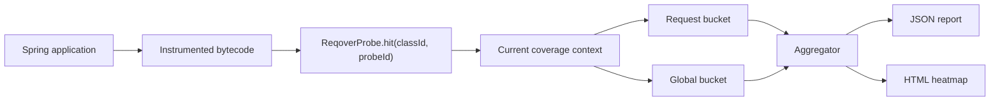
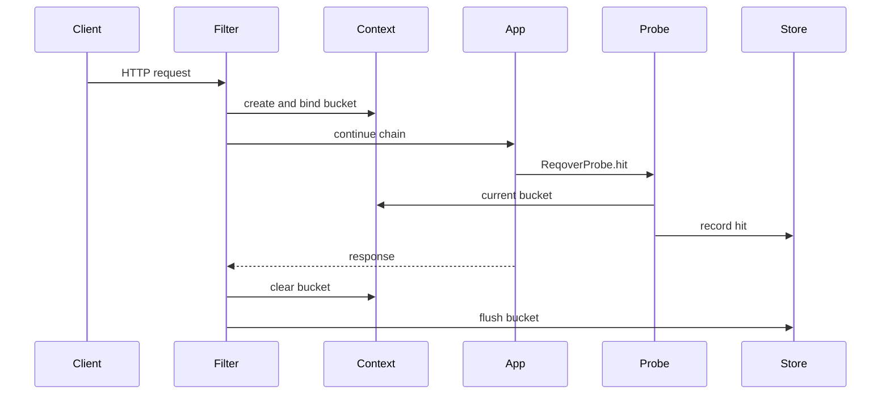
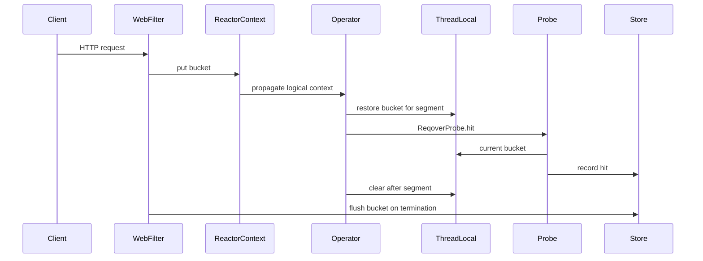

# 02. 시스템 아키텍처

## 전체 구조

Reqover는 크게 세 층으로 나눕니다.

1. Instrumentation layer: 애플리케이션 bytecode에 probe hit 호출을 삽입합니다.
2. Attribution layer: hit이 발생한 시점의 요청 context를 찾아 bucket에 기록합니다.
3. Report layer: bucket 데이터를 사람이 읽을 수 있는 endpoint별 coverage 리포트로 변환합니다.



## 모듈 설계 초안

### reqover-core

프레임워크와 무관한 핵심 모듈입니다.

책임:

- `CoverageBucket`
- `CoverageContext`
- `ReqoverProbe`
- hit 저장 자료구조
- bucket lifecycle
- aggregation model

### reqover-instrumentation

bytecode instrumentation을 담당합니다.

초기 후보:

- ASM
- Byte Buddy
- Java agent
- Gradle task 기반 offline instrumentation

MVP에서는 Java agent보다 offline 또는 test-time instrumentation이 더 단순할 수 있습니다. 다만 대회 데모의 임팩트를 위해 최종 형태는 `-javaagent` 실행을 목표로 합니다.

### reqover-spring-mvc

Spring MVC adapter입니다.

책임:

- Servlet Filter 등록
- 요청 시작 시 bucket 생성
- ThreadLocal에 bucket 바인딩
- 요청 종료 시 bucket flush
- endpoint pattern 추출

### reqover-spring-webflux

Spring WebFlux adapter입니다.

책임:

- WebFilter 등록
- Reactor Context에 bucket 저장
- thread hop 이후 ThreadLocal 복원
- context window 밖에서는 global bucket으로 fallback

### reqover-report

리포트 생성 모듈입니다.

책임:

- bucket snapshot 수집
- endpoint별 집계
- class/method/line mapping
- JSON 출력
- HTML 출력

### reqover-gradle-plugin

사용성을 위한 Gradle plugin입니다.

초기에는 선택 사항입니다. 제출 전 시간이 부족하면 README 기반 수동 실행으로 대체할 수 있습니다.

## Runtime data model

### CoverageBucket

```java
class CoverageBucket {
    String requestId;
    String method;
    String endpointPattern;
    Instant startedAt;
    Instant endedAt;
    ConcurrentMap<Integer, ProbeSet> hitsByClass;
}
```

### ProbeSet

초기 구현은 단순성과 검증 가능성을 우선합니다.

후보:

- `BitSet`
- `boolean[]`
- RoaringBitmap
- primitive int set

MVP에서는 `BitSet`이 적절합니다. class별 probe 수가 확정되면 `boolean[]` 또는 pooled bitset으로 최적화합니다.

### CoverageContext

MVC에서는 ThreadLocal을 기본으로 둡니다.

```java
final class CoverageContext {
    static final ThreadLocal<CoverageBucket> CURRENT = new ThreadLocal<>();
}
```

WebFlux에서는 Reactor Context에 bucket을 저장하고, 실행 segment마다 ThreadLocal에 복원합니다.

## Hit routing

계측된 코드는 다음 호출을 실행합니다.

```java
ReqoverProbe.hit(classId, probeId);
```

routing 규칙:

1. 현재 ThreadLocal에 bucket이 있으면 그 bucket에 기록합니다.
2. ThreadLocal에 bucket이 없지만 framework context에서 복원 가능하면 복원 후 기록합니다.
3. 아무 bucket도 없으면 global bucket에 기록합니다.
4. 예외가 발생하면 애플리케이션 흐름을 깨뜨리지 않고 기록을 포기합니다.

## MVC sequence



## WebFlux sequence



## Instrumentation 전략

### Option A. 경량 자체 계측

장점:

- context-aware hit API를 처음부터 설계할 수 있습니다.
- 라이선스 구조가 단순합니다.
- Phase 0 PoC가 빠릅니다.

단점:

- JaCoCo 수준의 line/branch mapping을 직접 구현하기 어렵습니다.
- JVM edge case를 직접 처리해야 합니다.
- 최종 기능이 method coverage에 머물 위험이 있습니다.

### Option B. JaCoCo 확장

장점:

- line/branch coverage 분석 자산을 재사용할 수 있습니다.
- 리포트 생태계와 연결하기 쉽습니다.
- 기술적으로 더 설득력 있는 결과물이 될 수 있습니다.

단점:

- JaCoCo internal 구조를 파악해야 합니다.
- static probe array cache와 요청별 bucket routing이 충돌합니다.
- EPL-2.0 라이선스 정리가 필요합니다.

## 권장 진행

Phase 0에서는 Option A로 가장 작은 PoC를 먼저 만듭니다.

성공 기준:

- class/method 진입 probe가 삽입됩니다.
- `ReqoverProbe.hit`이 호출됩니다.
- MVC 동시 요청에서 bucket이 분리됩니다.
- WebFlux thread hop에서 bucket이 유지됩니다.

그 다음 JaCoCo 분석 엔진과 어떻게 만날지 결정합니다.

## 정확성 불변식

Reqover가 지켜야 할 핵심 불변식입니다.

1. 요청 context window 밖의 hit은 특정 요청에 귀속하지 않습니다.
2. ThreadLocal은 요청 또는 reactive segment 종료 시 반드시 clear합니다.
3. 오귀속보다 미귀속이 낫습니다.
4. 관측된 endpoint -> code 관계는 하한으로 해석합니다.
5. 관측되지 않은 관계는 "절대 실행되지 않는다"는 뜻이 아닙니다.

## 리포트 방향

초기 JSON 리포트:

- endpoint summary
- request count
- class hit count
- probe id list
- observed thread names

대회 HTML 리포트:

- endpoint list
- endpoint별 class heatmap
- 선택한 class가 관측된 endpoint 역조회
- WebFlux thread transition timeline

## 보안 및 개인정보

MVP에서는 request body를 저장하지 않습니다.

저장 가능 정보:

- HTTP method
- normalized path pattern
- status code
- execution duration
- coverage hit

저장하지 않을 정보:

- request body
- response body
- authorization header
- cookie
- query parameter raw value

