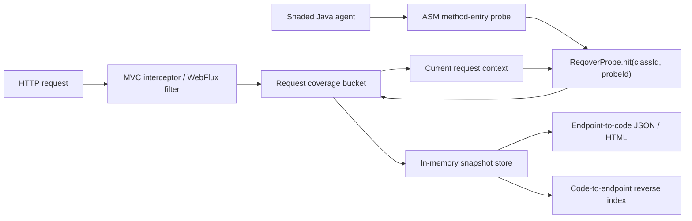
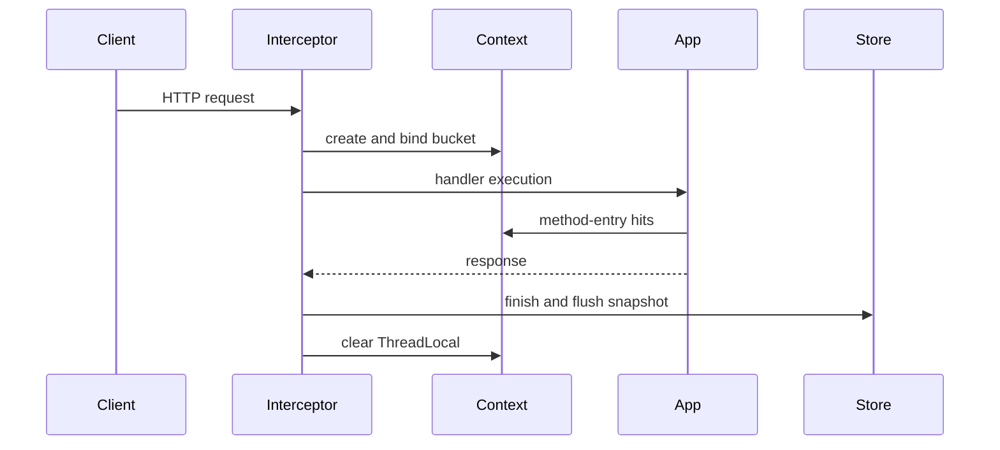
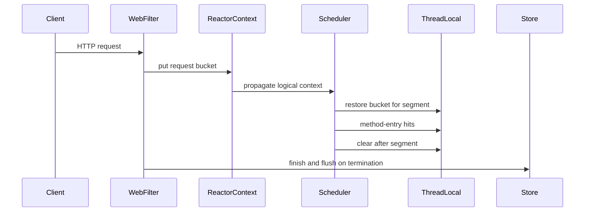

# 02. 시스템 아키텍처

이 문서는 Reqover `0.1.1`의 실제 구현을 설명합니다. 향후 아이디어가 아니라
현재 코드와 자동 테스트가 보장하는 범위만 포함합니다.

## 전체 흐름



Reqover는 세 층으로 나뉩니다.

1. **Instrumentation**: Java agent가 명시적으로 포함된 application class의
   method entry에 probe 호출을 삽입합니다.
2. **Attribution**: Spring adapter가 현재 HTTP 요청의 bucket을 context에
   연결하고 probe hit을 그 bucket으로 보냅니다.
3. **Reporting**: 완료된 snapshot을 endpoint 기준으로 합치고 정방향·역방향
   관계를 JSON과 standalone HTML로 렌더링합니다.

## 모듈 책임

| 모듈 | 실제 책임 |
| --- | --- |
| `reqover-core` | bucket, ThreadLocal context, probe registry, bounded in-memory store |
| `reqover-instrumentation` | ASM class transform, stable class ID, method metadata |
| `reqover-agent` | `premain`, include/exclude 정책, shaded standalone agent JAR |
| `reqover-spring-mvc` | MVC interceptor와 request lifecycle |
| `reqover-spring-webflux` | WebFilter, Reactor Context ↔ ThreadLocal bridge |
| `reqover-report` | endpoint aggregation, reverse index, HTML renderer |
| `examples/*` | manual probe와 agent 자동계측 E2E sample |

## Instrumentation

실행 형식은 다음과 같습니다.

```text
-javaagent:reqover-agent-0.1.1.jar=include=com.example.app
```

- `include=`는 필수이며 여러 prefix는 `;`로 구분합니다.
- 더 좁은 `exclude=`가 동일 class에 매치하면 exclude가 우선합니다.
- 유효한 include가 없으면 agent는 fail-closed로 비활성화됩니다.
- JDK, Spring, Reactor, Micrometer와 Reqover 내부 package는 기본 제외합니다.
- ASM은 `io.reqover.agent.internal.asm`으로 relocate되어 application의 ASM과
  classpath 충돌하지 않도록 격리됩니다.
- 현재 probe 정밀도는 method-entry입니다. synthetic method는 제외합니다.

transform 결과는 class ID, probe ID, method 이름, JVM descriptor, 확인 가능한
첫 line metadata를 `ProbeRegistry`에 등록합니다. 변환 실패는 application 실행을
중단시키지 않고 해당 class의 계측만 포기합니다.

## Hit routing

계측된 application bytecode는 다음 정적 호출만 수행합니다.

```java
ReqoverProbe.hit(classId, probeId);
```

1. 현재 `CoverageContext`에 request bucket이 있으면 그 bucket에 기록합니다.
2. bucket이 없으면 global bucket에 기록합니다. global hit은 특정 HTTP
   endpoint로 오귀속하지 않습니다.
3. probe 내부 오류는 application 흐름으로 전파하지 않고 dropped-hit count로
   기록합니다.

정확성 원칙은 **미귀속이 오귀속보다 낫다**입니다.

## Spring MVC lifecycle



normalized endpoint pattern은 Spring의 best-matching pattern을 사용하고, pattern이
아직 없으면 request URI로 fallback합니다. Servlet async re-dispatch에는 기존
bucket을 재사용하지만, re-dispatch 전 async worker thread의 application 실행은
현재 `0.1.1`에서 자동 전파하지 않습니다.

## Spring WebFlux lifecycle



Micrometer Context Propagation의 `ThreadLocalAccessor`가 Reactor Context의 bucket을
각 scheduler segment에서 `CoverageContext`로 복원합니다. agent E2E는 같은
endpoint bucket에 transport별 `reactor-http-*`(`nio` 또는 `epoll`), `boundedElastic-*`, `parallel-*` hit과
thread hop 뒤의 `validate(J)J` method가 함께 기록되는지 확인합니다. manual·auto
reactive 요청 20개를 병렬 실행해 endpoint별 10개씩 분리되고 class가 교차하지
않는지도 검증합니다.

## Snapshot과 report

`InMemoryCoverageStore`는 기본 최대 10,000개 snapshot을 보관하고 초과 시 오래된
항목부터 제거합니다. endpoint report에는 다음이 포함됩니다.

- normalized endpoint와 완료 요청 수
- request ID 목록
- 관측 thread 이름
- class, method, descriptor, probe ID, 확인 가능한 첫 line
- 각 method를 실행한 관측 endpoint의 reverse index

HTML은 위 관계를 endpoint 카드와 code-to-endpoint 표로 보여줍니다. 현재 구현은
heatmap, thread transition timeline, execution duration chart를 제공하지 않습니다.

## 데이터·보안 경계

Reqover bucket은 HTTP method, normalized endpoint pattern, request ID, status,
시작/종료 시각과 code hit metadata를 보유합니다. 다음 값은 수집하지 않습니다.

- request/response body
- authorization header와 cookie
- raw query parameter value

sample의 `/reqover/report*` endpoint는 인증이 없고 데모 스크립트는
`127.0.0.1`에만 bind합니다. 실제 애플리케이션 통합 시 report controller는
애플리케이션의 인증·네트워크 정책 아래에 별도로 두어야 합니다.

## 해석 한계

- Reqover는 JaCoCo의 line/branch coverage를 대체하지 않습니다.
- report는 관측된 실행 관계의 하한입니다.
- reverse index는 먼저 재검증할 API를 좁히는 신호이며 완전한 정적 변경 영향
  분석이 아닙니다.
- unmanaged thread와 MVC async worker의 context는 자동 보장하지 않습니다.
- `0.1.1`은 in-memory 개발·QA 관측을 우선하며 production always-on agent를
  주장하지 않습니다.
