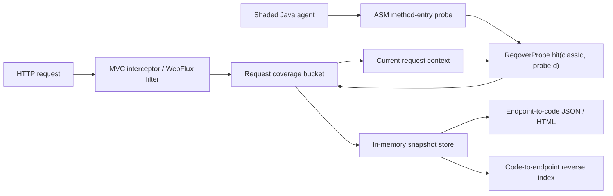
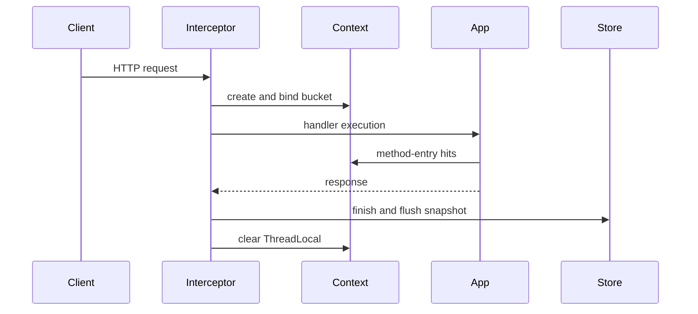
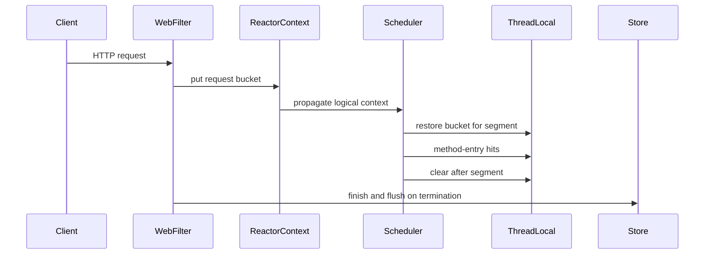

**English** | [한국어](02_architecture.ko.md)

# 02. System architecture

This document describes what Reqover `0.1.1` actually implements. It covers only
what the current code and automated tests guarantee — not planned ideas.

## Overall flow



Reqover is split into three layers.

1. **Instrumentation** — the Java agent inserts probe calls at the method entry
   of application classes you explicitly included.
2. **Attribution** — the Spring adapter binds the current HTTP request's bucket
   to a context and routes probe hits into that bucket.
3. **Reporting** — completed snapshots are aggregated per endpoint and the
   forward and reverse relationships are rendered as JSON and self-contained HTML.

## Module responsibilities

| Module | Actual responsibility |
| --- | --- |
| `reqover-core` | Buckets, ThreadLocal context, probe registry, bounded in-memory store |
| `reqover-instrumentation` | ASM class transform, stable class ID, method metadata |
| `reqover-agent` | `premain`, include/exclude policy, shaded standalone agent JAR |
| `reqover-spring-mvc` | MVC interceptor and request lifecycle |
| `reqover-spring-webflux` | `WebFilter`, Reactor Context ↔ ThreadLocal bridge |
| `reqover-report` | Endpoint aggregation, reverse index, HTML renderer |
| `examples/*` | E2E samples for manual probes and agent auto-instrumentation |

## Instrumentation

The invocation form is:

```text
-javaagent:reqover-agent-0.1.1.jar=include=com.example.app
```

- `include=` is required. Multiple prefixes are separated by `;`, and separate
  options by `,`.
- Prefixes are matched against the dotted class name. **The longest matching
  prefix wins; on a tie, `exclude` wins.** A longer `include` therefore beats a
  shorter `exclude` — which is what allows an explicit include to carve a
  subpackage out of a default-excluded framework prefix.
- Without a valid include the agent fails closed and instrumentation stays
  inactive.
- Two exclusion tiers exist, and the difference matters:

  | Tier | Prefixes | Can an `include` override it? |
  | --- | --- | --- |
  | Hard | `java.` `javax.` `jakarta.` `jdk.` `sun.` `com.sun.` `org.objectweb.asm.` `io.reqover.core.` `io.reqover.agent.` `io.reqover.instrumentation.` `io.reqover.report.` `io.reqover.spring.` | **No** — never, under any include |
  | Default | `org.springframework.` `reactor.` `io.micrometer.` | Yes, by a longer include |

- ASM is relocated to `io.reqover.agent.internal.asm` so it cannot collide with
  the application's own ASM on the classpath.
- Probe precision is currently method-entry. Synthetic methods are excluded.

Each transform registers the class ID, probe ID, method name, JVM descriptor, and
the first resolvable line number in `ProbeRegistry`. A transform failure never
aborts application startup — it only gives up on instrumenting that one class.

## Hit routing

Instrumented application bytecode performs exactly one static call:

```java
ReqoverProbe.hit(classId, probeId);
```

1. If the current `CoverageContext` holds a request bucket, the hit is recorded
   there.
2. If there is no bucket, the hit goes to the global bucket. Global hits are
   never misattributed to a specific HTTP endpoint.
3. Errors inside the probe are not propagated into application flow; they are
   counted as dropped hits (`ReqoverProbe.droppedHitCount()`).

The correctness principle is **unattributed is better than misattributed.**

## Spring MVC lifecycle



The normalized endpoint pattern uses Spring's best-matching pattern, falling back
to the request URI when no pattern is available yet. Servlet async re-dispatch
reuses the existing bucket, but application execution on the async worker thread
before re-dispatch is **not** propagated automatically in `0.1.1`.

## Spring WebFlux lifecycle



A Micrometer Context Propagation `ThreadLocalAccessor` restores the bucket from
the Reactor Context into `CoverageContext` on each scheduler segment.

The agent E2E test asserts that a single endpoint bucket contains hits from
`reactor-http-*` (`nio` or `epoll`, depending on transport), `boundedElastic-*`,
and `parallel-*` threads, together with `validate(J)J` executing after a thread
hop. It also fires 20 reactive requests concurrently — 10 manual and 10
auto-instrumented — and verifies they separate into 10 per endpoint with no
class bleeding across endpoints.

## Snapshots and reports

`InMemoryCoverageStore` retains at most 10,000 snapshots by default and evicts
the oldest entries beyond that bound. An endpoint report contains:

- the normalized endpoint and the number of completed requests
- the list of request IDs
- observed thread names
- class, method, descriptor, probe ID, and first resolvable line
- a reverse index of the observed endpoints that executed each method

The HTML renders these relationships as endpoint cards plus a code-to-endpoint
table. The current implementation does not provide heatmaps, thread-transition
timelines, or execution-duration charts.

## Data and security boundary

A Reqover bucket holds the HTTP method, normalized endpoint pattern, request ID,
status code, start and end timestamps, observed thread names, and code-hit
metadata. The following are **not** collected:

- request and response bodies
- authorization headers and cookies
- raw query parameter values

This is a structural property, not a policy: `CoverageBucketSnapshot` has no
field for them, and the adapters never call the servlet or reactive APIs that
would read them.

The samples' `/reqover/report*` endpoints have no authentication, and the demo
scripts bind only to `127.0.0.1`. When integrating into a real application, the
report controller must be placed behind that application's own authentication and
network policy — see the [integration guide](17_integration_guide.md).

## Limits of interpretation

- Reqover does not replace JaCoCo's line and branch coverage.
- A report is a **lower bound** on observed execution relationships.
- The reverse index is a signal for narrowing which APIs to re-verify first, not
  a complete static change-impact analysis.
- Context on unmanaged threads and MVC async workers is not guaranteed
  automatically.
- `0.1.1` prioritizes in-memory development and QA observation; it does not claim
  to be a production always-on agent.
