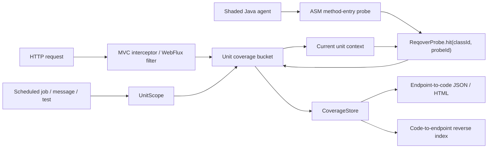
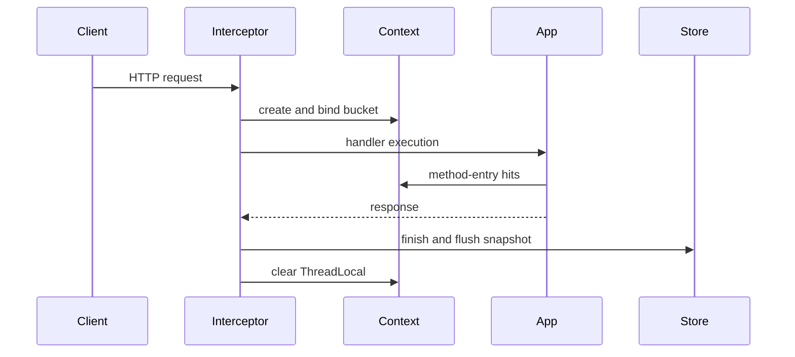
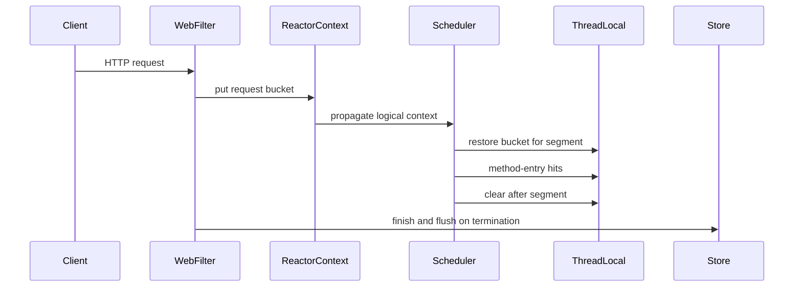
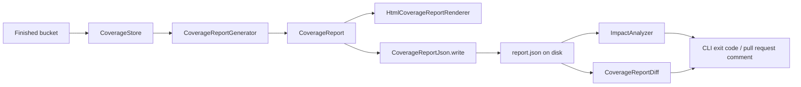

**English** | [한국어](02_architecture.ko.md)

# 02. System architecture

This document describes what Reqover `0.2.0` actually implements. It covers only
what the current code and automated tests guarantee — not planned ideas.

## Overall flow



Reqover is split into four layers.

1. **Instrumentation** — the Java agent inserts probe calls at the method entry
   of application classes you explicitly included.
2. **Attribution** — the Spring adapter binds the current HTTP request's bucket
   to a context and routes probe hits into that bucket; `UnitScope` does the same
   for units of work that are not HTTP requests.
3. **Reporting** — completed snapshots are aggregated per unit and the forward
   and reverse relationships are rendered as self-contained HTML, or written as a
   JSON document that outlives the JVM.
4. **Analysis** — the CLI reads a written report in a separate JVM and turns it
   into a diff, an impact list, or an exit code.

## Module responsibilities

| Module | Actual responsibility |
| --- | --- |
| `reqover-core` | Buckets, unit info and scopes, ThreadLocal context, probe registry, `CoverageStore` SPI |
| `reqover-instrumentation` | ASM class transform, stable class ID, method metadata |
| `reqover-agent` | `premain`, include/exclude policy, shaded standalone agent JAR |
| `reqover-spring-mvc` | MVC interceptor and request lifecycle |
| `reqover-spring-webflux` | `WebFilter`, Reactor Context ↔ ThreadLocal bridge |
| `reqover-report` | Endpoint aggregation, reverse index, HTML renderer, JSON read/write, diff, impact analysis |
| `reqover-spring-boot-starter` | One dependency for core, report, and both adapters; report service, opt-in HTTP endpoint, shutdown export |
| `reqover-cli` | Shaded executable JAR: `render`, `diff`, `impact` over a report read from disk |
| `examples/*` | E2E samples for manual probes and agent auto-instrumentation |

`reqover-report` outgrew its name in `0.2.0`. Besides rendering, it now owns JSON
persistence (`CoverageReportJson`), report comparison (`CoverageReportDiff`), and
impact analysis (`ImpactAnalyzer`). It still declares exactly one dependency,
`reqover-core` — the JSON reader and writer are hand-written for that reason, so
that generating or reading a report never drags a JSON library onto an
application's classpath.

`reqover-spring-boot-starter` is a single dependency that brings `reqover-core`,
`reqover-report`, and both adapters, and it is the only module that registers
Spring Boot auto-configuration of its own. It contributes:

- `ReqoverReportService`, which builds a report on demand from whichever
  `CoverageStore` the active adapter placed in the context.
- An HTTP report endpoint, **off by default**. It is registered only when
  `reqover.report.endpoint.enabled=true`, serves JSON at
  `reqover.report.endpoint.path` and HTML at that path plus `.html`, and has a
  servlet and a reactive implementation so that only the one matching the web
  application type activates.
- `ReqoverReportExporter`, a `DisposableBean` that writes the report to
  `reqover.report.export.json-path` and `reqover.report.export.html-path` when
  the application context closes. Both go through `ReqoverReportService`, so the
  exported file is byte-for-byte what the endpoint would have served. Export
  failures are printed and swallowed: a measurement tool must not be the reason
  a shutdown fails.

Every bean the starter contributes is `@ConditionalOnMissingBean`, so an
application that defines its own makes Reqover's back off.

`reqover-cli` is a shaded executable JAR with `render`, `diff`, and `impact`
commands. It never instruments anything and has no connection to a running
application: it only consumes a report that was already written to disk.

## Instrumentation

The invocation form is:

```text
-javaagent:reqover-agent-0.2.0.jar=include=com.example.app
```

- `include=` is required. Multiple prefixes are separated by `;`, and separate
  options by `,`.
- Prefixes are matched against the dotted class name. **The longest matching
  prefix wins; on a tie, `exclude` wins.** A longer `include` therefore beats a
  shorter `exclude` — which is what allows an explicit include to carve a
  subpackage out of a default-excluded framework prefix.
- Without a valid include the agent fails closed and instrumentation stays
  inactive.
- Two exclusion tiers exist, and the difference matters:

  | Tier | Prefixes | Can an `include` override it? |
  | --- | --- | --- |
  | Hard | `java.` `javax.` `jakarta.` `jdk.` `sun.` `com.sun.` `org.objectweb.asm.` `io.reqover.core.` `io.reqover.agent.` `io.reqover.instrumentation.` `io.reqover.report.` `io.reqover.spring.` | **No** — never, under any include |
  | Default | `org.springframework.` `reactor.` `io.micrometer.` | Yes, by a longer include |

- The starter lives in `io.reqover.spring.boot`, so it is already covered by the
  `io.reqover.spring.` hard exclusion. The CLI is not listed because it runs in
  its own JVM, without an agent attached.
- ASM is relocated to `io.reqover.agent.internal.asm` so it cannot collide with
  the application's own ASM on the classpath.
- Probe precision is currently method-entry. Synthetic methods are excluded.

Each transform registers the class ID, probe ID, method name, JVM descriptor, and
the first resolvable line number in `ProbeRegistry`. A transform failure never
aborts application startup — it only gives up on instrumenting that one class.

## Hit routing

Instrumented application bytecode performs exactly one static call:

```java
ReqoverProbe.hit(classId, probeId);
```

1. If the current `CoverageContext` holds a request bucket, the hit is recorded
   there.
2. If there is no bucket, the hit goes to the global bucket. Global hits are
   never misattributed to a specific HTTP endpoint.
3. Errors inside the probe are not propagated into application flow; they are
   counted as dropped hits (`ReqoverProbe.droppedHitCount()`).

The correctness principle is **unattributed is better than misattributed.**

## Units of work

Every bucket belongs to a `UnitInfo`: a unit ID, a unit type, a display name, and
an attribute map. That record was always generic — the five types it names are
`http-request`, `scheduled-job`, `message`, `test`, and `global`. What `0.2.0`
adds is `UnitScope`, which makes the non-HTTP ones usable without writing an
adapter:

```java
try (UnitScope scope = UnitScope.open(store, UnitInfo.scheduledJob(runId, "nightly-settlement"))) {
    settlementJob.run();
}
```

The report groups by `UnitInfo.name()` whatever the type is, so a job name, a
message destination, or a test name occupies the same column an endpoint pattern
would.

Attribution follows the thread that opened the scope. Work handed to another
thread inside the block is **not** recorded under that unit unless the other
thread opens `UnitScope.join(bucket)` on the same bucket. Closing the scope
returned by `open` finishes the bucket with `CoverageBucket.NO_STATUS` and
flushes it exactly once; closing twice is a no-op, so the block is safe to leave
early or by exception. Closing a `join` scope restores the previous context
without finishing or flushing — that stays with the scope that created the
bucket.

## Spring MVC lifecycle



The normalized endpoint pattern uses Spring's best-matching pattern, falling back
to the request URI when no pattern is available yet. Servlet async re-dispatch
reuses the existing bucket, but application execution on the async worker thread
before re-dispatch is **not** propagated automatically in `0.2.0`.

## Spring WebFlux lifecycle



A Micrometer Context Propagation `ThreadLocalAccessor` restores the bucket from
the Reactor Context into `CoverageContext` on each scheduler segment.

The agent E2E test asserts that a single endpoint bucket contains hits from
`reactor-http-*` (`nio` or `epoll`, depending on transport), `boundedElastic-*`,
and `parallel-*` threads, together with `validate(J)J` executing after a thread
hop. It also fires 20 reactive requests concurrently — 10 manual and 10
auto-instrumented — and verifies they separate into 10 per endpoint with no
class bleeding across endpoints.

## Snapshots and the store

`CoverageStore` is the seam between attribution and retention. The adapters and
`UnitScope` know only this interface — `flush(CoverageBucket)`, `snapshots()`,
`clear()` — so what happens to a finished bucket is a substitution point: keep it
in heap, write it somewhere, or drop it under a sampling rule. Implementations
must be safe for concurrent use, and `flush` is called on the thread that
completed the unit of work — an HTTP worker in the common case — so it must not
block for long.

`InMemoryCoverageStore` is one implementation of that interface, and the one that
ships. It retains at most `maxSnapshots` snapshots and evicts the oldest entries
beyond that bound; the bound is a constructor argument defaulting to 10,000, and
the adapters expose it as `reqover.mvc.max-snapshots` and
`reqover.webflux.max-snapshots`. Both adapters declare the store bean
`@ConditionalOnMissingBean(CoverageStore.class)`, so an application that
contributes its own `CoverageStore` gets that one used everywhere instead — by
the interceptor, the filter, and the report service alike.

## Report lifecycle

A recorded bucket becomes an answer in CI along one path:



`CoverageReportGenerator` reads the snapshots the store holds, groups them by
`UnitInfo.name()`, and resolves every `(classId, probeId)` pair through
`ProbeRegistry`. The resulting `CoverageReport` contains:

- the endpoint — or other unit name — and the number of completed requests
- the list of request IDs
- observed thread names
- class, method, descriptor, probe ID, and first resolvable line
- a reverse index of the observed endpoints that executed each method

From there the report goes two ways. `HtmlCoverageReportRenderer` produces the
self-contained page a person reads: endpoint cards plus a code-to-endpoint table.
It provides no heatmaps, thread-transition timelines, or execution-duration
charts. `CoverageReportJson` writes the same report as a JSON document
(`schemaVersion` 1) to a file.

**A written report is fully resolved.** Class names, method names, descriptors,
and line numbers are inside the document, not looked up when it is read back.
That is the architectural reason the CLI can render, diff, and analyse a report
in a different JVM, on a different machine, with no `ProbeRegistry` and no agent:
the probe IDs it carries already travel with the names they stood for.

The JSON is pretty-printed with sorted collections, so two runs over the same
traffic produce byte-identical files apart from `generatedAt`. That is
deliberate — it is what makes a committed baseline report diff cleanly in git.

Two consumers read the written document, and neither needs the application:

- `ImpactAnalyzer` matches changed source paths against the reverse index and
  names the endpoints observed executing code in those files. It turns each
  binary class name into the source path it would have been declared in and
  matches a changed path that ends with it at a directory boundary.
- `CoverageReportDiff` compares a baseline report against a current one, and
  reports endpoints present on only one side plus the code an endpoint started or
  stopped executing.

`reqover-cli` exposes both as `impact` and `diff`, alongside `render` for the
HTML. `--fail-on-impact` and `--fail-on-change` turn a result into exit code `1`,
while `2` is reserved for bad usage or an unreadable input — so a pipeline can
tell a tripped gate from a misconfiguration. `--format markdown` produces the
table that goes into a pull request comment. The full loop is in the
[CI impact analysis guide](18_ci_impact_analysis.md).

## Data and security boundary

A Reqover bucket holds a `UnitInfo` — unit ID, unit type, name, and a small
attribute map, which for an HTTP request is the method and the normalized
endpoint pattern — plus the start and end timestamps, the status code, observed
thread names, and code-hit metadata. The following are **not** collected:

- request and response bodies
- authorization headers and cookies
- raw query parameter values

This is a structural property, not a policy: `CoverageBucketSnapshot` has no
field for them, and the adapters never call the servlet or reactive APIs that
would read them. The exported JSON narrows further still — it carries unit names,
request counts, request IDs, thread names, and code identity, and not the
timestamps, status codes, or attributes the bucket held.

The starter's HTTP report endpoint is disabled by default and ships no
authentication of its own. Enabling it publishes internal class and method names
at `reqover.report.endpoint.path`, so it must be placed behind the application's
own authentication and network policy — see the
[integration guide](17_integration_guide.md). The samples turn it on explicitly
and the demo scripts bind only to `127.0.0.1`. The shutdown export writes the
same document to a path of your choosing; treat that file as the report it is.

## Limits of interpretation

- Reqover does not replace JaCoCo's line and branch coverage.
- A report is a **lower bound** on observed execution relationships.
- The reverse index is a signal for narrowing which APIs to re-verify first, not
  a complete static change-impact analysis.
- Impact analysis inherits that bound: a changed file that never ran during the
  recording is reported as unmatched, which is not the same as unaffected.
- Context on unmanaged threads and MVC async workers is not guaranteed
  automatically; a second thread needs `UnitScope.join`.
- `0.2.0` prioritizes development, QA, and CI use. Retention is in memory by
  default and a report leaves the JVM only when it is exported or served; it does
  not claim to be a production always-on agent.
