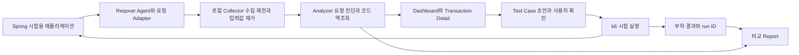

# Reqover 성능 검증 도구 개선 계획

> 당시 기획과 리뷰 진행 상황을 보존한 기록입니다. 아래 PR 분리·배포 상태는 작성 시점 기준이며, 현재 배포 기능은 [사용 문서](README.ko.md)와 [CHANGELOG](../CHANGELOG.md)를 참고합니다.

작성일: 2026년 10월 3일

- 구현 기준: 공개 main `935d3db`, 배포 버전 `0.2.0`; 10월 6일 리뷰 반영
- 이번 문서: 성능 검증 계획과 범위. 구현은 #34~#37에서 별도 검토

## 1 개발자가 끝내야 할 작업

운영 배포 전에 API를 실행해보고, 느리거나 실패한 요청을 골라 내부 실행 정보를
확인한 뒤, 그 사례를 다시 실행할 테스트로 남기는 흐름을 만들려고 합니다.

목표 흐름은 `API 실행 → 문제 요청 찾기 → 실행 정보 확인 → 재현 테스트 준비 →
재실행 → 개선 전후 비교`입니다. 실제 필요성과 설치 비용은 외부 Spring 프로젝트에서
검증합니다. 첫 사용자는 성능 테스트 전담 인력이 없는 작은 Spring 개발팀과 학생 팀입니다.

## 2 요구사항과 현재 코드 사이의 차이

| 항목 | 현재 코드에서 확인한 것 | 필요한 개선 |
| --- | --- | --- |
| 실행 메서드 | `Set`에 진입 probe를 기록 | 메서드 집합 유지, 시간·순서 추적은 별도 기능 |
| 요청별 시간과 상태 | snapshot에 `startedAt`, `endedAt`, `statusCode` 존재 | JSON과 화면에서 개별 요청으로 보존하고 집계 |
| 공개 리포트 | endpoint별 합집합과 역조회 | 느린 요청과 HTTP 실패를 먼저 찾는 화면 추가 |
| 입력 파라미터 | 현재 수집하지 않음 | 허용 필드·민감정보 제거 규칙부터 설계 |
| 메서드 시간과 예외 | 진입 probe만 있어서 측정 불가 | 선택한 메서드의 진입·종료·예외 측정 설계 |
| DB 구간 | JDBC/R2DBC 계측 없음 | OpenTelemetry 등 기존 계측 연동 가능성 검토 |
| 테스트 생성과 부하 | #36에 검토 가능한 JSON/JUnit 초안, 원본 재현·부하 미구현 | 피드백 검토 후 허용 입력 수집과 k6 실행 연동 |

현재 메서드 목록은 호출 순서나 호출 횟수를 나타내지 않습니다. 리포트에 정렬된 이름을
타임라인으로 표시하지 않습니다. WebFlux에서 메서드가 `Mono`를 반환하기까지의 시간과
그 `Mono`가 끝날 때까지의 시간도 다르므로 단계별 측정 범위를 따로 설명합니다.

## 3 비교에서 지켜야 할 기준

Postman도 virtual user, 반복 시나리오와 응답시간·오류율을 이용하는 성능 테스트를
제공합니다. k6는 오픈소스 부하 도구이며 부하 실행기를 새로 만들 이유가 약합니다.
OpenTelemetry Java agent 역시 선택한 메서드와 DB 호출 계측을 지원합니다.

따라서 차별성 가설은 **문제 요청과 Spring 내부 실행 정보를 연결하고, 그 사례를
개발자가 확인한 재현 테스트로 전환해 같은 화면에서 다시 검증하는 흐름**에 둡니다.
기존 API·메서드 역조회는 이 흐름에 사용할 코드 근거입니다.

상용 APM 가격이 높다는 일반화나 보안 취약점을 탐지한다는 주장은 사용하지 않습니다.
성능·오류 검증이 보안 진단을 대신하지는 않습니다.

## 4 구현 PR과 첫 피드백 검토의 범위

#25는 기획·보안·리뷰 문서만 포함합니다. 아래 기능은 #34~#37에 분리되어 있으며,
병합된 main의 기능이나 배포 버전으로 소개하지 않습니다.

### 실제 데이터로 먼저 개선할 부분

1. snapshot의 요청 ID, 작업 유형, endpoint, 시작·종료 시각, HTTP 상태를 report JSON에 추가합니다.
2. 전체 관측 HTTP 요청과 endpoint별 평균, p95, 최대, 누적 처리 시간을 집계합니다.
3. HTTP 4xx와 5xx, 상태 미확인을 구분합니다. 예외 내용을 수집한 것으로 표시하지 않습니다.
4. 개별 요청에서 해당 요청이 실행한 메서드 집합과 스레드를 확인합니다.
5. 검색과 실패·지연 필터를 제공하고 기존 역조회와 `impact` 기능을 유지합니다.
6. 예전 JSON을 읽으면 진단 정보가 없다는 상태를 보여줍니다.

기존 snapshot의 벽시계 구간은 서버 adapter가 관측한 구간입니다. MVC에서는 handler
진입 이후부터 종료 callback까지이며 전체 네트워크 응답시간이 아닙니다. 완료되지 않은
요청이나 시계 역행은 시간 집계에서 제외하고 미측정으로 표시합니다. p95는 유효 샘플의
nearest-rank 값이며 샘플 수를 함께 표시합니다.

화면의 실패율은 알려진 최종 HTTP 상태 중 4xx·5xx의 비율입니다. 상태 미확인은
성공으로 계산하지 않습니다. 테스트가 예상한 4xx였는지는 앞으로의 assertion에서
판단해야 합니다. 보관된 요청 통계는 실제 전체 트래픽의 TPS가 아닙니다.

### 첫 피드백 검토까지의 산출물

| 마감 | 결과물 | 완료 조건 |
| --- | --- | --- |
| 10월 4일 목표 | 요청 진단 데이터와 JSON 왕복 | 개별 시간·상태가 보존되고 예전 파일도 렌더됨 |
| 10월 5일 목표 | 실제 요청 진단 화면 | 정상·실패·지연 요청을 찾아 개별 코드 확인 |
| 10월 6일 목표 | 다섯 화면 설계와 회귀 확인 | 화면 간 이동·빈 상태·미구현 기능 구분, 데모 재현 |
| 피드백 검토 | 3분 데모와 결정할 질문 | 느린 GET·실패 GET 관측, 원인 후보와 다음 개선 제시 |

이 일정은 작업 목표이며 이번 PR 검증 기록에서 완료 여부를 갱신합니다. 검토에서는
실제 진단·Test drafts 화면을 먼저 보여주고 Load Test는 설계로 표시합니다.
Test drafts는 입력을 직접 보완하는 초안이며 원본 요청의 재현이나 자동 실행이 아닙니다.
현재 기능과 사용 흐름은 [테스트 초안 PR #36](https://github.com/reqover-labs/reqover/pull/36)에 정리했습니다.
보관된 요청의 이전·현재 시간과 상태는 [기록 비교 PR #37](https://github.com/reqover-labs/reqover/pull/37)로
확인합니다. 조건이 통제된 부하 run이나 자동 합격 판정과는 구분합니다.

## 5 최종 화면 기획

화면은 운영 도구처럼 표, 필터, 상세 패널 위주로 구성합니다. 한 화면에서 선택한
요청이 다음 화면의 테스트와 결과로 이어지도록 `requestId`, `caseId`, `runId`를 연결합니다.

| 화면 | 먼저 볼 정보 | 핵심 동작 | 빈 상태와 실패 상태 |
| --- | --- | --- | --- |
| Dashboard | 최근 관측 요청, 4xx/5xx, 평균·p95, endpoint별 누적 시간 | 실패 또는 느린 요청으로 이동 | 기록 없음, 옛 파일, 일부 기록만 남음 |
| Transaction Detail | 요청·상태·시간·실행 메서드, 수집 범위 | 문제 사례에서 재현 요청 초안 만들기 | 시간·예외·파라미터 없음, 기록 제한 표시 |
| Test Case | 출처 요청, URL·method, 시험용 변수, 기대 상태·시간 | 입력 확인, 초안 저장, 수동 실행 | 미지정 변수, 인증 없음, 삭제된 원본 |
| Load Test | case 선택, VU, 반복 또는 시간, timeout, 예산 | 실행·중지, run별 상태 확인 | k6 미설치, 대상 오류, 중지·중도 실패 |
| Report | run 조건, 요청 수·완료 수, RPS, p95, 오류율, 이전 run | 같은 조건에서 개선 전후 비교 | 샘플 부족, 조건 불일치, 부하 생성기 한계 |

### 화면 예시

```text
Dashboard
[기간 선택] [endpoint 검색] [전체 / 실패 / 지연]
관측 요청   알려진 상태   HTTP 4xx/5xx   평균   p95
Endpoint             요청수   4xx   5xx   p95   누적 처리 시간
GET /orders/{id}         ...

Transaction Detail
요청 ID   관측 처리 시간   HTTP 상태   endpoint
[실행 메서드] [입력값 수집 여부] [예외 정보 수집 여부]
실행된 메서드 집합 또는 실제 수집된 span
[테스트 초안 만들기]  입력 미수집 상태에서 사용자 검토를 요구

Test Case
출처 요청   method   시험 대상   기대 상태   허용 시간
입력 변수   마스킹·제외된 값   실행 전 확인
[저장] [한 번 실행]

Load Test
케이스 선택   VU   실행시간/반복   timeout
[시작] [중지]   현재 run   완료 요청   RPS   p95

Report
run A / run B   환경과 입력 조건   비교 가능 여부
시간 분포   p95   상태별 오류   관련 요청 상세
```

이번 리포트에서는 상세를 HTML `details`와 관계 그래프로 제공합니다. 테스트 초안
편집·JSON/JUnit 내보내기는 동작하지만 원본 파라미터·span·테스트 실행·부하는 아직
없습니다. 위의 실행·부하 결과 화면은 최종 설계이며 구현 기능과 구분합니다.

## 6 시스템 구조



Collector는 처음부터 별도 cloud 서버로 만들 필요가 없습니다. 초기 버전은 현재
`CoverageStore`와 report exporter를 활용하는 로컬 수집 경로로 시작합니다. 장기 세션
검색과 저장이 실제로 필요해지면 별도 저장·조회 서비스를 추가합니다.

부하 실행기와 검증 대상 JVM은 별도 process로 둡니다. MVC와 WebFlux는 같은
요청 진단 모델을 사용하되 각 adapter의 측정 경계를 유지합니다. OTel·DB 연동은
실행 귀속과 context 충돌, 중복 계측 비용을 확인하는 spike 뒤에 선택합니다.

## 7 11월 4~5일까지의 단계

| 기간 | 목표 | 결과와 판단 기준 |
| --- | --- | --- |
| 10월 3~7일 | 실제 요청 진단과 화면 기획 | 첫 검토에서 데이터로 정상·실패·지연을 구분 |
| 10월 8~14일 | 요청 측정 경계 보강, 실패 정보, 선택한 메서드 시간 spike | monotonic 경과시간, 예외와 4xx/5xx 구분, MVC sync 범위 명시 |
| 10월 15~21일 | 허용 입력 기반 재현 요청 초안 | 샘플 GET에서 재현, 민감값 미저장, 미지정 값은 사용자 보완 |
| 10월 22~28일 | k6 연동과 단일 API 부하 run | VU·duration, RPS·p95·오류, 중지·예산 제한, 요청과 run 연결 |
| 10월 29~11월 3일 | 회귀·라이선스·외부 재현·발표 동결 | 설치 문서, SBOM, 실패 시연, 개선 전후 비교와 영상 예비본 |
| 11월 4~5일 | 발표와 질의응답 | 실제 동작과 미지원 범위를 같은 기준으로 설명 |

병렬 작업은 팀이 분담하되 request/case/run 모델을 먼저 합의합니다. 일정이 밀리면
단일 GET의 문제 발견·재현·다시 실행을 완성하고 DB 원인 자동 판정, 여러 서비스 trace,
구매 시나리오, Node.js·Python, AI 진단은 발표 이후 후보로 둡니다.

데이터 모델과 공개 설정 변경은 공동 검토하고, 새 화면의 수치는 서로 다른 구현에서
같은 요청으로 교차 확인합니다.

## 8 입력 수집과 재현의 선행 조건

검토 과정에서 제기된 주민등록번호·이메일·전화번호·인증정보 위험을 수집 단계에서 처리합니다.
기본값은 본문·헤더·query·실제 path 값 미수집입니다. 명시적으로 허용한 시험용
필드만 수집하고 저장 전에 제외·마스킹합니다. Authorization, Cookie, 비밀번호,
API 키와 개인식별 값은 원문을 저장하지 않습니다.

마스킹된 요청은 정확히 그대로 재현할 수 없습니다. 초안에는 `${TEST_TOKEN}` 같은
실행 시 변수와 `replayable=false` 사유를 남기고 사용자가 시험용 값을 입력해야 합니다.
원래 실패 응답을 기대값으로 복사하지 않습니다. 예를 들어 500 재현 사례의 회귀
테스트 기대 상태는 개발자가 200으로 정해야 합니다. 인증은 로컬 환경에서 읽으며
내보낸 case JSON과 GitHub PR에는 포함되지 않습니다.

MVP는 명시적인 시험 대상의 GET부터 시작합니다. POST·결제·메일 발송 같은 변경
요청은 시험 데이터, reset·idempotency 정책을 정의한 뒤 수동으로 허용합니다.
다중 사용자의 인증 상태와 reset이 마련되기 전에는 로그인→구매 자동 시나리오를 약속하지 않습니다.

## 9 지표와 검증 기준

- API 관측 처리 시간: adapter의 시작·끝 구간. 네트워크 시간과 별도로 표시합니다.
- endpoint 누적 관측 시간: 같은 보관 구간의 유효 시간 합계, 평균 시간 × 유효 횟수입니다.
- 메서드 시간: 동기 메서드의 inclusive elapsed time부터. CPU 시간이나 자식 제외 시간과 다릅니다.
- HTTP 4xx/5xx: 상태별로 표시. 테스트 실패는 사용자 assertion과 timeout을 포함해 별도 집계합니다.
- RPS: 부하 run의 완료 HTTP 요청 수 / 정해진 측정 시간. 비즈니스 TPS와 구분합니다.
- VU: 부하 process의 가상 사용자 수. 실제 사용자 수나 동시 활성 HTTP 요청 수와 동일하지 않습니다.
- p95: 충분한 요청수와 표본수를 함께 제시. 빠진 trace 때문에 전체 부하의 p95를 추정하지 않습니다.

부하 생성기 결과는 모든 완료 요청으로 계산하고, 수집된 내부 trace는 상세 증거로
연결합니다. 일부 trace만 보관하면 누락·보관 정책을 표시합니다. 중첩 메서드 시간과
WebFlux 병렬 구간은 겹칠 수 있어서 합계로 시스템 자원량을 추정하지 않습니다.

## 10 PR로 나눌 작업

1. [#34 요청 진단](https://github.com/reqover-labs/reqover/pull/34): DTO, 옛 JSON 호환, 상세 상한과 진단 화면.
2. [#35 대시보드·CI](https://github.com/reqover-labs/reqover/pull/35): 관측 관계도, 재테스트 후보와 opt-in artifact.
3. [#36 테스트 초안](https://github.com/reqover-labs/reqover/pull/36): 사용자 검토와 비활성화 JUnit. Draft로 피드백 대기.
4. [#37 기록 비교](https://github.com/reqover-labs/reqover/pull/37): 보관 요약의 기술적 비교. Draft로 피드백 대기.

순서대로 이전 PR을 기반으로 쌓았으며, 각 PR에서는 해당 기능의 변경만 검토합니다.
공유 브랜치 이력을 강제로 다시 쓰지 않고 최신 main을 동기화했습니다.
main에 병합된 #24의 proxy/accessor/미매핑 URL 처리, #26의 의존성 패치,
#28의 여러 테스트 context 기록 누적 기능은 유지합니다.
#30의 전체 endpoint 집계, #31의 참조 probe, #33의 새 배포 좌표도 반영합니다.
전체 endpoint 집계와 별개로 시간·상태·개별 메서드 상세는 보관된 snapshot만 계산합니다.

이후 monotonic timing와 실패 종료 정보, 선택 메서드 시간과 OTel spike, 허용 입력과
익명화, k6 실행·중지·결과 import, 외부 적용·overhead 검증을 별도 PR로 검토합니다.

## 11 다음 피드백 검토에서 결정할 질문

1. 가장 도움이 되는 사용 순간은 배포 전 성능 확인인가요, 오류 재현인가요?
2. 단일 GET의 발견→재현→재검증이 첫 MVP로 충분한가요?
3. 다음 추가 정보는 입력값, 예외 내용, 선택한 메서드 시간, DB 구간 중 무엇인가요?
4. 로컬 파일 report만으로 첫 사용자 검증을 진행해도 되나요?
5. 어떤 실제 프로젝트·문제 사례로 가치와 정확성을 비교하면 좋을까요?

## 근거

- 현재 코드: `CoverageBucket`, `CoverageBucketSnapshot`, `ReqoverClassInstrumenter`, `CoverageReportGenerator`.
- [Postman performance testing](https://learning.postman.com/docs/tests-and-scripts/performance-testing/performance-test-configuration/): 기존 제품과 겹치는 기능 확인.
- [k6 metrics](https://grafana.com/docs/k6/latest/using-k6/metrics/reference/)와 [thresholds](https://grafana.com/docs/k6/latest/using-k6/thresholds/): 부하 결과와 통과 기준의 재사용.
- [OpenTelemetry method instrumentation](https://opentelemetry.io/docs/zero-code/java/agent/annotations/)와 [supported libraries](https://opentelemetry.io/docs/zero-code/java/agent/supported-libraries/): method·DB 계측 재사용 후보.
- 외부 피드백 검토 내용. 개인 정보는 공개 문서에 옮기지 않습니다.
