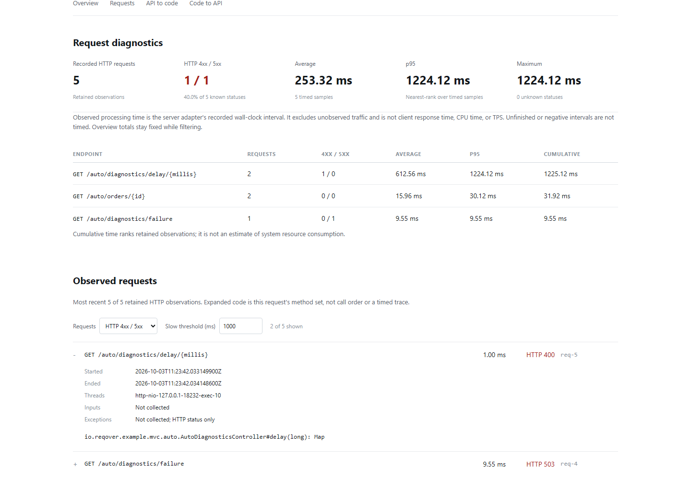

# 요청 진단 리포트 사용 방법

이번 개발 버전은 기존 API별 메서드 합집합과 함께 개별 요청을 보존합니다.
화면 위쪽에는 관측 HTTP 요청 수, 4xx·5xx, 평균·p95·최대 처리 시간과 endpoint별
누적 시간을 표시합니다. 요청을 펼치면 그 요청의 시각·상태·스레드·실행 메서드를 확인합니다.




화면은 2026년 10월 3일 loopback에서 agent를 붙인 MVC 데모로 캡처했습니다.
이 수치는 합성 데모의 관측 결과입니다.

## 실제 데모

배포된 0.2.0에는 없는 개발 기능이므로 현재 브랜치를 빌드합니다.

```powershell
.\scripts\run-agent-demo.ps1 -App mvc -Port 8080
```

스크립트가 기다리는 동안 다른 터미널에서 실행합니다.

```powershell
Invoke-RestMethod http://127.0.0.1:8080/auto/diagnostics/delay/1200
Invoke-WebRequest http://127.0.0.1:8080/auto/diagnostics/failure -SkipHttpErrorCheck
```

`http://127.0.0.1:8080/reqover/report.html`에서 지연·실패 요청을 확인합니다.
failure는 의도적으로 503을 반환하고, delay는 0~2000 ms만 허용합니다.
합성 데모이며 실제 애플리케이션 성능 측정값은 아닙니다.
macOS/Linux에서는 기존 `.sh` 데모 스크립트와 `curl`을 사용합니다.

WebFlux는 `-App webflux`로 실행하고 `/auto/reactive/diagnostics/delay/1200`,
`/auto/reactive/diagnostics/failure`를 호출합니다. Mono를 반환하는 순간과 reactive
요청이 끝나는 순간이 다르다는 것을 확인할 수 있습니다.

## 지표의 의미

- 처리 시간은 adapter가 요청 bucket을 생성한 뒤 종료한 벽시계 구간입니다. MVC는
  handler 매핑 이후부터 관측하며, 네트워크 응답시간·CPU 시간·메서드·DB 시간이 아닙니다.
  시계 조정의 영향을 받을 수 있어 monotonic timing을 후속 개선으로 계획했습니다.
- 미완료나 음수 구간은 집계에서 제외하고 미측정으로 표시합니다. 0 ms와 1 ms 미만은 유효합니다.
- p95는 유효한 관측 샘플의 nearest-rank 값입니다. 소수 요청의 p95를 전체 서비스 지표로 보지 않습니다.
- 4xx와 5xx를 구분하고, 실패율 분모는 확인된 최종 HTTP 상태인 200~599입니다.
  미확인 상태는 성공으로 세지 않습니다. 예상한 4xx가 테스트 실패인지는 별도 assertion의 문제입니다.
- 누적 시간은 같은 보관 구간의 시간 합계입니다. 시스템 자원이나 CPU 병목을 증명하지 않습니다.

기본 메모리 저장소의 상한과 eviction 정책에 따라 남아 있는 기록만 집계합니다.
이 수치는 전체 트래픽 TPS가 아닙니다. 필터는 목록을 좁히며 위쪽 전체 통계는 유지됩니다.
HTML은 가장 최근 HTTP 요청 100개까지 상세를 표시합니다. JSON도 기본적으로 최근 작업
100개의 상세만 원래 순서대로 저장하고, 빠진 상세 수를 `omittedRequestDetails`로 알립니다.
API별 합집합, 역조회와 완료 요청 수는 전체 보관 기록을 유지합니다. 내보낸 JSON으로
계산하는 시간·상태 통계는 그 파일의 상세 범위만 나타냅니다. 신뢰할 수 있는 로컬 호출자는
`CoverageReportJson.write(report, requestDetailsLimit)`로 상한을 정할 수 있고, 0이면 상세를
생략합니다. include 패키지와 저장 상한도 시험 범위에 맞게 조정합니다.

## 호환성과 현재 범위

schema 1에 선택적인 `requests` 배열을 추가했습니다. 개별 요청 ID, 작업 유형,
endpoint, 시작·끝 시각, 상태, 스레드와 메서드를 보존합니다. 옛 JSON은 계속 읽고,
요청 진단 데이터가 없다는 상태를 표시합니다. 기존 네 인자 `CoverageReport` 생성자도
유지합니다. `impact`와 `diff`는 이전 코드 관계 분석을 유지하며 시간·상태 비교는 별도 후속 기능입니다.

Java record 구성 요소는 다섯 개로 늘었습니다. 네 요소 record pattern과 구성 요소
수를 검사하는 소비자는 수정해야 하므로, JSON 추가와 별개로 다음 마이너 개발 릴리스에 포함할 변경입니다.

입력 파라미터, 헤더, 토큰, 예외 메시지는 수집하지 않습니다. 메서드 목록은 집합이며
호출 순서·횟수·span 시간이 아닙니다. 비HTTP 작업은 JSON에 보존하지만 HTTP 통계에서 제외합니다.
재실행과 부하 테스트는 이 진단 미리보기의 구현 범위가 아닙니다.
