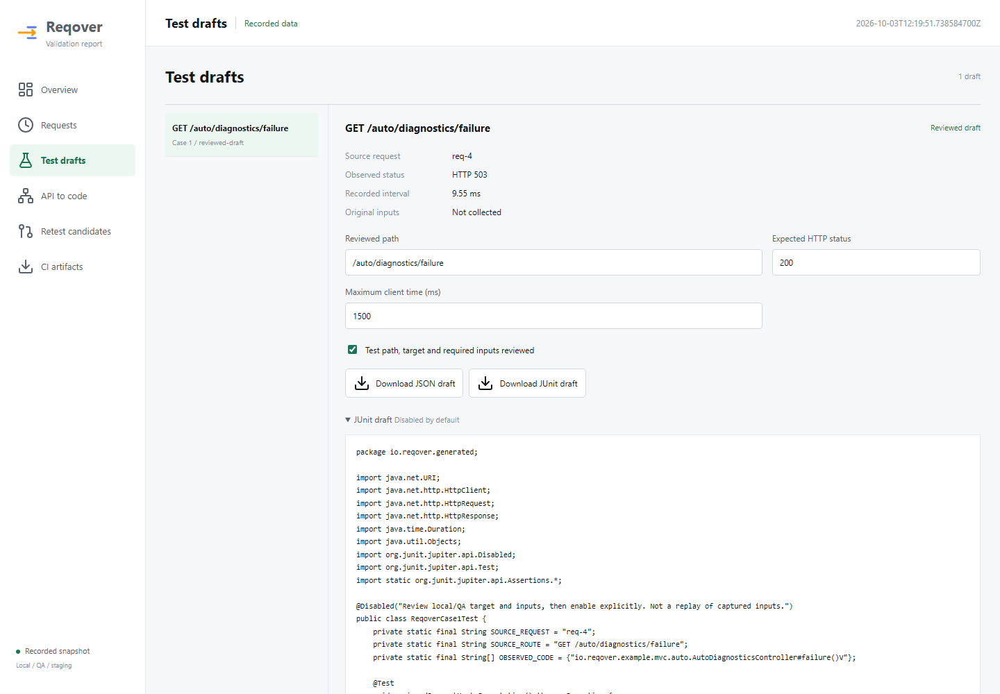

**English** | [한국어](27_test_case_drafts.ko.md)

# Reviewed test case drafts

Unreleased preview: a selected recorded request can now become a reviewed JSON
draft and a disabled JUnit 5 test. This implements the next part of the mentoring
workflow: **find a problem, retain its evidence, prepare a regression test**.
It is not faithful traffic replay, a test runner, or a load generator.



## Workflow

1. Choose a request in the request map, or expand it in Requests.
2. Select **Create test draft**. Its source ID, mapped route, observed status,
   recorded interval and method set stay linked to that observation.
3. Enter a concrete test path, expected HTTP status and optional maximum client
   time. Expected status and timing start empty; a captured 503 is not copied
   into an assertion that 503 is correct.
4. Review the target and required inputs explicitly. Editing fields clears that
   review. JUnit export stays blocked for incomplete or unsupported cases.
5. Download JSON for the draft or a disabled Java test for your existing test suite.

GET and HEAD are supported for JUnit export. POST/payment/email-like mutations
remain JSON drafts only; they need a separate reset/idempotency/safety design.
Concrete paths must start with one slash and cannot contain queries, fragments,
unresolved `{id}` or wildcard patterns, controls, or authority-changing forms.
The current preview has no query/body/authentication editor.

Drafts live **only in the open page's memory**. No localStorage, cloud save or
background request is used. Refreshing loses edits; downloaded drafts remain
local files. Existing source reports and native no-script tables do not change.

## Generated Java

The file uses Java 17's built-in HttpClient and JUnit 5, not Reqover-specific test
dependencies. The class is always `@Disabled`, even after the UI's review checkbox.
Review the generated file, add any test-only authentication locally, set an
explicit local/QA origin through `reqover.test.baseUrl`, then enable it yourself.
Do not include passwords or tokens in committed source or exported case files.

The base URL must be an HTTP(S) origin without credentials, path, query or fragment.
There is no production/default target. Redirects are disabled, connect timeout is
five seconds, and request timeout is ten seconds or the rounded-up manually set
client limit, whichever is larger. No browser network request occurs during export.

The generated status assertion is the reviewed expectation. Its optional time
assertion measures one full client request with `System.nanoTime()`, including
network/body handling, not the server adapter interval shown in the source report.
One test's client elapsed time is not p95, TPS, or proof of performance stability.

Recorded identifiers and method names are emitted as escaped Java string constants,
never as Java comments, class names or executable code. The class name and file
name are generated from the session's case number.

## JSON and privacy

Draft files use `kind: "reqover-http-test-draft"`, `schemaVersion: 1`, and
`replayable: false`. They are **not** coverage report JSON accepted by the CLI.
Their source observation is separate from `request.path` and `expected` fields.
No original query, body, headers, cookies or credentials are copied or invented.
JSON export is allowed before review and records `state: "review-required"`.
Manual review changes the state, not the truth of `replayable: false`.

Report metadata and paths entered by the user may still be private. Do not commit
generated cases automatically. The existing CI Action continues uploading only
its three diagnostic output files; it does not pick up browser-generated cases.

## Verification

```bash
./gradlew :reqover-report:test :reqover-cli:shadowJar
node --test scripts/test-case-drafts.test.cjs
```

The Node test requires JDK 17+ on PATH and the Gradle-resolved JUnit 5.12.2 API
dependencies. It compiles generated source, including hostile Unicode/control
metadata, with `javac --release 17`. CI runs this after Java tests on both JDKs.
Browser checks cover review gating, no expectation copying, download contents,
multiple independent drafts, mobile layout, no external requests, and existing
filters/maps/download/legacy/no-script behavior.

References: [Java 17 HttpClient](https://docs.oracle.com/en/java/javase/17/docs/api/java.net.http/java/net/http/HttpClient.html)
and [JUnit 5.12.2 Disabled](https://docs.junit.org/5.12.2/api/org.junit.jupiter.api/org/junit/jupiter/api/Disabled.html).
