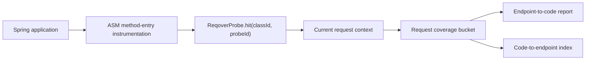

# Reqover README Refresh Implementation Plan

> **For agentic workers:** REQUIRED SUB-SKILL: Use superpowers:subagent-driven-development (recommended) or superpowers:executing-plans to implement this plan task-by-task. Steps use checkbox (`- [ ]`) syntax for tracking.

**Goal:** Run Reqover on Windows with JDK 21, capture three verified product screenshots, turn the main README into a product-first onboarding hub, and expand the Reqover Labs organization profile.

**Architecture:** The main repository remains the authoritative product and engineering guide, while the organization profile is a concise brand and navigation hub. Actual MVC and WebFlux sample processes generate all screenshots; no generated or mocked product UI is used. One test-only Windows cleanup fix makes the existing E2E verification reliable before documentation claims are published.

**Tech Stack:** Java 21 toolchain, Java 17 bytecode target, Gradle 9.5.1 wrapper, Spring Boot 3.3.5, JUnit 5, PowerShell, Chrome/Playwright-compatible browser automation, Markdown, GitHub Actions.

## Global Constraints

- Build and test with JDK 21; describe Java 17 only as the compiled bytecode target.
- Treat Reqover as a source-built `0.1.0-SNAPSHOT` MVP with no release, tag, Maven Central artifact, or package.
- Describe Reqover as a request-attribution complement to aggregate coverage, not a JaCoCo replacement.
- State that observed code-to-endpoint relationships are a lower bound and that an unobserved relationship does not prove no impact.
- State that the sample HTML report endpoint has no authentication and must not be exposed to a public network.
- Use only locally executed Reqover HTML reports for product screenshots.
- Keep local absolute paths, environment values, temporary logs, `.env` files, API keys, tokens, and build outputs out of commits.
- Use `agent/readme-product-refresh` in both repositories and publish two Draft PRs.
- Preserve the existing GitHub and LinkedIn links for 김태희 and 이상민.

---

## File Structure

### Main repository: `reqover-labs/reqover`

- Modify `reqover-agent/src/test/java/io/reqover/agent/AgentSpringE2ETest.java`: tolerate transient Windows log-file locking after the sample JVM exits.
- Create `docs/16_readme_demo_capture.md`: reproducible environment, commands, evidence, and troubleshooting for the screenshots.
- Create `docs/assets/reqover-mvc-request-attribution.png`: MVC endpoint-separated report.
- Create `docs/assets/reqover-webflux-thread-hop.png`: WebFlux auto-instrumentation report with multiple threads.
- Create `docs/assets/reqover-code-to-endpoint-index.png`: shared code to two observed endpoints.
- Modify `README.md`: product-first landing, demo, quickstart, architecture, accuracy boundaries, documentation, team, and community.
- Preserve `docs/assets/reqover-webflux-report.png`: do not delete the existing evidence asset during this change.

### Organization profile repository: `reqover-labs/.github`

- Modify `profile/README.md`: mission, MVP status, capability summary, project links, participation and security guidance, maintainers, and precise license wording.

---

### Task 1: Stabilize Windows E2E Cleanup

**Files:**
- Modify: `reqover-agent/src/test/java/io/reqover/agent/AgentSpringE2ETest.java`
- Test: `reqover-agent/src/test/java/io/reqover/agent/AgentSpringE2ETest.java`

**Interfaces:**
- Consumes: `SampleApp(Process process, Path log)` and the existing `stop(SampleApp)` cleanup path.
- Produces: `deleteLogWithRetry(Path log)`, a test-only helper that returns after deletion or throws the last `FileSystemException` after 20 attempts.

- [ ] **Step 1: Reproduce the existing cleanup failure**

Run:

```powershell
$env:JAVA_HOME = 'C:\Program Files\Java\jdk-21.0.10'
$env:Path = "$env:JAVA_HOME\bin;$env:Path"
.\gradlew.bat :reqover-agent:test --tests io.reqover.agent.AgentSpringE2ETest --no-daemon --console=plain
```

Expected before the fix: both E2E methods reach `stop()` and fail at `Files.deleteIfExists(app.log())` with a Windows `FileSystemException` saying another process is using the file.

- [ ] **Step 2: Add a bounded retry around only the transient log deletion**

Replace the final deletion in `stop(SampleApp)` and add the helper below:

```java
    private void stop(SampleApp app) throws Exception {
        try {
            app.process().destroy();
            if (!app.process().waitFor(10, TimeUnit.SECONDS)) {
                app.process().destroyForcibly();
                app.process().waitFor(10, TimeUnit.SECONDS);
            }
        } finally {
            deleteLogWithRetry(app.log());
        }
    }

    private static void deleteLogWithRetry(Path log) throws Exception {
        java.nio.file.FileSystemException lastFailure = null;
        for (int attempt = 1; attempt <= 20; attempt++) {
            try {
                Files.deleteIfExists(log);
                return;
            } catch (java.nio.file.FileSystemException error) {
                lastFailure = error;
                if (attempt < 20) {
                    Thread.sleep(50);
                }
            }
        }
        throw lastFailure;
    }
```

Do not catch general `IOException`; permission errors and persistent filesystem errors must remain visible.

- [ ] **Step 3: Verify the targeted E2E test passes**

Run:

```powershell
.\gradlew.bat :reqover-agent:test --tests io.reqover.agent.AgentSpringE2ETest --no-daemon --console=plain
```

Expected: `BUILD SUCCESSFUL`, with both MVC and WebFlux E2E methods passing.

- [ ] **Step 4: Verify the complete clean baseline**

Run:

```powershell
.\gradlew.bat clean test --no-daemon --console=plain
```

Expected: `BUILD SUCCESSFUL`, no failed tests, and no leftover sample process listening on ports `18080` or `18081`.

- [ ] **Step 5: Commit the isolated test fix**

```powershell
git add -- reqover-agent/src/test/java/io/reqover/agent/AgentSpringE2ETest.java
git diff --cached --check
git commit -m "test: tolerate Windows E2E log cleanup delay"
```

---

### Task 2: Build, Run, Verify, and Capture the Real Demo

**Files:**
- Create: `docs/16_readme_demo_capture.md`
- Create: `docs/assets/reqover-mvc-request-attribution.png`
- Create: `docs/assets/reqover-webflux-thread-hop.png`
- Create: `docs/assets/reqover-code-to-endpoint-index.png`

**Interfaces:**
- Consumes: MVC manual-probe endpoints, WebFlux Java-agent endpoint, JSON report at `/reqover/report`, and HTML report at `/reqover/report.html`.
- Produces: three 1440px-wide evidence images and one reproducibility document used by `README.md`.

- [ ] **Step 1: Build the agent, both sample jars, and SBOM**

Run:

```powershell
$env:JAVA_HOME = 'C:\Program Files\Java\jdk-21.0.10'
$env:Path = "$env:JAVA_HOME\bin;$env:Path"
.\gradlew.bat :reqover-agent:jar :examples:mvc-sample:bootJar :examples:webflux-sample:bootJar cyclonedxBom --no-daemon --console=plain
```

Expected files:

```text
reqover-agent/build/libs/reqover-agent-0.1.0-SNAPSHOT.jar
examples/mvc-sample/build/libs/mvc-sample-0.1.0-SNAPSHOT.jar
examples/webflux-sample/build/libs/webflux-sample-0.1.0-SNAPSHOT.jar
build/reports/bom/reqover-sbom.json
```

- [ ] **Step 2: Start the MVC manual-probe sample on port 18082**

Start a hidden background process and redirect output to an untracked temporary file outside the repository:

```powershell
$mvcOutLog = Join-Path $env:TEMP 'reqover-readme-mvc.out.log'
$mvcErrLog = Join-Path $env:TEMP 'reqover-readme-mvc.err.log'
$mvcJar = (Resolve-Path '.\examples\mvc-sample\build\libs\mvc-sample-0.1.0-SNAPSHOT.jar').Path
$mvcProcess = Start-Process `
  -FilePath "$env:JAVA_HOME\bin\java.exe" `
  -ArgumentList @('-jar', $mvcJar, '--server.port=18082', '--spring.main.banner-mode=off') `
  -RedirectStandardOutput $mvcOutLog `
  -RedirectStandardError $mvcErrLog `
  -WindowStyle Hidden `
  -PassThru
```

Poll `http://localhost:18082/reqover/report` for up to 45 seconds. If the process exits or readiness does not succeed, print `$mvcOutLog` and `$mvcErrLog`, stop, and investigate before taking screenshots.

Use this exact readiness check:

```powershell
$mvcReady = $false
$mvcDeadline = (Get-Date).AddSeconds(45)
while ((Get-Date) -lt $mvcDeadline) {
  if ($mvcProcess.HasExited) {
    Get-Content -LiteralPath $mvcOutLog -ErrorAction SilentlyContinue
    Get-Content -LiteralPath $mvcErrLog -ErrorAction SilentlyContinue
    throw "MVC sample exited with code $($mvcProcess.ExitCode)."
  }
  try {
    Invoke-RestMethod 'http://localhost:18082/reqover/report' -TimeoutSec 2 | Out-Null
    $mvcReady = $true
    break
  } catch {
    Start-Sleep -Milliseconds 500
  }
}
if (-not $mvcReady) {
  Get-Content -LiteralPath $mvcOutLog -ErrorAction SilentlyContinue
  Get-Content -LiteralPath $mvcErrLog -ErrorAction SilentlyContinue
  throw 'MVC sample did not become ready within 45 seconds.'
}
```

- [ ] **Step 3: Generate and assert the MVC report data**

Run:

```powershell
Invoke-RestMethod 'http://localhost:18082/orders/1' | Out-Null
Invoke-RestMethod -Method Post 'http://localhost:18082/payments' | Out-Null
$mvcReport = Invoke-RestMethod 'http://localhost:18082/reqover/report'

if ($mvcReport.completedRequestCount -ne 2) { throw 'Expected two completed MVC requests.' }
if ($mvcReport.endpoints.endpoint -notcontains 'GET /orders/{id}') { throw 'Missing orders endpoint.' }
if ($mvcReport.endpoints.endpoint -notcontains 'POST /payments') { throw 'Missing payments endpoint.' }

$shared = $mvcReport.reverseIndex | Where-Object {
  $_.className -eq 'io.reqover.example.mvc.SharedValidator'
}
if (@($shared.endpoints).Count -ne 2) { throw 'SharedValidator must map to two observed endpoints.' }
```

Expected: two endpoint cards and a `SharedValidator` reverse-index row containing both endpoint patterns.

- [ ] **Step 4: Capture the MVC and reverse-index images**

Open `http://localhost:18082/reqover/report.html` in an automated browser with a 1440px viewport.

Capture:

- the summary and both MVC endpoint cards as `docs/assets/reqover-mvc-request-attribution.png`;
- the `Code to Endpoint Index` heading and the `SharedValidator` row as `docs/assets/reqover-code-to-endpoint-index.png`.

Use browser element bounding boxes or a deterministic crop from the rendered page. Do not include the address bar, terminal, local file paths, or unrelated desktop content.

The equivalent Playwright capture is:

```javascript
const { chromium } = await import('playwright');
const browser = await chromium.launch({ headless: true });
const page = await browser.newPage({
  viewport: { width: 1440, height: 1000 },
  deviceScaleFactor: 1,
});
await page.goto('http://localhost:18082/reqover/report.html', {
  waitUntil: 'networkidle',
});
await page.locator('.index-panel').evaluate((element) => {
  element.style.display = 'none';
});
await page.locator('main').screenshot({
  path: 'C:/Users/1043t/Documents/Codex/2026-07-31/new-chat/work/reqover/docs/assets/reqover-mvc-request-attribution.png',
  animations: 'disabled',
});
await page.reload({ waitUntil: 'networkidle' });
await page.locator('.index-panel').screenshot({
  path: 'C:/Users/1043t/Documents/Codex/2026-07-31/new-chat/work/reqover/docs/assets/reqover-code-to-endpoint-index.png',
  animations: 'disabled',
});
await browser.close();
```

- [ ] **Step 5: Stop the MVC process and verify the port is released**

```powershell
Stop-Process -Id $mvcProcess.Id -Force -ErrorAction SilentlyContinue
$mvcProcess.WaitForExit()
if (Get-NetTCPConnection -State Listen -LocalPort 18082 -ErrorAction SilentlyContinue) {
  throw 'MVC demo still owns port 18082.'
}
```

- [ ] **Step 6: Start the WebFlux sample with the Java agent on port 18083**

```powershell
$webfluxOutLog = Join-Path $env:TEMP 'reqover-readme-webflux.out.log'
$webfluxErrLog = Join-Path $env:TEMP 'reqover-readme-webflux.err.log'
$agentJar = (Resolve-Path '.\reqover-agent\build\libs\reqover-agent-0.1.0-SNAPSHOT.jar').Path
$webfluxJar = (Resolve-Path '.\examples\webflux-sample\build\libs\webflux-sample-0.1.0-SNAPSHOT.jar').Path
$webfluxProcess = Start-Process `
  -FilePath "$env:JAVA_HOME\bin\java.exe" `
  -ArgumentList @(
    "-javaagent:$agentJar=include=io.reqover.example.webflux.auto",
    '-jar',
    $webfluxJar,
    '--server.port=18083',
    '--spring.main.banner-mode=off'
  ) `
  -RedirectStandardOutput $webfluxOutLog `
  -RedirectStandardError $webfluxErrLog `
  -WindowStyle Hidden `
  -PassThru
```

Poll `http://localhost:18083/reqover/report` for up to 45 seconds with the same early-exit diagnostics as the MVC process.

Use this exact readiness check:

```powershell
$webfluxReady = $false
$webfluxDeadline = (Get-Date).AddSeconds(45)
while ((Get-Date) -lt $webfluxDeadline) {
  if ($webfluxProcess.HasExited) {
    Get-Content -LiteralPath $webfluxOutLog -ErrorAction SilentlyContinue
    Get-Content -LiteralPath $webfluxErrLog -ErrorAction SilentlyContinue
    throw "WebFlux sample exited with code $($webfluxProcess.ExitCode)."
  }
  try {
    Invoke-RestMethod 'http://localhost:18083/reqover/report' -TimeoutSec 2 | Out-Null
    $webfluxReady = $true
    break
  } catch {
    Start-Sleep -Milliseconds 500
  }
}
if (-not $webfluxReady) {
  Get-Content -LiteralPath $webfluxOutLog -ErrorAction SilentlyContinue
  Get-Content -LiteralPath $webfluxErrLog -ErrorAction SilentlyContinue
  throw 'WebFlux sample did not become ready within 45 seconds.'
}
```

- [ ] **Step 7: Generate and assert the WebFlux report data**

```powershell
Invoke-RestMethod 'http://localhost:18083/auto/reactive/orders/42' | Out-Null
$webfluxReport = Invoke-RestMethod 'http://localhost:18083/reqover/report'
$reactive = $webfluxReport.endpoints | Where-Object {
  $_.endpoint -eq 'GET /auto/reactive/orders/{id}'
}

if ($null -eq $reactive) { throw 'Missing reactive endpoint.' }
if ($reactive.classes.className -notcontains 'io.reqover.example.webflux.auto.AutoReactiveOrderController') {
  throw 'Missing auto-instrumented reactive controller.'
}
if ($reactive.classes.className -notcontains 'io.reqover.example.webflux.auto.AutoReactiveOrderService') {
  throw 'Missing auto-instrumented reactive service.'
}
if (@($reactive.threadNames).Count -lt 2) {
  throw 'Expected WebFlux attribution across at least two threads.'
}
```

- [ ] **Step 8: Capture the WebFlux thread-hop image**

Open `http://localhost:18083/reqover/report.html` at a 1440px viewport and capture the summary plus the reactive endpoint card, including its thread chips, as:

```text
docs/assets/reqover-webflux-thread-hop.png
```

The equivalent Playwright capture is:

```javascript
const { chromium } = await import('playwright');
const browser = await chromium.launch({ headless: true });
const page = await browser.newPage({
  viewport: { width: 1440, height: 1000 },
  deviceScaleFactor: 1,
});
await page.goto('http://localhost:18083/reqover/report.html', {
  waitUntil: 'networkidle',
});
await page.locator('.index-panel').evaluate((element) => {
  element.style.display = 'none';
});
await page.locator('main').screenshot({
  path: 'C:/Users/1043t/Documents/Codex/2026-07-31/new-chat/work/reqover/docs/assets/reqover-webflux-thread-hop.png',
  animations: 'disabled',
});
await browser.close();
```

- [ ] **Step 9: Stop the WebFlux process and verify the port is released**

```powershell
Stop-Process -Id $webfluxProcess.Id -Force -ErrorAction SilentlyContinue
$webfluxProcess.WaitForExit()
if (Get-NetTCPConnection -State Listen -LocalPort 18083 -ErrorAction SilentlyContinue) {
  throw 'WebFlux demo still owns port 18083.'
}
```

- [ ] **Step 10: Write the reproducibility document**

Create `docs/16_readme_demo_capture.md` with this content:

```markdown
# 16. README Demo Capture

## Purpose

This document records how the screenshots in the root README were generated from a local Reqover run. The images are product output, not mockups.

## Verified Environment

- OS: Windows
- Date: 2026-07-31
- JDK: 21.0.10
- Gradle: 9.5.1 wrapper
- MVC port: 18082
- WebFlux port: 18083

Reqover builds with JDK 21 and emits Java 17-compatible bytecode.

## Build

```powershell
$env:JAVA_HOME = 'C:\Program Files\Java\jdk-21.0.10'
$env:Path = "$env:JAVA_HOME\bin;$env:Path"
.\gradlew.bat clean test --no-daemon --console=plain
.\gradlew.bat :reqover-agent:jar :examples:mvc-sample:bootJar :examples:webflux-sample:bootJar cyclonedxBom --no-daemon --console=plain
```

## MVC Request Attribution

Start `mvc-sample` on port `18082`, then call:

```powershell
Invoke-RestMethod 'http://localhost:18082/orders/1'
Invoke-RestMethod -Method Post 'http://localhost:18082/payments'
Invoke-RestMethod 'http://localhost:18082/reqover/report'
```

Verified results:

- `completedRequestCount` is `2`.
- `GET /orders/{id}` and `POST /payments` are separate endpoint entries.
- `io.reqover.example.mvc.SharedValidator` maps back to both observed endpoints.

Assets:

- `docs/assets/reqover-mvc-request-attribution.png`
- `docs/assets/reqover-code-to-endpoint-index.png`

## WebFlux Java-Agent Attribution

Run the WebFlux jar with:

```powershell
java "-javaagent:reqover-agent/build/libs/reqover-agent-0.1.0-SNAPSHOT.jar=include=io.reqover.example.webflux.auto" `
  -jar examples/webflux-sample/build/libs/webflux-sample-0.1.0-SNAPSHOT.jar `
  --server.port=18083 `
  --spring.main.banner-mode=off
```

Then call:

```powershell
Invoke-RestMethod 'http://localhost:18083/auto/reactive/orders/42'
Invoke-RestMethod 'http://localhost:18083/reqover/report'
```

Verified results:

- `GET /auto/reactive/orders/{id}` is present.
- `AutoReactiveOrderController` and `AutoReactiveOrderService` were inserted by the Java agent.
- The request bucket contains multiple thread names from the reactive execution.

Asset:

- `docs/assets/reqover-webflux-thread-hop.png`

## Interpretation Boundary

Reqover reports execution relationships observed in these requests. An absent relationship does not prove that a code path can never affect an endpoint.

## Troubleshooting

- Confirm `java -version` and `.\gradlew.bat --version` both use JDK 21.
- Check ports `18082` and `18083` before starting a sample.
- Call a business endpoint before opening the report.
- Confirm the Java-agent `include=` prefix matches the sample package.
- Stop the sample JVM after capture; do not commit process logs or build outputs.
```

- [ ] **Step 11: Visually inspect all three assets**

Check each file with image inspection:

- text is readable at GitHub README width;
- no row is cut in half;
- the three images show different evidence;
- dimensions are reasonable and no image is empty or corrupted.

- [ ] **Step 12: Commit the evidence**

```powershell
git add -- docs/16_readme_demo_capture.md `
  docs/assets/reqover-mvc-request-attribution.png `
  docs/assets/reqover-webflux-thread-hop.png `
  docs/assets/reqover-code-to-endpoint-index.png
git diff --cached --check
git commit -m "docs: add verified Reqover demo evidence"
```

---

### Task 3: Rewrite the Main README as a Product Landing and Onboarding Hub

**Files:**
- Modify: `README.md`

**Interfaces:**
- Consumes: the three evidence images and `docs/16_readme_demo_capture.md` from Task 2.
- Produces: stable anchors `#why-reqover`, `#see-it-in-action`, `#quickstart`, `#how-it-works`, `#compatibility-and-status`, `#documentation`, and `#contributing` for the organization profile.

- [ ] **Step 1: Replace `README.md` with the approved structure and copy**

Use the following complete Markdown. Preserve the verified thread and class claims; do not add release or package badges.

````markdown
<h1 align="center">Reqover</h1>

<p align="center">
  <strong>Request-scoped runtime coverage attribution for Spring MVC and WebFlux.</strong><br>
  어떤 HTTP 요청이 어떤 메서드를 실행했는지 연결하고, 변경된 코드에서 관측된 엔드포인트를 역으로 찾습니다.
</p>

<p align="center">
  <a href="https://github.com/reqover-labs/reqover/actions/workflows/build.yml"></a>
  <a href="LICENSE"></a>
  <a href="build.gradle.kts"></a>
  <a href="build.gradle.kts"></a>
</p>

<p align="center">
  <a href="#see-it-in-action">Demo</a> ·
  <a href="#quickstart">Quickstart</a> ·
  <a href="#documentation">Documentation</a> ·
  <a href="#contributing">Contributing</a>
</p>


> [!IMPORTANT]
> Reqover는 현재 소스에서 빌드해 사용하는 `0.1.0-SNAPSHOT` MVP입니다. Maven Central 또는 GitHub Releases에 배포된 artifact는 아직 없습니다. 개발·QA·staging 환경의 관측과 시연을 우선하며, sample report endpoint는 인증을 제공하지 않습니다.

## Why Reqover

일반적인 집계 커버리지는 코드가 실행됐다는 사실을 보여주지만, 그 실행을 만든 HTTP 요청을 기본 차원으로 제공하지는 않습니다. Reqover는 Spring 애플리케이션에서 관측된 요청과 method-entry hit를 같은 bucket에 기록합니다.

| 질문 | 집계 커버리지 | Reqover |
| --- | --- | --- |
| 어떤 코드가 실행됐는가? | 제공 | 제공 |
| 어떤 HTTP endpoint가 그 코드를 실행했는가? | 기본 차원이 아님 | endpoint-to-code report |
| 이 메서드를 실행한 관측 API는 무엇인가? | 별도 분석 필요 | code-to-endpoint index |
| WebFlux가 thread를 바꿔도 요청 귀속이 유지되는가? | 요청 차원 밖의 문제 | Reactor Context 기반으로 유지 |

Reqover는 JaCoCo를 대체하지 않습니다. line/branch 정밀 커버리지에 요청 단위 실행 귀속을 보완하는 도구입니다.

## See It in Action

### 1. 요청별 실행 경로 분리

같은 애플리케이션에서 `GET /orders/{id}`와 `POST /payments`를 호출하면 각 endpoint가 실행한 controller와 service가 별도 카드에 표시됩니다. 공통으로 실행된 `SharedValidator`는 두 카드 모두에 나타납니다.

### 2. WebFlux thread hop 추적

Java agent가 controller와 service의 method entry를 자동 계측합니다. reactive 실행이 여러 thread로 이동해도 같은 요청 bucket에 기록됩니다.


### 3. 코드에서 관측 endpoint 역조회

`Code to Endpoint Index`는 특정 메서드를 실행한 관측 API를 보여줍니다. 코드 변경 후 먼저 재검증할 endpoint를 좁히는 신호로 사용할 수 있습니다.


촬영 환경과 검증 절차는 [README Demo Capture](docs/16_readme_demo_capture.md)에 기록되어 있습니다.

## Quickstart

### Requirements

- JDK 21 — Gradle build와 테스트에 필요
- Git
- 사용 가능한 HTTP port

Reqover가 생성하는 bytecode target은 Java 17입니다. 현재 CI는 JDK 21에서 검증합니다.

### Windows PowerShell

```powershell
git clone https://github.com/reqover-labs/reqover.git
Set-Location .\reqover

$env:JAVA_HOME = 'C:\Program Files\Java\jdk-21'
$env:Path = "$env:JAVA_HOME\bin;$env:Path"

.\gradlew.bat test
.\scripts\run-agent-demo.ps1 -App mvc -Port 8080
```

`JAVA_HOME`은 설치한 JDK 21 경로로 설정하십시오. 스크립트가 report URL을 출력하고 대기하면 다음 주소를 엽니다.

```text
http://localhost:8080/reqover/report.html
```

종료하려면 스크립트를 실행한 터미널에서 Enter를 누릅니다.

### macOS / Linux

```bash
git clone https://github.com/reqover-labs/reqover.git
cd reqover

./gradlew test
./scripts/run-agent-demo.sh mvc 8080
```

### Expected result

MVC auto demo report에는 다음 항목이 나타나야 합니다.

```text
GET /auto/orders/{id}
io.reqover.example.mvc.auto.AutoOrderController
io.reqover.example.mvc.auto.AutoOrderService
```

WebFlux demo는 다음 명령으로 실행합니다.

```powershell
.\scripts\run-agent-demo.ps1 -App webflux -Port 8080
```

```bash
./scripts/run-agent-demo.sh webflux 8080
```

report에는 `GET /auto/reactive/orders/{id}`와 자동 계측된 reactive controller/service, 두 개 이상의 thread 이름이 나타나야 합니다.

## How It Works



1. **Instrumentation** — Java agent가 선택한 application class의 method entry에 probe 호출을 삽입합니다.
2. **Attribution** — Spring MVC는 request-bound ThreadLocal을, WebFlux는 Reactor Context와 context propagation을 이용해 현재 bucket을 찾습니다.
3. **Reporting** — 완료된 bucket을 endpoint별로 집계하고 JSON과 standalone HTML로 렌더링합니다.

상세 설계는 [시스템 아키텍처](docs/02_architecture.md)와 [Agent E2E Demo](docs/09_agent_e2e_demo.md)를 참고하십시오.

## Compatibility and Status

| 항목 | 현재 기준 |
| --- | --- |
| Project version | `0.1.0-SNAPSHOT` |
| Build JDK | 21 |
| Bytecode target | Java 17 |
| CI | Ubuntu + Temurin 21 |
| Spring Boot samples | 3.3.5 |
| MVC adapter | 구현 및 integration test |
| WebFlux adapter | 구현 및 thread-hop integration test |
| Instrumentation | ASM method-entry + `-javaagent` |
| Report | JSON + standalone HTML |
| Distribution | source build only |

### Current capabilities

- Spring MVC와 WebFlux 요청별 coverage bucket
- ASM method-entry 자동 계측
- endpoint-to-code report
- code-to-endpoint reverse index
- Spring Boot auto-configuration
- agent 기반 별도 JVM E2E test
- CycloneDX 1.6 SBOM 생성

## Project Structure

| 모듈 | 책임 |
| --- | --- |
| `reqover-core` | request bucket, context, probe registry, in-memory snapshot |
| `reqover-instrumentation` | ASM class transformation과 stable class ID |
| `reqover-agent` | `-javaagent` packaging과 class transformer |
| `reqover-spring-mvc` | Spring MVC request attribution |
| `reqover-spring-webflux` | Reactor Context 기반 WebFlux attribution |
| `reqover-report` | endpoint report와 reverse index, JSON/HTML model |
| `examples/mvc-sample` | MVC 수동 probe·agent demo |
| `examples/webflux-sample` | WebFlux thread-hop·agent demo |

## Build and SBOM

```bash
./gradlew clean test
./gradlew cyclonedxBom
```

Windows에서는 `.\gradlew.bat`을 사용합니다.

SBOM 출력:

```text
build/reports/bom/reqover-sbom.json
```

## Documentation

- [프로젝트 기획](docs/00_project_plan.md)
- [요구사항](docs/01_requirements.md)
- [시스템 아키텍처](docs/02_architecture.md)
- [MVP 상태](docs/08_phase0_mvp_status.md)
- [Agent E2E Demo](docs/09_agent_e2e_demo.md)
- [Demo Script](docs/10_demo_script.md)
- [Performance Measurement](docs/11_performance_measurement.md)
- [JaCoCo Interop Decision](docs/14_jacoco_interop_decision.md)
- [Local Performance Results](docs/15_performance_results.md)
- [README Demo Capture](docs/16_readme_demo_capture.md)
- [대회 준비 문서](docs/competition/README.md)

## Limitations and Safe Use

- 현재 method-entry 기준이며 JaCoCo 수준의 line/branch coverage를 제공하지 않습니다.
- synthetic method는 현재 계측 대상에서 제외됩니다.
- snapshot은 in-memory로 유지되며 기본 상한 10,000건을 넘으면 오래된 항목부터 제거합니다.
- report는 관측된 요청의 실행 관계만 보여줍니다. 보이지 않은 관계가 없다는 증거가 아닙니다.
- code-to-endpoint index는 우선 재검증 대상을 좁히는 신호이며 완전한 변경 영향 분석을 보장하지 않습니다.
- sample의 `/reqover/report`와 `/reqover/report.html`에는 인증이 없습니다. 공개 네트워크에 노출하지 마십시오.
- 현재는 production always-on agent가 아니라 개발·QA·staging 관측을 우선합니다.

## Performance

로컬 순차 측정의 범위와 한계는 [Local Performance Results](docs/15_performance_results.md)에 공개되어 있습니다. 해당 수치는 production benchmark가 아니라 MVP sanity check입니다.

## Contributing

문서 개선, 버그 재현, 테스트와 코드 기여를 환영합니다.

- [Contributing Guide](CONTRIBUTING.md)
- [Code of Conduct](CODE_OF_CONDUCT.md)
- [Security Policy](SECURITY.md)
- [Issues](https://github.com/reqover-labs/reqover/issues)

보안 취약점은 공개 issue 대신 Security Policy의 private reporting 절차를 사용하십시오.

## Team

2026 오픈소스 개발자대회 출품을 목표로 Reqover를 개발하는 [Reqover Labs](https://github.com/reqover-labs)입니다.

| 이름 | GitHub | LinkedIn | 주요 기여 |
| --- | --- | --- | --- |
| 김태희 | [@TaeHuiKKIM](https://github.com/TaeHuiKKIM) | [TaeHui Kim](https://www.linkedin.com/in/taehui-kim-930713412/) | 코어 설계와 MVP 구현: core, instrumentation, agent, report, sample |
| 이상민 | [@lsmin3388](https://github.com/lsmin3388) | [Sangmin Lee](https://www.linkedin.com/in/sangminn0) | 공개 저장소 정비: build, CI, core hardening, Spring adapter, docs |

## License

Reqover 자체 작성 코드는 [Apache License 2.0](LICENSE)으로 제공됩니다. 서드파티 라이선스는 [THIRD_PARTY_NOTICES.md](THIRD_PARTY_NOTICES.md)를 참고하십시오.
````

- [ ] **Step 2: Check the README structure and local links**

Run:

```powershell
$readme = Get-Content -Raw '.\README.md'
$required = @(
  '## Why Reqover',
  '## See It in Action',
  '## Quickstart',
  '## How It Works',
  '## Compatibility and Status',
  '## Documentation',
  '## Limitations and Safe Use',
  '## Contributing'
)
foreach ($heading in $required) {
  if (-not $readme.Contains($heading)) { throw "Missing heading: $heading" }
}

$localLinks = [regex]::Matches($readme, '\]\((?!https?://|#|mailto:)([^)#]+)(?:#[^)]+)?\)')
foreach ($match in $localLinks) {
  $path = $match.Groups[1].Value
  if (-not (Test-Path -LiteralPath (Join-Path (Get-Location) $path))) {
    throw "Broken local link: $path"
  }
}
```

Expected: all required headings and local targets exist.

- [ ] **Step 3: Inspect the rendered hierarchy**

Verify:

- exactly one H1;
- no heading-level jump;
- no stars/forks badges;
- all three product images render and have descriptive alt text;
- the MVP warning appears before the first long technical section;
- Quickstart does not imply a published artifact.

- [ ] **Step 4: Commit the README**

```powershell
git add -- README.md
git diff --cached --check
git commit -m "docs: rebuild README around verified product demo"
```

---

### Task 4: Expand the Reqover Labs Organization Profile

**Files:**
- Modify in `reqover-labs/.github`: `profile/README.md`

**Interfaces:**
- Consumes: the final main README anchors from Task 3.
- Produces: a concise organization landing page linking to the authoritative product documentation.

- [ ] **Step 1: Clone and isolate the organization profile repository**

From the parent `work` directory:

```powershell
git clone https://github.com/reqover-labs/.github.git reqover-org-profile
Set-Location .\reqover-org-profile
git switch -c agent/readme-product-refresh
git status --short --branch
```

Expected: a clean `agent/readme-product-refresh` branch.

- [ ] **Step 2: Replace `profile/README.md` with precise organization copy**

Use this complete Markdown:

```markdown
<h1 align="center">Reqover Labs</h1>

<p align="center">
  <strong>We connect observed Spring requests to the code paths they execute.</strong><br>
  Spring MVC와 WebFlux의 HTTP 요청 단위 런타임 커버리지를 만드는 오픈소스 팀입니다.
</p>

<p align="center">
  <a href="https://github.com/reqover-labs/reqover">Reqover</a> ·
  <a href="https://github.com/reqover-labs/reqover#see-it-in-action">Demo</a> ·
  <a href="https://github.com/reqover-labs/reqover#quickstart">Quickstart</a> ·
  <a href="https://github.com/reqover-labs/reqover#documentation">Docs</a> ·
  <a href="https://github.com/reqover-labs/reqover/issues">Issues</a>
</p>

## What We Build

[Reqover](https://github.com/reqover-labs/reqover)는 실행 중인 Spring 애플리케이션에서 관측된 HTTP 요청과 실제 실행 메서드를 연결합니다.

- Spring MVC와 WebFlux 요청별 coverage attribution
- ASM method-entry instrumentation과 `-javaagent`
- endpoint-to-code report와 code-to-endpoint reverse index
- reactive thread hop 환경의 request context propagation

> [!NOTE]
> Reqover는 현재 2026 오픈소스 개발자대회 출품을 목표로 개발 중인 source-built MVP입니다. 최신 구현 상태와 제한사항은 [메인 README](https://github.com/reqover-labs/reqover#compatibility-and-status)에서 확인해 주세요.

## Featured Project

| Project | Status | Start here |
| --- | --- | --- |
| [reqover](https://github.com/reqover-labs/reqover) | `0.1.0-SNAPSHOT` · active MVP | [Demo](https://github.com/reqover-labs/reqover#see-it-in-action) · [Quickstart](https://github.com/reqover-labs/reqover#quickstart) · [Docs](https://github.com/reqover-labs/reqover#documentation) |

## Participate

문서 개선, 버그 재현, 테스트와 코드 기여를 환영합니다.

- [Contributing Guide](https://github.com/reqover-labs/reqover/blob/main/CONTRIBUTING.md)
- [Code of Conduct](https://github.com/reqover-labs/reqover/blob/main/CODE_OF_CONDUCT.md)
- [Open Issues](https://github.com/reqover-labs/reqover/issues)
- [Security Policy](https://github.com/reqover-labs/reqover/blob/main/SECURITY.md)

보안 취약점은 공개 issue에 작성하지 말고 Security Policy의 private reporting 절차를 따라 주세요.

## Maintainers

| 이름 | GitHub | LinkedIn |
| --- | --- | --- |
| 김태희 | [@TaeHuiKKIM](https://github.com/TaeHuiKKIM) | [TaeHui Kim](https://www.linkedin.com/in/taehui-kim-930713412/) |
| 이상민 | [@lsmin3388](https://github.com/lsmin3388) | [Sangmin Lee](https://www.linkedin.com/in/sangminn0) |

## License

Reqover 자체 작성 코드는 [Apache License 2.0](https://github.com/reqover-labs/reqover/blob/main/LICENSE)으로 제공됩니다. 서드파티 고지는 [THIRD_PARTY_NOTICES.md](https://github.com/reqover-labs/reqover/blob/main/THIRD_PARTY_NOTICES.md)를 참고해 주세요.
```

- [ ] **Step 3: Validate organization links and claims**

Check that:

- every `reqover#...` anchor exists in Task 3's README;
- the profile says “출품을 목표로” rather than claiming confirmed competition participation;
- the license sentence applies only to Reqover-authored code;
- Discussions, releases, packages, sponsors, and published artifacts are not claimed;
- both LinkedIn links display the person's name, not a generic “LinkedIn” label.

- [ ] **Step 4: Commit the organization profile**

```powershell
git add -- profile/README.md
git diff --cached --check
git commit -m "docs: expand Reqover Labs organization profile"
```

---

### Task 5: Final Verification and Draft PR Publication

**Files:**
- Verify all files changed in Tasks 1–4.
- Do not create or stage local logs, build output, `.env`, secrets, or temporary browser files.

**Interfaces:**
- Consumes: completed main and organization branches.
- Produces: two pushed branches and two Draft PR URLs.

- [ ] **Step 1: Run final main-repository tests and build**

In `work/reqover`:

```powershell
$env:JAVA_HOME = 'C:\Program Files\Java\jdk-21.0.10'
$env:Path = "$env:JAVA_HOME\bin;$env:Path"
.\gradlew.bat clean test build cyclonedxBom --no-daemon --console=plain
```

Expected: `BUILD SUCCESSFUL`; the SBOM exists; no sample process remains on `18080`, `18081`, `18082`, or `18083`.

- [ ] **Step 2: Verify repository state and review the complete diff**

```powershell
git status --short --branch
git diff --check main...HEAD
git diff --stat main...HEAD
git log --oneline main..HEAD
git diff main...HEAD -- README.md docs/16_readme_demo_capture.md reqover-agent/src/test/java/io/reqover/agent/AgentSpringE2ETest.java
```

Confirm only the approved files and the committed design/plan documents are present.

- [ ] **Step 3: Perform the sensitive-data audit**

```powershell
git diff --name-only main...HEAD | Where-Object {
  $_ -match '(^|/)\.env($|\.)|\.pem$|\.key$|credential|secret'
}
git status --short --untracked-files=all
```

Expected: no sensitive path is part of the diff. Build directories and local logs remain ignored or outside the repository.

- [ ] **Step 4: Verify the organization profile diff**

In `work/reqover-org-profile`:

```powershell
git status --short --branch
git diff --check main...HEAD
git diff --stat main...HEAD
git diff main...HEAD -- profile/README.md
```

- [ ] **Step 5: Push the main repository branch**

Use the GitHub publication workflow and run:

```powershell
git push -u origin agent/readme-product-refresh
```

- [ ] **Step 6: Create the main Draft PR**

```powershell
gh pr create `
  --repo reqover-labs/reqover `
  --base main `
  --head agent/readme-product-refresh `
  --draft `
  --title "docs: rebuild Reqover README around verified demos" `
  --body "## Summary
- run and verify MVC/WebFlux demos on JDK 21
- add three real report screenshots and reproducibility notes
- rebuild the README as a product-first onboarding hub
- stabilize Windows E2E temporary-log cleanup

## Verification
- .\gradlew.bat clean test build cyclonedxBom --no-daemon --console=plain
- MVC endpoint and reverse-index assertions on port 18082
- WebFlux Java-agent and multi-thread attribution assertions on port 18083
- local README link and image validation

## Notes
- Reqover remains a source-built 0.1.0-SNAPSHOT MVP
- no .env, credentials, logs, or build outputs are included"
```

- [ ] **Step 7: Push the organization branch**

In `work/reqover-org-profile`:

```powershell
git push -u origin agent/readme-product-refresh
```

- [ ] **Step 8: Create the organization Draft PR**

```powershell
gh pr create `
  --repo reqover-labs/.github `
  --base main `
  --head agent/readme-product-refresh `
  --draft `
  --title "docs: expand Reqover Labs organization profile" `
  --body "## Summary
- clarify the Reqover Labs mission and current MVP status
- add Demo, Quickstart, Docs, Issues, contribution, and security paths
- preserve named GitHub and LinkedIn maintainer links
- narrow competition and license wording to publicly supported claims

## Dependency
Merge reqover-labs/reqover README PR first so the new section anchors resolve on main."
```

- [ ] **Step 9: Inspect both Draft PRs**

Confirm:

- both PRs are Draft;
- the main PR renders all three images;
- GitHub's Mermaid preview renders;
- organization links point to the exact main README anchors;
- CI starts on the main PR and reaches a terminal result;
- no unexpected file appears in either PR.

- [ ] **Step 10: Report the outcome**

Return both Draft PR links, the final test command and result, the three evidence image names, and any remaining review note. Do not claim merge or release completion.
